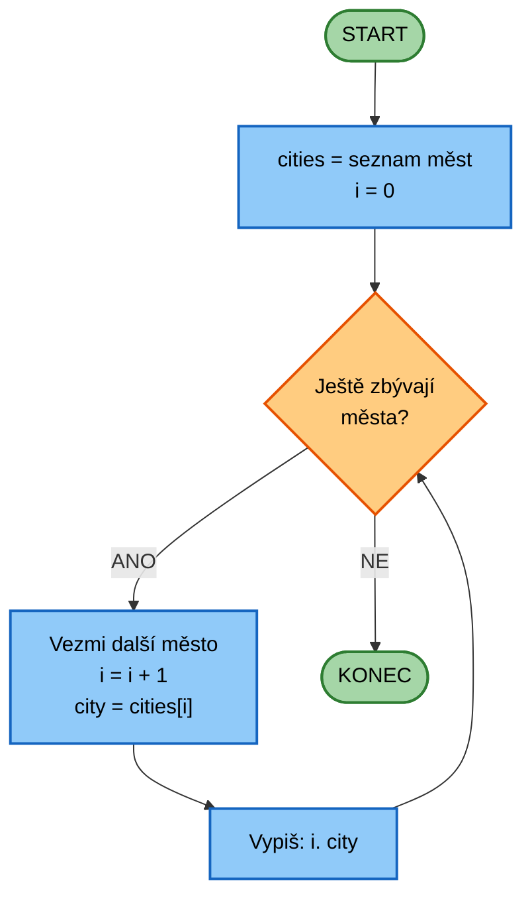

# CVIČENÍ 2: DATOVÉ TYPY TEXTOVÉ ŘETĚZCE

Algoritmizace a programování

## CÍL 4: METODY ŘETĚZCŮ

**Metoda** je funkce, která patří konkrétnímu objektu. Voláme ji pomocí **tečkové notace**: `objekt.metoda()`.

### 4.1 Změna velikosti písmen

```python
name = "severus snape"

print(name.upper()) # "SEVERUS SNAPE"
print(name.lower()) # "severus snape"
print(name.isupper()) # False
print(name.upper().isupper()) # True
```

**Důležité:** Metody **nevytváří novou hodnotu**, nezmění původní řetězec!

```python
name = "alice"
name.upper() # Toto se ignoruje!
print(name) # Stále "alice"

name = name.upper() # Správně - přiřadíme výsledek
print(name) # "ALICE"
```

### 4.2 Hledání a nahrazování

```python
text = "Python is amazing. Python is fun!"

# Hledání
position = text.find("amazing") # Vrátí index: 10
position = text.find("Java") # Vrátí -1 (nenalezeno)

# Nahrazení
new_text = text.replace("Python", "Programming")
print(new_text) # "Programming is amazing. Programming is fun!"

# Počet výskytů
count = text.count("Python") # 2
```

### 4.3 Rozdělení a spojení

```python
# Rozdělení na seznam
sentence = "Jablko,Hruška,Banán"
fruits = sentence.split(",")
print(fruits) # ["Jablko", "Hruška", "Banán"]

# Spojení seznamu
words = ["Python", "je", "super"]
sentence = " ".join(words)
print(sentence) # "Python je super"
```

**Praktický příklad: Zpracování CSV dat**

V medicíně často pracujeme s daty ve formátu CSV (Comma-Separated Values):

```python
# Jeden řádek z CSV souboru s vitálními funkcemi
data_line = "Jan Novák,35,120/80,72,36.6"

# Rozdělení na jednotlivé hodnoty
values = data_line.split(",")
print(values)
# ['Jan Novák', '35', '120/80', '72', '36.6']

# Přístup k jednotlivým hodnotám
name = values[0]
age = int(values[1])
blood_pressure = values[2]
heart_rate = int(values[3])
temperature = float(values[4])

print(f"Pacient: {name}, věk {age} let")
print(f"TK: {blood_pressure} mmHg, TF: {heart_rate} bpm")
print(f"Teplota: {temperature} °C")
```

**Zpětné spojení:**

```python
# Vytvoření nového záznamu
new_record = ["Marie Svobodová", "42", "115/75", "68", "36.8"]
csv_line = ",".join(new_record)
print(csv_line)
# "Marie Svobodová,42,115/75,68,36.8"
```

### 4.4 Ořezání mezer

```python
text = " Hello "
print(text.strip()) # "Hello"
print(text.lstrip()) # "Hello "
print(text.rstrip()) # " Hello"
```

**💻 Zkus:**
```python
email = " USER@EXAMPLE.COM "

# Očisti mezery a převeď na malá písmena
clean_email = email.strip().lower()
print(clean_email) # "user@example.com"

# Praktický příklad - validace e-mailu
if "@" in clean_email and "." in clean_email:
 print("E-mail vypadá platně")
else:
 print("Neplatný formát e-mailu")
```

---

#### ÚKOL: Normádní formát výstupu

Vytvoř program, který:

1. Načte jméno pacienta (může obsahovat mezery na začátku/konci a být velkými písmeny)
2. Očistí mezery pomocí `strip()`
3. Převede na malá písmena pomocí `lower()`
4. Vypíše: `"Normální formát: [jméno]"`

---

### 4.5 For cyklus se seznamem slov

Když rozdělíme řetězec na seznam slov, můžeme je projít cyklem:

```python
teachers = "Snape,Dumbledore,Lupin,McGonagall"
teacher_list = teachers.split(",")

for teacher in teacher_list:
 print(f"Profesor {teacher} učí na Bradavicích.")
```

**Výstup:**
```
Profesor Snape učí na Bradavicích.
Profesor Dumbledore učí na Bradavicích.
Profesor Lupin učí na Bradavicích.
Profesor McGonagall učí na Bradavicích.
```

#### Funkce enumerate() - průchod s indexem

Často potřebuješ **číslo pořadí** při procházení seznamu. K tomu slouží `enumerate()`:

```python
cities = ["Praha", "Brno", "Ostrava", "Plzeň"]

# Bez enumerate - ruční čítání:
index = 0
for city in cities:
 print(f"{index + 1}. {city}")
 index += 1

# S enumerate - elegantnější:
for i, city in enumerate(cities, start=1):
 print(f"{i}. {city}")
```

**Výstup:**

```
1. Praha
2. Brno
3. Ostrava
4. Plzeň
```

**Jak enumerate() funguje:**

- `enumerate(seznam)` vrátí **dvojice**: (index, prvek)
- `start=1` říká: "začni počítat od 1" (výchozí je 0)
- `i, city` rozbalí dvojici na dvě proměnné

**Vývojový diagram for cyklu:**



**Medicínský příklad - list pacientů:**
```python
patients = "Jan Novák,Marie Svobodová,Petr Dvořák"
patient_list = patients.split(",")

print("=== SEZNAM PACIENTŮ ===")
for num, name in enumerate(patient_list, start=1):
 print(f"Pacient č. {num}: {name}")
```

**Výstup:**
```
=== SEZNAM PACIENTŮ ===
Pacient č. 1: Jan Novák
Pacient č. 2: Marie Svobodová
Pacient č. 3: Petr Dvořák
```

---

#### ÚKOL: Seznam diagnóz

Vytvoř program, který:

1. Vytvoří řetězec s diagnózami oddělenými středníkem: `"Diabetes;Hypertenze;Astma;Migrena"`
2. Rozdělí ho na seznam pomocí `split(";")`
3. Pomocí `enumerate()` projde seznam a vypíše každou diagnózu s číslem:
 ```
 1. Diabetes
 2. Hypertenze
 3. Astma
 4. Migrena
 ```

---

### 4.6 Porovnávání řetězců

```python
password = "Python123"

if password == "Python123":
 print("Přístup povolen")
else:
 print("Špatné heslo")
```

**Pozor:** Záleží na velikosti písmen! `"Python" != "python"`

**Porovnání bez ohledu na velikost:**
```python
if password.lower() == "python123":
 print("Přístup povolen")
```

---

#### ÚKOL: Přihlášení do systému

Vytvoř program, který:

1. Nastavil správné uživatelské jméno: `"admin"`
2. Načte uživatelské jméno od uživatele
3. Porovná ho se správným (bez ohledu na velikost písmen)
4. Pokud se shodují, vypíše: `"Přihlášení úspěšné!"`
5. Jinak vypíše: `"Neznámý uživatel!"`

---

### 4.7 Operátor `in`

Zjistí, zda řetězec obsahuje podřetězec:

```python
text = "I love vanilla ice cream"

if "vanilla" in text:
 print("Vanilka nalezena!")

if "chocolate" not in text:
 print("Čokoláda chybí!")
```

**Praktický příklad:** Kontrola obsahu

```python
comment = input("Napiš komentář: ")

if "spam" in comment.lower():
 print("Komentář obsahuje spam!")
elif "reklama" in comment.lower():
 print("Komentář obsahuje reklamu!")
elif "fake" in comment.lower():
 print("Komentář obsahuje nepravdivé informace!")
else:
 print("Komentář publikován")
```

**💻 Zkus:**
```python
# Načti větu od uživatele
sentence = input("Napiš větu: ")

# Zkontroluj, zda obsahuje "python" (bez ohledu na velikost)
if "python" in sentence.lower():
 print("Python je super!")
else:
 print("Zkus to znovu s Pythonem")
```
---

