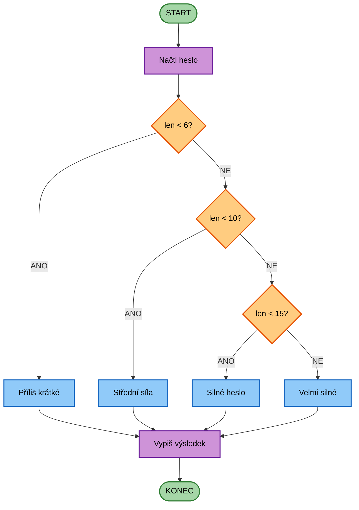

# CVIČENÍ 2: DATOVÉ TYPY TEXTOVÉ ŘETĚZCE

Algoritmizace a programování

## CÍL 5: PODMÍNKY S ŘETĚZCI

### 5.1 Vnořené podmínky (if-elif-else)

Když máme více než 2 možnosti, použijeme `elif` (zkratka "else if"):

```python
password = input("Zadej heslo: ")

if len(password) < 6:
 result = "Příliš krátké (minimálně 6 znaků)"
elif len(password) < 10:
 result = "Střední síla"
elif len(password) < 15:
 result = "Silné heslo"
else:
 result = "Velmi silné heslo"

print(f"Hodnocení: {result}")
```

**Jak if-elif-else funguje:**

1. Python testuje podmínky **shora dolů**
2. Když najde **první pravdivou**, provede její blok a **skončí**
3. Pokud **žádná není pravdivá**, provede `else`

**Vývojový diagram:**



**Medicínský příklad - klasifikace BMI:**
```python
bmi = float(input("Zadej BMI: "))

if bmi < 18.5:
 category = "podváha"
 warning = "Doporučujeme zvýšit příjem kalorií"
elif bmi < 25:
 category = "normální váha"
 warning = "Vše v pořádku"
elif bmi < 30:
 category = "nadváha"
 warning = "Doporučujeme zvýšit pohybovou aktivitu"
else:
 category = "obezita"
 warning = "Konzultujte s lékařem"

print(f"Kategorie: {category}")
print(f"Doporučení: {warning}")
```

> **Pozor na pořadí!** Podmínky se testují shora dolů. Pokud dáš `elif bmi < 30` před `elif bmi < 25`, výsledek bude špatně!

---

