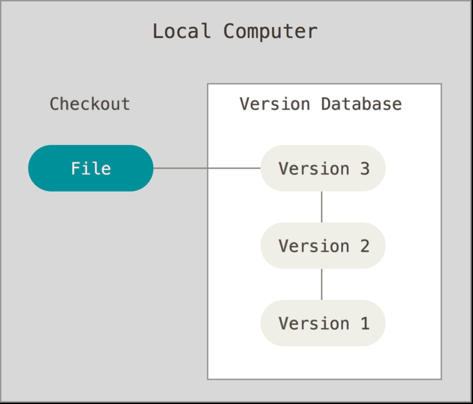
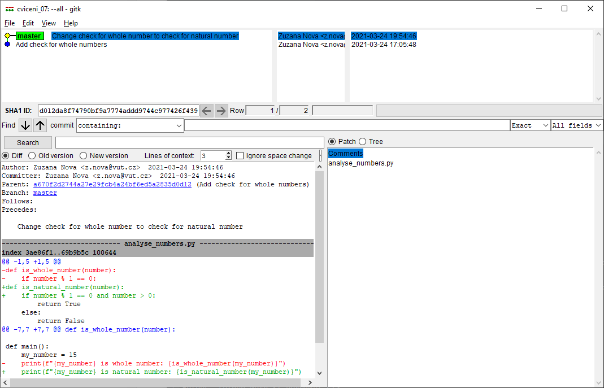

# CVIČENÍ 9: ZÁKLADY GIT A GITHUB

Algoritmizace a programování

## CÍL 1: ZÁKLADY PRÁCE S GIT

Git je verzovací nástroj – zaznamenává změny prováděné v souborech v průběhu času a umožňuje kdykoli obnovit jejich konkrétní verzi.

Lokální úložiště je na tvém počítači. Lokální verzovací systém uchovává v databázi sadu verzí každého spravovaného souboru – takže se můžeš kdykoli vrátit k jakékoli předchozí verzi.



---

### 1.1 Tři stavy souborů v Gitu

Git používá pro spravované soubory tři základní stavy:

- **změněno (modified)** – v souboru byly provedeny změny, ale ještě nebyl zapsán do databáze,
- **připraveno k zapsání (staged)** – změněný soubor v jeho aktuální verzi je určen k zapsání do další verze,
- **zapsáno (committed)** – data jsou bezpečně uložena v lokální databázi.

Z toho vyplývá, že projekt je v systému Git rozdělen do tří částí:

- **pracovní adresář** (working directory),
- **oblast připravovaných změn** (staging area),
- **adresář systému Git** (Git directory).


Git se dá používat různými způsoby – k dispozici jsou nástroje příkazové řádky i grafická uživatelská rozhraní (např. **gitk**, **git gui** nebo přímo integrované v **PyCharmu**). Mezi nejznámější online platformy pro sdílení repozitářů patří:

- **GitHub** – nejrozšířenější platforma, kterou budeme používat
- **GitLab** – alternativa s CI/CD
- **BitBucket** – populární v komerčním prostředí

---

### 1.2 Globální nastavení

Předtím než začneš Git používat, musíš ho správně nastavit.

Na projektu většinou spolupracuje více lidí, proto každá změna musí mít svého autora. Nastav jméno a email (změň na své):

```bash
git config --global user.name "Zuzana Nova"
git config --global user.email z.nova@vut.cz
```

Moderní Git používá jako výchozí název hlavní větve `main` (starší verze používaly `master`). Zajisti si to:

```bash
git config --global init.defaultBranch main
```

Po zadání příkazů `git config` to vypadá, že se nic nestalo – nic nového se do příkazové řádky nevypíše, ale to je v pořádku. Aktuální nastavení zkontroluj příkazem:

```bash
git config --global --list
```

```
user.name=Zuzana Nova
user.email=z.nova@vut.cz
init.defaultbranch=main
```

Pokud chceš nějaké nastavení změnit, zadej znovu příkaz s novými hodnotami. Pokud konfigurace v jakémkoliv kroku neproběhla, ihned se obrať na cvičícího.

---

### 1.3 Založení repozitáře

Vytvoř si složku pro dnešní cvičení a pomocí příkazové řádky se do ní přepni (pomocí `cd`). Následně v ní založ gitový repozitář:

```bash
git init
```

```
Initialized empty Git repository in ./.git/
```

Repozitář je zatím prázdný. Ověř to příkazem `git status`:

```bash
git status
```

```
On branch main

No commits yet

nothing to commit (create/copy files and use "git add" to track)
```

Výpis říká, že jsi na hlavní větvi `main`. „No commits yet" znamená, že v Gitu zatím není žádná revize, a „nothing to commit" říká, že ve složce není nic ke sledování.

> **💡 Poznámka:**
> Git při inicializaci vytváří skrytou složku `.git` a ukládá do ní své informace. Do této složky **nikdy nezasahuj** – nebudeme ji přesouvat ani mazat.

---

### 1.4 Soubor `.gitignore`

Ne všechny soubory v projektu chceš sledovat Gitem. Některé vznikají automaticky a do repozitáře nepatří – například složka `.venv/` (virtuální prostředí), `__pycache__/` (cache Pythonu) nebo `.idea/` (nastavení PyCharmu).

Vytvoř v kořenovém adresáři projektu soubor `.gitignore` (pozor, název **začíná tečkou**) a vlož do něj:

```
.venv/
__pycache__/
.idea/
```

Git bude tyto soubory a složky úplně ignorovat a nebude je nabízet k přidání.

> **💡 Tip:**
> Soubor `.gitignore` sám přidej do Gitu (`git add .gitignore`) – díky tomu ho budou mít i spolupracovníci, pokud si repozitář naklonují.

---

### 1.5 První revize

**📝 ÚKOL 1: Vytvoření souboru a první revize**

1. Vytvoř soubor `analyse_numbers.py`. Při vytváření souboru v PyCharmu se program zeptá, zda chceš přidat soubor do Gitu. Hlášku prozatím nepotvrzuj a přidání do Gitu zruš pomocí **Cancel**.
2. Vytvoř funkci `is_whole_number()` se vstupním parametrem `number`. Tato funkce ověří, jestli je hodnota v proměnné `number` celé číslo. Výstupem bude `True`, pokud je číslo celé, a `False`, pokud celé není.
3. Doplň kód definující hlavní funkci `main()` bez vstupních parametrů.
4. V hlavní funkci vytvoř proměnnou `my_number`, ke které přiřaď libovolnou číselnou hodnotu.
5. Funkci `is_whole_number()` zavolej se vstupním argumentem `my_number` a výsledek vypiš do terminálu.

Po dokončení úkolu zadej do příkazové řádky příkaz `git status` a všimni si, co se změnilo:

```bash
git status
```

```
On branch main

No commits yet

Untracked files:
  (use "git add <file>..." to include in what will be committed)
          analyse_numbers.py

nothing added to commit but untracked files present (use "git add" to track)
```

Git nyní hlásí, že registruje soubor `analyse_numbers.py`, který ale zatím **nesleduje**. Soubor svítí v příkazové řádce červeně, stejně jako v PyCharmu.

Každý soubor, který chceš pomocí Gitu sledovat, musíš do Gitu nejprve **přidat**. PyCharm to nabízel automaticky, ale je nutné to umět i bez jeho pomoci. Soubor přidáš manuálně:

```bash
git add analyse_numbers.py
```

Výsledek ověř:

```bash
git status
```

```
On branch main

No commits yet

Changes to be committed:
  (use "git rm --cached <file>..." to unstage)
        new file:   analyse_numbers.py
```

Soubor nyní zezelenal a změny se přesunuly do části **Stage**. Tady najdeš změny, které budou přidány do nové **revize** (**commit**).

Vytvoř novou revizi:

```bash
git commit
```

Po zadání tohoto příkazu se otevře editor (Notepad), do kterého napíšeš popisek k revizi, abys věděl/a, jaké změny byly provedeny. Na první řádek napiš např.: `Add check for whole numbers`. Ostatní řádky začínající `#` můžeš ignorovat. Soubor **ulož** (nepoužívej „Uložit jako") a **zavři**.

Další možnost, jak zadat popis revize:

```bash
git commit -m "Add check for whole numbers"
```

V příkazové řádce se vypíše krátká informace o provedené revizi:

```
[main (root-commit) a670f2d] Add check for whole numbers
 1 file changed, 14 insertions(+)
 create mode 100644 analyse_numbers.py
```

Zkontroluj stav repozitáře:

```bash
git status
```

```
On branch main
nothing to commit, working tree clean
```

Git žádné změny nevidí – ty jsou již uloženy v revizi. V PyCharmu soubor `analyse_numbers.py` již není barevně zvýrazněn.

Detailní informace o poslední revizi získáš příkazem `git show`:

```bash
git show
```

```
commit a670f2d2744a27e29fcb4a24bf6ed5a2835d0d12 (HEAD -> main)
Author: Zuzana Nova <z.nova@vut.cz>
Date:   Wed Mar 24 17:05:48 2021 +0100

    Add check for whole numbers

diff --git a/analyse_numbers.py b/analyse_numbers.py
new file mode 100644
index 0000000..3ae86f1
--- /dev/null
+++ b/analyse_numbers.py
@@ -0,0 +1,14 @@
+def is_whole_number(number):
+    if number % 1 == 0:
+        return True
+    else:
+        return False
+
+
+def main():
+    my_number = 15
+    print(f"{my_number} is whole number: {is_whole_number(my_number)}")
+
+
+if __name__ == "__main__":
+    main()
```

Nahoře vidíš unikátní označení revize (hash), díky kterému se můžeš v budoucnu k revizi vrátit. Následuje jméno autora, datum, popis a shrnutí změn. Ve výpisu se pohybuj šipkami nebo `PgUp`/`PgDn` a ukonči klávesou `q`.

---

### 1.6 Druhá revize

**📝 ÚKOL 2: Úprava funkce a nová revize**

1. Změň funkci `is_whole_number()` – nepotřebuješ ověřovat celé číslo, ale **přirozené číslo**.
2. Uprav název funkce (např. na `is_natural_number()`).
3. Uprav část ověřující vlastnosti čísla.
4. Nezapomeň upravit volání funkce v `main()`.
5. Po úpravě zkontroluj stav repozitáře příkazem `git status`.

```bash
git status
```

```
On branch main
Changes not staged for commit:
  (use "git add <file>..." to update what will be committed)
  (use "git restore <file>..." to discard changes in working directory)

        modified:   analyse_numbers.py

no changes added to commit (use "git add" and/or "git commit -a")
```

Git zjistil, že se soubor změnil – ve výpisu opět zčervenal. V PyCharmu se změní barva názvu souboru na modrou a vedle čísel řádků se objeví barevný sloupec: zelená = nový řádek, modrá = změněný řádek, šedá šipka = smazaný řádek. Kliknutím na ně uvidíš původní kód.

Co se přesně změnilo zjistíš příkazem `git diff`:

```bash
git diff
```

```diff
diff --git a/analyse_numbers.py b/analyse_numbers.py
index 3ae86f1..69b9b5c 100644
--- a/analyse_numbers.py
+++ b/analyse_numbers.py
@@ -1,5 +1,5 @@
-def is_whole_number(number):
-    if number % 1 == 0:
+def is_natural_number(number):
+    if number % 1 == 0 and number > 0:
         return True
     else:
         return False
@@ -7,7 +7,7 @@ def is_whole_number(number):
 def main():
     my_number = 15
-    print(f"{my_number} is whole number: {is_whole_number(my_number)}")
+    print(f"{my_number} is natural number: {is_natural_number(my_number)}")
```

Červené řádky s `-` byly odebrány, zelené s `+` přibyly. I když v řádku změníš jediné slovo, Git ho ukáže jako smazaný a znova přidaný. Řádky s `@@` říkají, kde v souboru proběhla změna.

Tento příkaz se hodí pokaždé, když ti během úprav přestane část programu fungovat – díky němu vidíš, co jsi změnil/a, a chyba musí být na některém z těchto řádků.

Pokud jsou úpravy hotové, připrav je pro další revizi:

```bash
git add analyse_numbers.py
```

Zkontroluj stav:

```bash
git status
```

```
On branch main
Changes to be committed:
  (use "git restore --staged <file>..." to unstage)

          modified:   analyse_numbers.py
```

Vytvoř novou revizi a zkontroluj pomocí `git show`:

```bash
git commit -m "Change check for whole number to check for natural number"
```

```
commit d012da8f74790bf9a7774addd9744c977426f439 (HEAD -> main)
Author: Zuzana Nova <z.nova@vut.cz>
Date:   Wed Mar 24 19:54:46 2021 +0100

    Change check for whole number to check for natural number
...
```

> **💡 Tip: Jak psát zprávy k revizím**
>
> Na prvním řádku shrň změny ideálně v **jedné větě do 50 znaků**. Piš v činném rodě, začni velkým písmenem a neukončuj tečkou, např.:
>
> `Fix typo in introduction to user guide`
>
> Tyto jednořádkové popisky slouží k orientaci v historii a využívají je nástroje spojené s Gitem. Pokud nejsi schopen/schopna shrnout změny na jednom řádku, pravděpodobně jsou příliš rozsáhlé a bylo by lepší je rozdělit do několika menších revizí.
>
> Pokud potřebuješ změny popsat podrobněji, odděl první řádek jedním prázdným řádkem a změny popiš. Vysvětli **co** a **proč** jsi měnil/a, nepopisuj jak. Řádky by neměly přesáhnout 72 znaků.

---

### 1.7 Procházení historie

Revizí bude postupně přibývat a bude se hodit je umět procházet. Jedním ze způsobů je `git log`, který vypíše všechny revize od nejnovější:

```bash
git log
```

```
commit d012da8f74790bf9a7774addd9744c977426f439 (HEAD -> main)
Author: Zuzana Nova <z.nova@vut.cz>
Date:   Wed Mar 24 19:54:46 2021 +0100

    Change check for whole number to check for natural number

commit a670f2d2744a27e29fcb4a24bf6ed5a2835d0d12
Author: Zuzana Nova <z.nova@vut.cz>
Date:   Wed Mar 24 17:05:48 2021 +0100

    Add check for whole numbers
```

V logu se pohybuj šipkami nebo `PgUp`/`PgDn` a ukonči klávesou `q`.

Pro kompaktnější přehled použij:

```bash
git log --oneline
```

```
d012da8 (HEAD -> main) Change check for whole number to check for natural number
a670f2d Add check for whole numbers
```

Pro orientaci v historii se hodí i grafické rozhraní **gitk**. Spusť příkaz `gitk --all` a prohlédni si svou dosavadní historii:

```bash
gitk --all
```



> **💡 Tip:**
> Pokud program `gitk` necháš otevřený, nové změny se v něm projeví až po obnovení: menu *File → Update* nebo klávesa `F5`.

**📝 ÚKOL 3: Přidání funkce pro sudá čísla**

1. Do souboru `analyse_numbers.py` přidej funkci `is_even_number()`. Vstupním parametrem bude číslo (`number`). Výstupem bude `True`, pokud je číslo sudé, a `False`, pokud sudé není.
2. Volání funkce přidej do hlavní funkce `main()` a výstup vypiš do terminálu.
3. Vytvoř novou revizi a výsledek si zkontroluj přes `gitk --all`.

---

### 1.8 Grafické rozhraní `git gui`

Git disponuje také grafickým rozhraním, které nahrazuje příkazy v příkazové řádce. Oba přístupy se dají velmi dobře kombinovat. Rozhraní otevřeš příkazem:

```bash
git gui
```


V `git gui` můžeš snadno provést celý workflow:

1. **Add** – kliknutím na ikony souborů je přesuneš do *Staged Changes* (nebo tlačítkem *Stage Changed* přesuneš všechny).
2. **Commit** – vlož commit message a klikni na *Commit*.
3. **Push** – tlačítkem *Push* nahraješ revize na vzdálený repozitář.

Zároveň vidíš zobrazení aktuálních změn v souborech. Změny se automaticky nezobrazí – rozhraní aktualizuješ tlačítkem *Rescan*.

> **💡 Tip:**
> `git gui` je alternativou příkazů v příkazové řádce. Klidně oba přístupy kombinuj – v praxi se to hodí.

---

### 1.9 Git v PyCharmu

Příkazová řádka a `gitk`/`git gui` jsou základ, ale **PyCharm** (a podobné editory jako VS Code) nabízí pohodlný grafický přístup ke Gitu přímo v editoru:

- Záložka **Git** dole ukazuje historii a větve – podobně jako `gitk`.
- Změněné soubory vidíš barevně: červená = nesledovaný, modrá = změněný, zelená = nový.
- **Commit** provedeš přes `Ctrl+K` (nebo menu *Git → Commit*).
- **Push** provedeš přes `Ctrl+Shift+K`.
- Kliknutím na barevné značky vedle čísel řádků vidíš diff přímo v editoru.

> **💡 Tip:**
> I když používáš grafické rozhraní, je důležité rozumět příkazům – pomůže ti to, když se něco pokazí nebo když potřebuješ vyřešit složitější situaci (např. konflikt).
