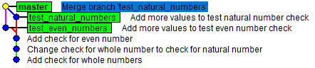

# CVIČENÍ 9: ZÁKLADY GIT A GITHUB

Algoritmizace a programování

## CÍL 2: VĚTVENÍ V GITU

Během práce na programu budeš občas současně pracovat na několika dílčích částech a přijde čas, kdy budeš chtít tyto změny sloučit dohromady. Stejně tak se může stát, že během řešení své části zjistíš, že potřebuješ opravit chybu v hlavním programu a pak se vrátit ke své původní práci. Proto se naučíme v Gitu používat **větve** (**branches**).

Představ si to jako pařez stromu – z hlavního kmene (`main`) vyrostou větve pro různé úkoly. Každá větev má svou vlastní historii změn, ale nakonec ji můžeš sloučit zpátky do kmene.

---

### 2.1 Vytvoření nových větví

V repozitáři už jednu větev využíváme. Výpis větví získáš příkazem `git branch`:

```bash
git branch
```

```
* main
```

Zatím máme jen jednu větev `main` – **hlavní větev**.

Vytvoř novou větev pro testování funkce `is_natural_number()`:

```bash
git branch test_natural_numbers
```

```bash
git branch
```

```
* main
  test_natural_numbers
```

Příkaz vytvořil novou větev, ale hvězdička říká, že jsi pořád na větvi `main`. Do nové větve se přepneš příkazem:

```bash
git switch test_natural_numbers
```

```bash
git branch
```

```
  main
* test_natural_numbers
```

> **💡 Tip:**
> Vytvoření větve a přepnutí můžeš udělat najednou: `git switch -c nazev_vetve` (zkratka za **c**reate).

**📝 ÚKOL 4: Testování na větvi `test_natural_numbers`**

1. Otestuj funkčnost funkce `is_natural_number()`.
2. Změň proměnnou `my_number` na `my_numbers` – bude obsahovat **seznam** několika čísel.
3. V cyklu procházej jednotlivé prvky seznamu a vypisuj výsledky pro funkci `is_natural_number()`.
4. Pokud jsou výstupní hodnoty správné, z aktuálního stavu souboru vytvoř novou revizi.
5. Stav zkontroluj pomocí `gitk --all`.


Aktuální větev je zvýrazněná tučně a starší větev `main` je stále na původní revizi.

---

### 2.2 Práce s více větvemi

Vrať se na hlavní větev `main` a vytvoř na ní novou větev `test_even_numbers`:

```bash
git switch main
git switch -c test_even_numbers
```

```bash
git branch
```

```
  main
* test_even_numbers
  test_natural_numbers
```

**📝 ÚKOL 5: Testování na větvi `test_even_numbers`**

1. Do souboru doplň totéž jako při testování přirozených čísel – v seznamu `my_numbers` zvol **jiné hodnoty**.
2. Vytvoř novou revizi a zkontroluj pomocí `gitk --all`.


> **⚠️ Pozor:**
> Vždy před přepnutím na jinou větev vytvoř novou revizi a pomocí `git status` ověř, že je vše uložené.

Takto se lze přepínat mezi různými větvemi. Obdobně probíhá i práce v týmu – společný základ reprezentuje hlavní větev `main` a každý pracuje na své větvi, dokud není práce hotová.

---

### 2.3 Sloučení větví

Pokud máš některou větev hotovou, budeš potřebovat změny z ní začlenit do větve `main`. Přepni se zpět na `main` a proveď sloučení:

```bash
git switch main
git merge test_even_numbers
```

```
Updating b78c08d..84c17f8
Fast-forward
 analyse_numbers.py | 5 +++--
 1 file changed, 3 insertions(+), 2 deletions(-)
```

Větve byly sloučeny. **Fast-forward** znamená, že se pouze přidaly nové změny do větve `main` a nic se neslučovalo. Výsledek zkontroluj pomocí `gitk --all` – větev `main` se posunula na poslední revizi z této větve.


---

### 2.4 Řešení konfliktů

Nyní sloučíme i druhou větev `test_natural_numbers`:

```bash
git merge test_natural_numbers
```

```
Auto-merging analyse_numbers.py
CONFLICT (content): Merge conflict in analyse_numbers.py
Automatic merge failed; fix conflicts and then commit the result.
```

Git nedokáže větve sloučit automaticky, protože v obou větvích došlo ke změnám na **stejných řádcích** a Git neví, kterou verzi vybrat. Finální rozhodnutí nechává na tobě a na problematické místo upozorní.

V souboru se objeví značky označující konfliktní úsek:

```python
def main():
<<<<<<< HEAD
    my_numbers = [15, 10, -20]
    for my_number in my_numbers:
        print(f"{my_number} is even number: {is_even_number(my_number)}")
=======
    my_numbers = [15, -1, 2.5]
    for my_number in my_numbers:
        print(f"{my_number} is natural number: {is_natural_number(my_number)}")
>>>>>>> test_natural_numbers
```

> **📘 Co znamenají značky konfliktu?**
>
> - `<<<<<<< HEAD` – začátek tvé aktuální verze (větev, na které jsi)
> - `=======` – oddělovač mezi verzemi
> - `>>>>>>> test_natural_numbers` – konec verze z druhé větve

Soubor uprav podle svých představ – smaž části kódu, které nechceš, případně kód uprav tak, aby fungoval, a **smaž všechny značky** (`<<<`, `===`, `>>>`):

```python
def main():
    my_numbers = [15, 10, -20, 2.5]
    for my_number in my_numbers:
        print(f"{my_number} is even number: {is_even_number(my_number)}")
        print(f"{my_number} is natural number: {is_natural_number(my_number)}")
```

Pomocí `git add` a `git commit` vytvoř revizi s řešením konfliktu. Ke každé **slučovací revizi** (**merge commit**) můžeš přidat popisek. Výsledek ověř pomocí `gitk --all`:



---

### 2.5 Smazání nepotřebných větví

Po sloučení změn již staré větve nepotřebuješ – veškeré změny jsou v hlavní větvi `main`. Vymaž je:

```bash
git branch -d test_natural_numbers
```

```
Deleted branch test_natural_numbers (was a8321a3).
```

```bash
git branch -d test_even_numbers
```

```
Deleted branch test_even_numbers (was 84c17f8).
```
