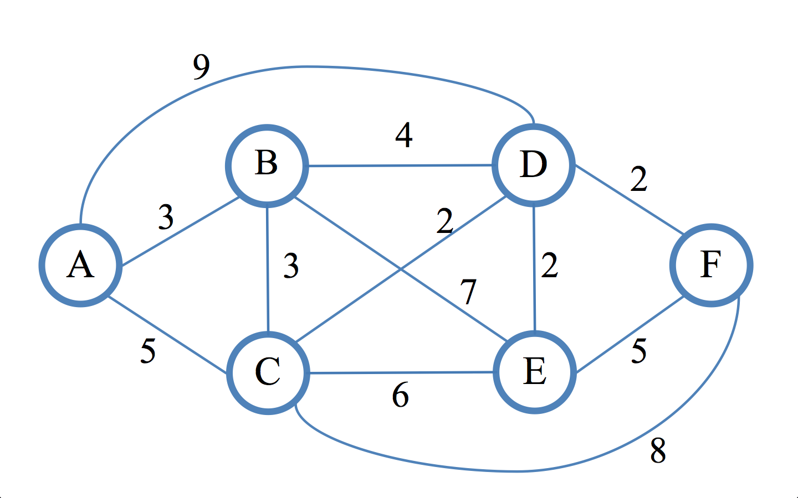
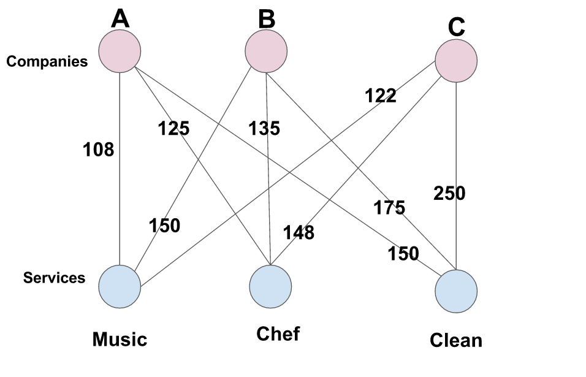
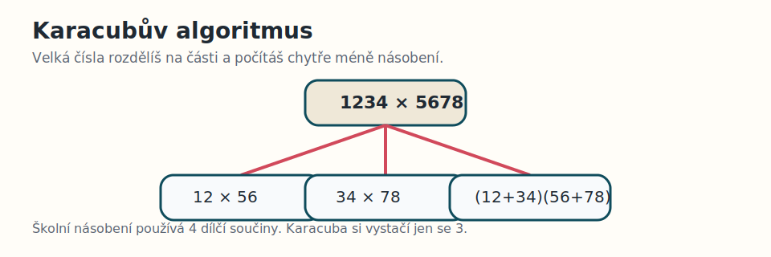

# CVIČENÍ 9: ALGORITMY VYHLEDÁVÁNÍ

Algoritmizace a programování

## CÍL 5: TEORETICKY ZAJÍMAVÉ ALGORITMY

V předchozích cílech ses soustředil hlavně na algoritmy, které si umíš relativně snadno představit i implementovat. 
Existuje ale spousta dalších algoritmů, které jsou teoreticky velmi zajímavé a v informatice hrají důležitou roli.

V tomhle cíli si některé z nich jen stručně představíš. Nejde o to, abys je teď uměl implementovat do detailu, 
ale aby sis odnesl přehled, jaké typy problémů řeší a čím jsou algoritmicky zajímavé.

> **Poznámka:** Tenhle cíl je záměrně víc přehledový a teoretický. Ber ho jako rozšíření obzorů, ne jako něco, 
> co musíš hned celé umět naprogramovat zpaměti.

### 5.1 Dijkstrův algoritmus

Dijkstrův algoritmus řeší problém **nejkratší cesty v grafu**. Máš uzly a spojení mezi nimi, přičemž každé spojení má
nějakou cenu, délku nebo čas.

Právě tohle ohodnocení hran je důležité: nehledáš cestu s nejmenším počtem kroků, ale cestu s nejmenším součtem vah.
Na obrázku tedy čísla u hran neříkají pořadí průchodu, ale cenu jednotlivých přesunů. Nejkratší cesta vznikne tak, 
že se tyto hodnoty sčítají. V tomhle konkrétním obrázku si to můžeš představit třeba jako hledání nejkratší cesty z uzlu
`A` do uzlu `F`.

Grafická představa:

Typické použití:

- hledání nejkratší trasy v mapě,
- hledání cesty v počítačové síti.

Jak to algoritmus dělá:

Na obrázku vidíš graf s ohodnocenými hranami. Algoritmus si u uzlů průběžně zapisuje nejlepší zatím známou cenu od startu. 
Pak vždy vezme uzel s nejnižší známou cenou a zkusí přes něj zlevnit cesty k dalším sousedům.

> **📘 Složitost:**
>
> - hrubá síla, kdy bys zkoušel mnoho možných cest: přibližně exponenciálně, zjednodušeně třeba $O(2^V)$
> - jednoduchá varianta bez prioritní fronty: přibližně $O(V^2)$
> - efektivnější varianta s prioritní frontou: přibližně $O((V + E) \log V)$

### 5.2 Maďarský algoritmus

Maďarský algoritmus, často označovaný jako Hungarian algorithm, řeší **přiřazovací problém**. Máš třeba několik lidí
a několik úloh a chceš najít přiřazení s nejmenší celkovou cenou.

Grafická představa:

Typické použití:

- přiřazení firem k nabízeným službám,
- přiřazení pracovníků ke konkrétním úlohám.

Jak to algoritmus dělá:

Na obrázku vidíš `Companies (A, B, C)` a `Services (Music, Chef, Clean)`. Smysl je v tom, že chceš každé firmě přiřadit
právě jednu službu a zároveň každou službu použít právě jednou tak, aby celkový součet cen byl co nejmenší. 
Algoritmus si matici postupně upravuje tak, aby se takové optimální párování dalo najít bez zkoušení všech kombinací.

> **📘 Složitost:**
>
> - hrubá síla: přibližně $O(n!)$
> - maďarský algoritmus: přibližně $O(n^3)$

### 5.3 FFT

FFT je zkratka pro Fast Fourier Transform, tedy rychlou Fourierovu transformaci. Používá se tam, kde tě nezajímá 
jen pořadí hodnot v čase, ale i to, **z jakých frekvencí se signál skládá**.

Typické použití:

- zpracování zvuku,
- analýza EKG nebo EEG signálů.

Jak to algoritmus dělá:

Velký výpočet rozdělí na menší části, které se dají spočítat zvlášť a potom znovu složit dohromady. Díky tomu se výpočet
frekvencí výrazně zrychlí.

> **📘 Složitost:**
>
> - přímý výpočet DFT: přibližně $O(n^2)$
> - FFT: přibližně $O(n \log n)$

### 5.4 Karacubův algoritmus

Karacubův algoritmus, často uváděný jako Karatsuba algorithm, je rychlejší metoda pro **násobení velkých čísel**.

Grafická představa:

Běžné školní násobení má kvadratickou složitost. Karacubův algoritmus čísla rozdělí na části a sníží počet potřebných
násobení.

Jak to algoritmus dělá:

Velká čísla rozdělí na horní a dolní polovinu. Pak z nich nespočítá všechny dílčí součiny zvlášť, ale chytře
je zkombinuje tak, aby mu stačilo méně násobení než u školního postupu.

Typické použití:

- kryptografie,
- výpočty s velmi velkými čísly.

> **📘 Složitost:**
>
> - školní násobení: přibližně $O(n^2)$
> - Karacubův algoritmus: přibližně $O(n^{1.585})$

### 5.5 Co si z toho odnést

I když jsou tyto algoritmy dost odlišné, mají něco společného:

- každý řeší jiný typ problému,
- každý vznikl proto, že naivní řešení bylo příliš pomalé nebo nepraktické,
- u všech je důležité přemýšlet o tom, jak rychle roste počet operací s velikostí vstupu.

Právě to je hlavní důvod, proč se asymptotickou složitostí zabýváme. Nepomáhá jen u vyhledávání v seznamu, 
ale i u trasování, přiřazování, zpracování signálů nebo násobení velkých čísel.

> **Tip:** Pokud tě některý z těchto algoritmů zaujal, zkus si dohledat jednoduchou vizualizaci nebo animaci.
> U těchto témat často pomůže obrázek nebo krokové vysvětlení víc než samotný vzorec.

---