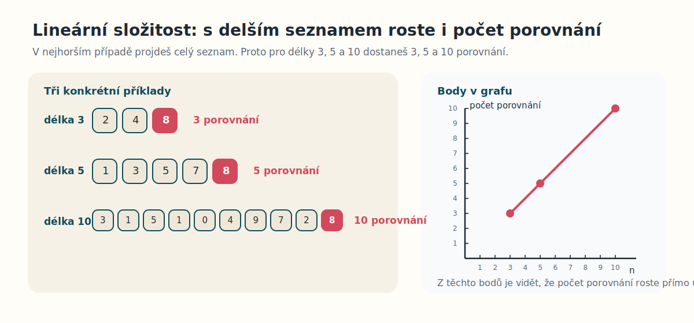
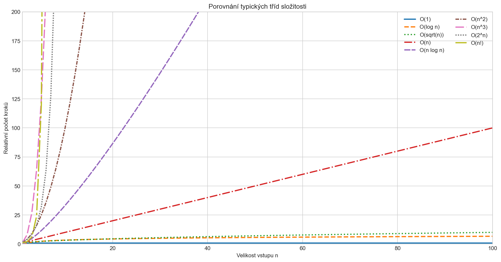

# CVIČENÍ 10: ALGORITMY VYHLEDÁVÁNÍ

Algoritmizace a programování

## CÍL 1: ANALÝZA ASYMPTOTICKÉ SLOŽITOSTI

### ANALÝZA ASYMPTOTICKÉ SLOŽITOSTI

Než začneš porovnávat konkrétní algoritmy, je potřeba rozumět tomu, **co vlastně porovnáváš**. U algoritmů nás často zajímá, jak rychle roste jejich náročnost s velikostí vstupních dat.

Když máš seznam o 10 prvcích, skoro každý algoritmus bude působit rychle. Rozdíly se začnou výrazně projevovat až tehdy, když má seznam 1 000, 10 000 nebo 1 000 000 prvků.

Právě proto se používá **asymptotická složitost**. Ta neřeší přesný čas v sekundách na konkrétním počítači, ale popisuje, jak se bude algoritmus chovat, když poroste velikost vstupu.

### 1.1 Co znamená velikost vstupu

Velikost vstupu se obvykle značí jako $n$.

V různých úlohách může $n$ znamenat něco jiného:

- počet prvků v seznamu,
- délku textového řetězce,
- počet řádků v souboru,
- počet pacientských záznamů v tabulce.

Pokud tedy řekneš, že algoritmus má složitost $O(n)$, znamená to, že jeho náročnost roste přibližně lineárně s velikostí vstupu.

### 1.2 Proč nestačí měřit jen čas v sekundách

Přímé měření času je užitečné, ale samo o sobě nestačí. Výsledek totiž ovlivňuje:

- výkon počítače,
- další spuštěné procesy,
- konkrétní implementace v Pythonu,
- velikost a typ vstupních dat.

Asymptotická složitost je oproti tomu obecnější. Neříká ti, že program poběží třeba přesně `0.24 s`, ale pomáhá ti pochopit, jak rychle poroste jeho náročnost při větších a větších datech.

> **📘 Co je asymptotická složitost?**
>
> Asymptotická složitost popisuje, jak se mění počet operací algoritmu v závislosti na velikosti vstupu.
>
> Neřeší přesný čas běhu, ale **trend růstu**.

Podobně můžeš analyzovat i **paměťovou náročnost**, tedy kolik paměti algoritmus potřebuje navíc při zpracování dat. Postupuje se velmi podobně jako u časové složitosti, ale v tomhle cvičení se budeme soustředit hlavně na **časovou náročnost**, protože je pro vyhledávací algoritmy teď důležitější.

### 1.3 Intuice na jednoduchých příkladech

Nejprve si ukážeme několik typických situací.

**Příklad 1: Jediný průchod seznamem**

```python
def print_temperatures(temperatures):
	for temperature in temperatures:
		print(temperature)
```

Tahle funkce projde každý prvek právě jednou. Pokud se seznam zdvojnásobí, přibližně se zdvojnásobí i počet kroků.

Složitost je tedy přibližně $O(n)$.

**Příklad 2: Dva vnořené cykly**

```python
def compare_all_pairs(values):
	for left in values:
		for right in values:
			print(left, right)
```

Tady se pro každý prvek znovu prochází celý seznam. Když má seznam $n$ prvků, počet kombinací je přibližně $n \cdot n = n^2$.

Složitost je tedy $O(n^2)$.

**Příklad 3: Postupné půlení problému**

```python
def halve_until_one(value_count):
	while value_count > 1:
		value_count = value_count // 2
```

Pokud v každém kroku zmenšíš problém na polovinu, počet kroků roste mnohem pomaleji než u lineárního průchodu.

Takové chování odpovídá složitosti $O(\log n)$.

### 1.3.1 Grafická intuice

Ještě intuitivněji si to můžeš představit na lineárním vyhledávání, kde musíš postupně procházet prvky, dokud nenarazíš na hledanou hodnotu.

**Lineární složitost $O(n)$**

Tady naopak nevíš, kde se hledaná hodnota nachází. Musíš proto kontrolovat prvky jeden po druhém, takže s rostoucí velikostí seznamu roste i počet potřebných porovnání.

Když si vezmeš třeba seznamy délky $3$, $5$ a $10$, pak v nejhorším případě uděláš právě $3$, $5$ a $10$ porovnání. Do grafu tedy zakreslíš body $(3, 3)$, $(5, 5)$ a $(10, 10)$ a z nich je dobře vidět přímka, tedy lineární růst.



### 1.5 Nejlepší, průměrný a nejhorší scénář

U jednoho algoritmu můžeš často rozlišovat více případů:

- **nejlepší scénář** – co se stane, když máš štěstí,
- **průměrný scénář** – co se děje typicky,
- **nejhorší scénář** – co se stane v nejméně příznivém případě.

Například u sekvenčního vyhledávání:

- nejlepší scénář: hledaný prvek je hned na začátku,
- nejhorší scénář: hledaný prvek je na konci nebo tam vůbec není.

V tomhle cvičení nás bude nejčastěji zajímat právě **nejhorší scénář**, protože dává bezpečný horní odhad náročnosti algoritmu.

**Ukázka ze sekvenčního vyhledávání:**

Chceš zjistit, jestli v seznamu existuje číslo `8`.

- **Nejlepší scénář**: `8` je hned na začátku, takže algoritmus skončí skoro okamžitě.  
	<div style="font-size: 1.2em;">[<span style="color: #c62828; font-weight: 700;">8</span>, 3, 1, 5, 1, 0, 3, 2, 5, 6, 6, 4]</div>
- **Průměrný scénář**: `8` najdeš někde přibližně uprostřed, takže projdeš jen část seznamu.  
	<div style="font-size: 1.2em;">[3, 1, 5, 1, 0, 4, <span style="color: #c62828; font-weight: 700;">8</span>, 3, 2, 5, 6, 6, 4]</div>
- **Nejhorší scénář**: `8` je až úplně na konci, takže musíš projít skoro celý seznam.  
	<div style="font-size: 1.2em;">[3, 1, 5, 1, 0, 3, 2, 5, 6, 6, 4, <span style="color: #c62828; font-weight: 700;">8</span>]</div>

Právě na téhle jednoduché úloze je dobře vidět, proč je důležité říct nejen **jak složitost zapisuješ**, ale i **pro jaký scénář ji hodnotíš**.

Právě tady je důležité nezaměnit dvě různé věci:

- nejlepší / průměrný / nejhorší scénář říká, **jaký typ vstupu** zrovna hodnotíš,
- asymptotický zápis pak říká, **jakým způsobem popisuješ růst** pro tento scénář.

Teprve když máš jasno v tom, **o jakém scénáři mluvíš**, dává smysl zavádět značky jako $O$, $\Omega$ nebo $\Theta$.

### 1.6 Nejčastější zápisy

Odhad řádu růstu funkce $g(n)$ zkoumaného algoritmu lze provést řadou různých způsobů. Mezi základní řadíme například:

- $f(n) = O(g(n))$ – Big O notation  
	**Asymptotická horní mez** – algoritmus pro jakákoliv vstupní data asymptoticky nepřesáhne stanovenou funkci.

- $f(n) = \Omega(g(n))$ – Big Omega notation  
	**Asymptotická dolní mez** – algoritmus pro jakákoliv vstupní data asymptoticky nedosáhne lepší složitosti než je stanovená funkce.

- $f(n) = \Theta(g(n))$ – Big Theta notation  
	**Asymptotická těsná mez** – kde platí zároveň $O$ i $\Omega$.

Jednoduše si to můžeš představit takto:

- **Big O** říká, jak rychle algoritmus roste **maximálně**,
- **Big Omega** říká, jak rychle roste **alespoň**,
- **Big Theta** říká, že znáš jeho růst **přesněji**, tedy shora i zdola stejným řádem.

> **📘 Jak si to představit intuitivně?**
>
> - $O(n)$ je něco jako horní strop: algoritmus nebude růst hůř než lineárně.
> - $\Omega(n)$ je dolní podlaha: algoritmus nebude růst lépe než lineárně.
> - $\Theta(n)$ říká, že algoritmus roste skutečně lineárně, protože má lineární horní i dolní mez.

### 1.6.1 Proč se nejčastěji používá Big O

V praxi se v úvodních kurzech i v běžné programátorské komunikaci nejčastěji používá právě **Big O**. Důvody jsou hlavně tyto:

1. Je jednodušší ho určit i zdůvodnit.
2. Často nám stačí vědět, jak špatně může algoritmus růst v nejhorším případě.
3. Pro běžné porovnání algoritmů bývá horní odhad úplně dostačující.

Například když porovnáváš algoritmus s růstem $O(n)$ a algoritmus s růstem $O(n^2)$, už to samo o sobě většinou stačí k rozhodnutí, který z nich se bude lépe škálovat pro velká data.

Zápis **Big Theta** je přesnější, ale bývá náročnější na zdůvodnění, protože musíš ukázat nejen horní mez, ale i dolní mez růstu.

### 1.6.2 Souvisí to s nejlepším a nejhorším scénářem?

Ano, ale není to totéž.

Tohle je důležité: **nejlepší, průměrný a nejhorší scénář** a zápisy **$O$, $\Omega$, $\Theta$** nejsou dvě různá slova pro stejnou věc. Odpovídají na dvě různé otázky:

- nejlepší / průměrný / nejhorší scénář říká, **jaký typ vstupu** zrovna hodnotíš,
- $O$, $\Omega$, $\Theta$ říká, **jaký typ meze růstu** pro tento scénář popisuješ.

Například u sekvenčního vyhledávání může platit:

- v nejlepším scénáři je složitost $\Theta(1)$,
- v nejhorším scénáři je složitost $\Theta(n)$,
- a zároveň můžeš říct, že v nejhorším scénáři je také $O(n)$.

Takže:

- **Big O není automaticky totéž co nejhorší scénář**, i když se tak velmi často používá,
- **Big Omega není automaticky totéž co nejlepší scénář**, i když to může svádět,
- **Big Theta** se hodí tehdy, když chceš vyjádřit přesnější řád růstu.

Pro začátek si můžeš pamatovat jednoduché pravidlo:

> Nejlepší, průměrný a nejhorší scénář říká, **pro jaké vstupy algoritmus hodnotíš**.  
> Zápisy $O$, $\Omega$ a $\Theta$ pak říkají, **jakým způsobem ten růst popisuješ**.

### 1.6.3 Co znamená co nejtěsnější mez

Když zařazuješ funkci do tříd složitosti, často platí víc různých zápisů najednou. Důležité ale je najít takový zápis, který vystihuje růst co nejpřesněji.

Dobré je mít v hlavě orientační pořadí tříd růstu:

$$
1 < \log n < \sqrt{n} < n < n \log n < n^2 < n^3 < 2^n < n!
$$

Podívej se na jednoduchý příklad:

- $25n + 3$ je pravda, že patří do $O(n)$,
- zároveň ale také do $O(n^2)$ nebo třeba do $O(2^n)$,
- z pohledu dolní meze zároveň patří do $\Omega(1)$, $\Omega(\log n)$ i $\Omega(n)$,
- nejpřesnější zápis je ale $\Theta(n)$, protože pro tuto funkci umíš ukázat horní i dolní lineární mez.

Proto se v praxi říká, že hledáš **co nejtěsnější mez**. Pokud zapisuješ horní mez pomocí Big O, nechceš napsat jen něco, co je technicky pravda, ale něco, co růst popisuje rozumně přesně.

Správně tedy můžeš napsat třeba:

$$
25n + 3 \in O(n)
$$

V těchto materiálech budeme nejčastěji používat právě zápis $O(\cdot)$, ale budeme se snažit, aby šlo vždy o **nejmenší rozumnou horní mez**, ne o zbytečně volný odhad.

### 1.7 Typické třídy složitosti

S těmito typy složitosti se budeš setkávat nejčastěji. Jsou seřazené přibližně od nejpříznivějších po nejméně příznivé pro velké vstupy:

- $O(1)$ – **konstantní složitost**  
	Počet kroků se s velikostí vstupu prakticky nemění.
	Příklad: přístup k prvku seznamu podle indexu `values[0]`; vrácení prvního pacienta v seznamu.

- $O(\log n)$ – **logaritmická složitost**  
	V každém kroku zahodíš velkou část problému, typicky polovinu.
	Příklad: binární vyhledávání v seřazeném seznamu; opakované půlení intervalu.

- $O(\sqrt{n})$ – **odmocninová složitost**  
	Roste rychleji než logaritmus, ale pomaleji než lineární průchod.
	Příklad: testování dělitelů čísla jen do $\sqrt{n}$; některé jednodušší numerické nebo vyhledávací postupy, kde nemusíš projít celý vstup.

- $O(n)$ – **lineární složitost**  
	Počet kroků roste přímo úměrně velikosti vstupu.
	Příklad: průchod celým seznamem teplot; sekvenční vyhledávání v neseřazených datech.

- $O(n \log n)$ – **lineárně-logaritmická složitost**  
	Roste rychleji než $O(n)$, ale výrazně pomaleji než $O(n^2)$.
	Příklad: efektivní třídicí algoritmy jako mergesort nebo heapsort; třídění velkého seznamu měření.

- $O(n^2)$ – **kvadratická složitost**  
	Typicky vzniká při dvou vnořených cyklech nad stejnými daty.
	Příklad: porovnání všech dvojic pacientů; jednoduché třídění typu bubble sort.

- $O(n^3)$ – **kubická složitost**  
	Často vzniká při třech vnořených cyklech.
	Příklad: porovnání všech trojic hodnot; některé neoptimalizované algoritmy nad maticemi.

- $O(2^n)$ – **exponenciální složitost**  
	Počet kroků roste velmi rychle a už pro středně velká data bývá nepraktický.
	Příklad: zkoušení všech podmnožin; hrubá síla u některých kombinatorických úloh.

- $O(n!)$ – **faktoriální složitost**  
	Extrémně rychlý růst, použitelný jen pro velmi malé vstupy.
	Příklad: vyzkoušení všech pořadí prvků; brute-force řešení problému obchodního cestujícího.

Obecně platí, že čím rychleji daná funkce roste, tím hůř se algoritmus škáluje pro velké vstupy.

> **💡 Tip:** Rozdíl mezi $O(n)$ a $O(n^2)$ nemusí být u malých vstupů skoro vidět, ale u velkých dat bývá zásadní. U exponenciálních a faktoriálních algoritmů se problém projeví ještě mnohem dřív.

### 1.8 Jak rychle tyto složitosti rostou

Na obrázku níže vidíš orientační porovnání několika typických tříd složitosti v jednom společném grafu.



Co je na grafu důležité:

- u malých vstupů mohou rozdíly působit nenápadně,
- s rostoucím $n$ se ale začne výrazně projevovat, které funkce rostou pomalu a které naopak velmi rychle,
- exponenciální a faktoriální složitost se stávají nepraktickými už pro poměrně malé hodnoty $n$,
- lineární nebo logaritmické algoritmy zůstávají použitelné i pro mnohem větší vstupy,
- různé styly čar pomáhají odlišit jednotlivé křivky i tehdy, když si je prohlížíš bez barev,
- osa $y$ je záměrně omezená na rozumný rozsah, takže nejprudší části exponenciální a faktoriální křivky mohou být nahoře oříznuté ve prospěch čitelnosti.

> **💡 Poznámka:** Graf byl vygenerovaný jednoduchým skriptem `scripts/generate_complexity_growth_chart.py`. Pokud budeš chtít, můžeš si rozsah hodnot nebo zobrazované funkce snadno upravit a vykreslit znovu.

### 1.9 Ilustrační výpočetní časy

| Složitost | $n=10$ | $n=20$ | $n=50$ | $n=100$ | $n=1000$ | $n=10^6$ | $n=10^9$ |
| --- | ---: | ---: | ---: | ---: | ---: | ---: | ---: |
| $O(\log n)$ | 4 ns | 5 ns | 6 ns | 7 ns | 10 ns | 20 ns | 30 ns |
| $O(\sqrt{n})$ | 4 ns | 8 ns | 8 ns | 10 ns | 32 ns | 1 µs | 32 µs |
| $O(n)$ | 10 ns | 20 ns | 50 ns | 100 ns | 1 µs | 1 ms | 1 s |
| $O(n\log n)$ | 34 ns | 87 ns | 283 ns | 665 ns | 10 µs | 20 ms | 30 s |
| $O(n^2)$ | 100 ns | 400 ns | 3 µs | 10 µs | 1 ms | 16 min 40 s | 32 let |
| $O(n^3)$ | 1 µs | 8 µs | 125 µs | 1 ms | 1 s | 32 let | $3{,}17 \times 10^{10}$ let |
| $O(n^4)$ | 10 µs | 160 µs | 6 ms | 100 ms | 16 min 40 s | $3{,}17 \times 10^7$ let | $3{,}17 \times 10^{19}$ let |
| $O(2^n)$ | 1 µs | 1 ms | 13 dní | $4{,}0 \times 10^{12}$ let | hodně! | hodně! | hodně! |
| $O(3^n)$ | 59 µs | 4 s | $2{,}28 \times 10^7$ let | hodně! | hodně! | hodně! | hodně! |
| $O(n!)$ | 4 ms | 77 let | hodně! | hodně! | hodně! | hodně! | hodně! |
| $O(n^n)$ | 10 s | $3{,}32 \times 10^9$ let | hodně! | hodně! | hodně! | hodně! | hodně! |

Taková tabulka samozřejmě neříká, jak rychle poběží konkrétní Python skript na tvém počítači. Dobře ale ukazuje, proč se i zdánlivě „malý“ rozdíl ve složitosti může u větších vstupů projevit dramaticky.

### 1.10 Jak se zbavit zbytečných členů

Nejvíc nás bude zajímat odhad složitosti v nejhorším možném scénáři. V tom případě obvykle postupuješ tak, že:

1. zanedbáš členy funkce, které rostou pomaleji než dominantní člen,
2. zanedbáš konstanty.

Formálně si to můžeš představit takto: pokud se funkce skládá z více částí

$$
f(n) = f_1(n) + f_2(n) + f_3(n),
$$

pak nás asymptoticky zajímá ta část, která roste nejrychleji:

$$
O(f(n)) = \max\left(O(f_1(n)), O(f_2(n)), O(f_3(n))\right).
$$

Jinými slovy: pro velká $n$ rozhoduje **nejstrmější řád růstu funkce**.

Podobně se zachází i s konstantami. Pokud nějakou funkci jen násobíš konstantním číslem $c > 0$,

$$
f(n) = c \cdot g(n),
$$

tak se její asymptotická složitost nemění:

$$
O(c \cdot g(n)) = O(g(n)).
$$

Proč? Protože konstanta sice může algoritmus zrychlit nebo zpomalit třeba dvakrát, desetkrát nebo stokrát, ale **nemění samotný typ růstu**. Když se vstup zvětší třeba z $n$ na $2n$, pořád sleduješ stejný průběh, jen přepočítaný jiným pevným násobkem.

Jinými slovy: konstanty ovlivňují praktický čas běhu, ale neovlivňují to, **jak rychle složitost roste s velikostí vstupu**.

Podívej se na příklady:

- $5999 \rightarrow O(1)$
- $n / 2 \rightarrow O(n)$
- $5n + 3 \rightarrow O(n)$
- $2n^2 + 10n + 1 \rightarrow O(n^2)$
- $7 \log n + 20 \rightarrow O(\log n)$
- $n^3 + 5n^2 + 100n \rightarrow O(n^3)$
- $1000n + n^2 + 10n^3 \rightarrow O(n^3)$
- $2^n + n^4 \rightarrow O(2^n)$

Proč to funguje?

Protože u velkých vstupů začne převládat právě ten člen, který roste nejrychleji.

**Příklad:**

Pokud máš funkci $2n^2 + 10n + 1$, tak pro malé $n$ mohou být členy $10n$ a $1$ ještě vidět. Ale jakmile je $n$ velké, člen $n^2$ začne dominovat a ostatní členy už celkový růst skoro neovlivní.

Podobně u funkce $2^n + n^4$ bude pro opravdu velká $n$ dominantní člen $2^n$, protože exponenciální růst nakonec překoná libovolný polynom.

> **💡 Poznámka:** V praxi je kromě asymptotické složitosti potřeba zohlednit i další parametry. Někdy tak může být výhodnější použít algoritmus s horší asymptotickou složitostí:
>
> - **Složitá implementace**  
>   Algoritmy s lepší asymptotickou složitostí bývají často složitější a mohou výrazně zvýšit čas potřebný na implementaci.
>
> - **Malá velikost vstupních dat**  
>   U malé velikosti vstupních dat může vzrůst vliv konstant a výrazů nižšího řádu, které se v asymptotické složitosti zanedbávají. Algoritmus s vyšší asymptotickou složitostí tak může v praxi běžet rychleji než asymptoticky jednodušší algoritmus.
>
> - **Rozdíly mezi průměrným a nejhorším scénářem**  
>   V určitých situacích může být výhodnější algoritmus, který má horší asymptotickou složitost pro nejhorší scénář, ale relativně nízkou složitost průměrnou, třeba když víš, že nejhorší scénář nastává jen zřídka. Naopak v kritických aplikacích může být důležitější chování v nejhorším případě než průměrný výkon.

### 1.11 Co při odhadu vlastně počítáme

Když už víš, že nás v tomhle cvičení zajímá hlavně **nejhorší scénář**, můžeš se ptát ještě na jednu věc: co přesně v tom scénáři vlastně počítat.

Při analýze algoritmu obvykle nepočítáš každou drobnost úplně přesně, ale vybíráš si **základní operaci**, která dává pro danou úlohu smysl.

U vyhledávání to často bývá:

- počet porovnání,
- počet průchodů cyklem,
- počet kontrol podmínky.

Například u sekvenčního vyhledávání je přirozené počítat, kolikrát porovnáváš hledanou hodnotu s prvkem seznamu.

To ale neznamená, že se operace **nedají** počítat přesně. Dají. Jenže kdybys počítal úplně každou drobnost, třeba přiřazení do proměnné, posun indexu, kontrolu podmínky i samotné porovnání zvlášť, dostal bys velmi detailní zápis, který je pro základní odhad zbytečně složitý.

Proto se v asymptotické analýze obvykle vybere jedna **hlavní operace**, která nejlépe vystihuje náročnost dané úlohy. U vyhledávání je to často porovnání, protože právě ta většinou rozhodují o tom, jak dlouho bude algoritmus běžet.

Podívej se na jednoduchý příklad v nejhorším scénáři:

```python
def linear_search(values, target):
	for value in values:
		if value == target:
			return True
	return False
```

Když budeš počítat **základní operaci**, můžeš sledovat jen porovnání `value == target`:

$$
n \text{ porovnání v nejhorším scénáři} \rightarrow O(n)
$$

Když budeš naopak počítat skoro všechno, dostaneš třeba tento hrubý odhad:

- průchod cyklem: přibližně $n$,
- kontrola podmínky `if`: přibližně $n$,
- porovnání `value == target`: přibližně $n$,
- závěrečný `return False`: konstanta.

To můžeš zapsat třeba jako:

$$
3n + 1 \rightarrow O(n)
$$

Na tom je dobře vidět hlavní pointa:

- přesnější počítání ti dá detailnější funkci,
- výběr základní operace ti dá jednodušší funkci,
- v obou případech ale pro nejhorší scénář vyjde stejný asymptotický závěr: $O(n)$.

### 1.12 Krátké shrnutí

V tomhle cíli je důležité odnést si hlavně tyto myšlenky:

1. Asymptotická složitost popisuje růst náročnosti algoritmu s velikostí vstupu.
2. Neřeší přesný čas v sekundách, ale trend růstu.
3. Při analýze obvykle zanedbáváš konstanty a pomaleji rostoucí členy.
4. U vyhledávání často počítáš počet porovnání.
5. Pro další cíle budeš porovnávat hlavně lineární a logaritmické chování algoritmů.

---
