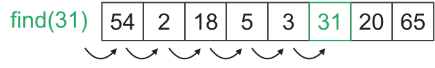
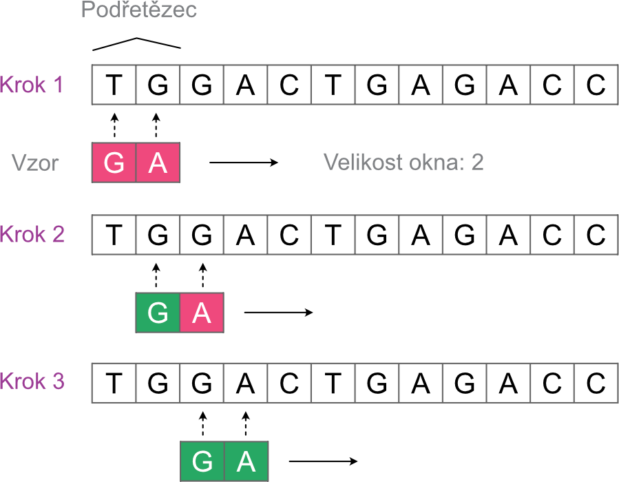
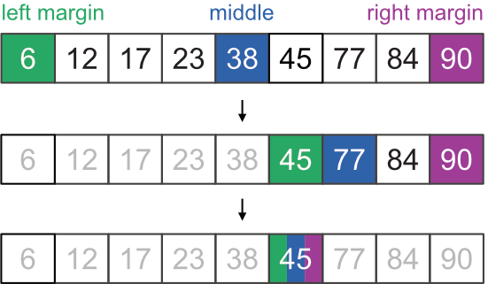

# CVIČENÍ 10: ALGORITMY VYHLEDÁVÁNÍ

Algoritmizace a programování

## CÍL 2: ALGORITMY VYHLEDÁVÁNÍ

V této sekci se seznámíme se základními algoritmy pro vyhledávání. Vyhledávání je jedna z nejčastějších úloh, které programátor musí řešit. Současně se s ním setkáváme takřka denně jako uživatelé. Znáte Google?:)

Vyhledávání ale nemusí znamenat jen to, že se snažíme nalézt prvek v nějaké databázi. Algoritmy vyhledávání řeší celou řadu užitečných úloh, např. kombinatorické nebo optimalizační úlohy:

- Plánovač tras či aktivit
- Nalezení nejkratší cesty
- Optimalizace průmyslových procesů
- Prolamování hesel
- Vyjádření podobnosti mezi objekty

U algoritmů vyhledávání (a obecně) platí, že **neexistuje** jeden univerzální algoritmus vhodný pro řešení všech problémů. Před implementací algoritmu nebo výběru již implementované metody bychom měli dobře zvážit situaci, kterou budeme řešit.

Mezi ty základní patří např.:

- Vyhledávání v neseřazené struktuře
- Vyhledávání v seřazené struktuře
- Vyhledáváme pouze jednou
- Vyhledáváme opakovaně ve stejné struktuře
- Vyhledáváme v rozsáhlé struktuře/nekonečném datovém streamu
- Vyhledáváme první výskyt
- Vyhledáváme poslední výskyt (četnost prvku)

#### 2.1 Než začneme…

Vyzkoušíme si práci s Gitem/GitHubem. Nejprve si soubory k dnešnímu cvičení přesuneme na individuální GitHub účet a poté naklonujeme do pracovního adresáře s dnešním cvičení.

**Adresa repozitáře**:

#### ÚKOL: Git a příprava repozitáře

1. Na vlastním GitHub účtu vytvoř kopii zdrojového repozitáře (`fork`).
2. Otevři v prohlížeči adresu zdrojového repozitáře.
3. Vpravo nahoře najdi tlačítko `Fork` a klikni na něj.
4. Naklonuj si repozitář ze svého GitHub účtu do složky s dnešním cvičením.

> **💡 Poznámka:** Podrobný postup viz cvičení 11, cíl 3.

---

#### 2.2 Sekvenční vyhledávání v neseřazeném seznamu

Mějme naše data uložena v iterovatelné datové struktuře (např. seznamu, kde pořadí každé hodnoty je dáno jejím indexem). Základní způsob nalezení konkrétní hodnoty pak spočívá jednoduše v tom, že postupně (v sekvenci) projdeme každý prvek seznamu, dokud nenalezneme naši hodnotu.

Pokud vyhledáváme v **neseřazeném** seznamu znamená to, že jednotlivé prvky byly do seznamu umístěny náhodně. Při každém porovnání s hledanou hodnotou může a nemusí dojít k nalezení prvku. Jinými slovy, v každé iteraci je (většinou) stejná pravděpodobnost, že nalezneme hledaný prvek.

V dnešním cvičení budeme pracovat s různými typy sekvencí, které jsou uloženy v souboru `.json`. Naším prvním úkolem bude prozkoumat obsah tohoto souboru a data poté načíst.

#### ÚKOL: Načtení dat ze souboru

1. V modulu `searching.py` doplň funkci `read_data()`.
2. Funkce bude mít dva vstupní parametry:
	- název souboru k načtení,
	- klíč specifický pro naše data.
3. Ověř, že zadaný klíč pochází z množiny povolených řešení v souboru `sequential.json`.
4. Pokud klíč není platný, vrať hodnotu `None`.
5. Pomocí modulu `json` načti `.json` soubor ve formě slovníku.
6. Vrať hodnoty uložené pod klíčem definovaným druhým vstupním parametrem (`field`).
7. Funkci `read_data()` zavolej z hlavní funkce se vstupním argumentem `sequential.json` a `unordered_numbers`.
8. Výstup funkce ulož do proměnné `sequential_data` a její obsah vytiskni v terminálu.
9. Vytvoř novou revizi (`commit`) a změny nahraj na svůj vzdálený repozitář (`push`).

V dalším kroku si vytvoříme funkci pro sekvenční vyhledávání. Tento algoritmus nazýváme jako *naivní* – algoritmus totiž není příliš sofistikovaný ani výpočetně efektivní. Na některých typech neseřazených sekvencí však může jít o jediné možné řešení.

#### ÚKOL: Sekvenční vyhledávání

Implementuj algoritmus sekvenčního vyhledávání, který v neseřazeném seznamu najde pozice a četnost výskytu zadaného čísla.

1. V modulu `searching.py` vytvoř funkci `linear_search()`.
2. Funkce bude mít dva vstupní parametry:
	- prohledávanou sekvenci,
	- hledané číslo.
3. Funkce vrátí slovník se dvěma klíči:
	- `positions` pro seznam pozic (indexů),
	- `count` pro počet výskytů hledaného čísla.
4. Volání funkce a korektnost implementace ověř z hlavní funkce `main()`.
5. V hlavní funkci definuj také vyhledávané číslo.
6. Vytvoř novou revizi (`commit`) a změny nahraj na svůj vzdálený repozitář (`push`).

---

#### 2.3 Analýza algoritmu sekvenčního vyhledávání pro neseřazený seznam

Proveďte analýzu implementovaného algoritmu a odhadněte jeho asymptotickou složitost pro případy uvedené v tabulce níže. Nezapomeňte, že při analýze zanedbáváme konstanty. Základní výpočetní jednotkou u sekvenčního vyhledávání bude množství porovnání, které algoritmus musí provést k dosažení výsledku.

| Nejlepší scénář | Nejhorší scénář |
| --- | --- |
|  |  |

---

#### 2.4 Vyhledávání vzorů v neseřazené sekvenci

V předchozím příkladu jsme vyhledávali vždy jen jeden specifický element. V celé řadě případů je však nutné vyhledávat posloupnost elementů, tzv. vzor. V následujícím příkladu si rozšíříme příklad z předchozího úkolu na vyhledávání vzorů v sekvenci DNA.

Mějme naše data opět uložena v iterovatelné datové struktuře – textovém řetězci. Naivní algoritmus nalezení pozice vzoru opět spočívá jednoduše v tom, že postupně (v sekvenci) projdeme prvky řetězce, dokud nenalezneme přesnou shodu na všech pozicích mezi vzorem a podřetězcem prohledávané sekvence.

Základní princip algoritmu pro nalezení pozic vzoru v sekvenci může vypadat např. takto:

1. Nastav ukazatel v analyzované sekvenci na podřetězec v rozsahu nultý až $m$-tý prvek, kde $m$ je délka vzoru.
2. Porovnej shodu prvků mezi vzorem a podřetězcem.
3. Pokud jsou všechny prvky shodné, ulož pozici prostředního prvku podřetězce.
4. Posuň ukazatel o jednu pozici doprava.
5. Opakuj předchozí kroky dokud existuje oblast, která ještě nebyla prohledána.

#### ÚKOL: Vyhledávání vzorů v DNA

Implementuj algoritmus sekvenčního vyhledávání vzorů, který v řetězci DNA najde pozice výskytu zadaného vzoru. Délka vzoru může být různá.

1. V modulu `searching.py` vytvoř funkci `pattern_search()`.
2. Funkce bude mít dva vstupní parametry:
	- prohledávanou sekvenci,
	- hledaný vzor.
3. Pro usnadnění můžeš využít kód z minulého úkolu.
4. Prohledávanou sekvenci získej ze souboru `sequential.json` pod klíčem `dna_sequence`.
5. Funkce vrátí množinu, ve které budou uložené pozice (indexy) výskytu vzoru v sekvenci.
6. Volání funkce a korektnost implementace ověř z hlavní funkce `main()`.
7. V hlavní funkci definuj také vyhledávaný vzor, například `ATA`.
8. Vytvoř novou revizi (`commit`) a změny nahraj na svůj vzdálený repozitář (`push`).

---

#### 2.5 Upravené vyhledávání vzorů v neseřazené sekvenci

V naivním algoritmu v úkolu 2.3 jsme v každé iteraci provedli vždy $m$ operací (porovnání), kde $m$ je délka vzoru. Toto můžeme ještě trochu vylepšit.

Porovnání jednotlivých prvků v jedné iteraci má totiž smysl provádět jen do té doby, dokud jsou prvky shodné. Ve chvíli, kdy nalezneme první neshodu, nemá smysl v porovnání dalších prvků pokračovat a můžeme se přesunout rovnou na další iteraci.

#### ÚKOL: Vylepšení vyhledávání vzorů

1. Uprav algoritmus ve funkci `pattern_search()` tak, aby při nalezení první neshody automaticky pokračoval další iterací.
2. Při pokračování proveď posun indexu o jednu pozici doprava a porovnej nový podřetězec.
3. Vytvoř novou revizi (`commit`) a změny nahraj na svůj vzdálený repozitář (`push`).

---

### **2.6 Analýza algoritmu vyhledávání vzorů**

Proveďte analýzu naivního – „vylepšeného“ – algoritmu vyhledávání vzorů a odhadněte jeho asymptotickou složitost pro případy uvedené v tabulce níže. Pro zápis uvažujte: $n$ – délka analyzované sekvence; $m$ – délka vzoru.

| Algoritmus | Nejlepší scénář | Nejhorší scénář |
| --- | --- | --- |
| Naivní – vylepšený |  |  |

---

#### 2.7 Binární vyhledávání na seřazeném seznamu

Binární vyhledávání využívá výhodu, kterou nám poskytuje seřazení hodnot v datové struktuře. Jedná se o algoritmus typu *Rozděl a panuj* (Divide and Conquer) s jejichž obecnou podstatou se seznámíme později. Základní myšlenkou algoritmu je postupné rozdělení problému na menší části. Z řešení dílčích částí poté sestavíme celkový výsledek. Základní princip algoritmu pro vrácení pozice hledané hodnoty vypadá následovně:

1. Zkontroluj prostřední prvek. Pokud obsahuje hledanou hodnotu, ukonči hledání a vrať pozici prostředního prvku.
2. Pokud je prostřední prvek menší než hledané číslo, zmenši oblast prohledávání na pravou půlku seznamu.
3. Pokud je prostřední prvek větší než hledané číslo, zmenši oblast prohledávání na levou polovinu seznamu.
4. Opakuj předchozí kroky dokud existuje oblast, která ještě nebyla prohledána.

Vizuální ukázka pro hledání hodnoty 45 může vypadat např. takto:

> **💡 Poznámka:** Implementačně lze v Pythonu velikost prohledávané oblasti změnit několika způsoby. Destruktivní varianta s využitím slicingu odstraní v každé iteraci nepotřebnou polovinu sekvence. Indexy levého a pravého okraje oblasti pak zůstávají konstantní. Asymptotická složitost pro tyto operace nad seznamem je však $O(n)$ či $O(k)$ v případě odstranění nebo vyjmutí podsekvence ($k$ = počet vyjmutých prvků). Algoritmus lze optimalizovat vhodným nastavením pozic levého a pravého okraje prohledávané oblasti. V takovém případě snížíme asymptotickou složitost změny rozsahu oblasti na konstantní $O(1)$.

#### ÚKOL: Binární vyhledávání

Implementuj algoritmus binárního vyhledávání, který zjistí, jestli se ve vzestupně seřazené posloupnosti nachází zadané číslo, a vrátí jeho pozici.

1. V modulu `searching.py` vytvoř funkci `binary_search()`.
2. Funkce bude mít dva vstupní parametry:
	- prohledávaný seznam čísel,
	- hledané číslo.
3. Seřazený seznam čísel získej ze souboru `sequential.json` pod klíčem `ordered_numbers`.
4. Funkce vrátí index, na kterém se hledané číslo v sekvenci nachází.
5. Pokud číslo nalezené není, funkce vrátí hodnotu `None`.
6. Volání funkce a korektnost implementace ověř z hlavní funkce `main()`.
7. V hlavní funkci definuj také vyhledávané číslo.
8. Vytvoř novou revizi (`commit`) a změny nahraj na svůj vzdálený repozitář (`push`).

---

#### 2.8 Analýza algoritmu binárního vyhledávání

Proveďte analýzu implementovaného algoritmu a odhadněte jeho asymptotickou složitost pro případy uvedené v tabulce. Výsledky porovnejte s algoritmem pro sekvenční vyhledávání.

Jak se bude chovat algoritmus v nejhorším případě? Nejhorší scénář nastane ve chvíli, kdy velikost prohledávané oblasti bude obsahovat pouze jeden prvek, bez ohledu na to, jestli prvek obsahuje hledané číslo či nikoliv. Základní výpočetní jednotkou bude opět počet porovnání. Uvědomte si, že po prvním porovnání zůstane k prohledání polovina všech hodnot ($n/2$), po druhém porovnání čtvrtina ($n/4$) a po třetím porovnání osmina ($n/8$). Jaký je celkový počet porovnání v závislosti na počtu prvků v případě nejhoršího scénáře?

| Případ | Nejlepší scénář | Nejhorší scénář |
| --- | --- | --- |
| prvek se nachází v seznamu |  |  |
| prvek se nenachází v seznamu |  |  |

> **💡 Poznámka:** Vždy bychom měli zvážit, zda seřazení dat stojí za výpočetní práci navíc, kterou musí program vykonat. Při malé nebo naopak velmi velké velikosti vstupních dat může být sekvenční vyhledávání metodou první volby. Pokud naopak víme, že v datech budeme vyhledávat opakovaně, vyplatí se provést na začátku jejich seřazení. Toho velmi efektivně využívají některé pokročilé datové struktury, které provádí zařazení prvku ihned po jeho vložení.

---
