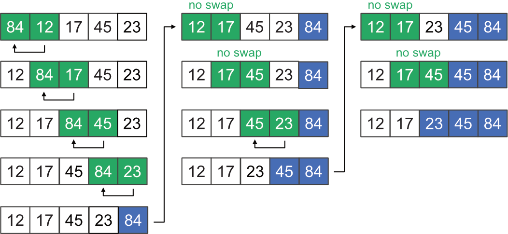

# CVIČENÍ 10B: ŘAZENÍ A ZÁKLADY OOP

Algoritmizace a programování

## CÍL 1: BUBBLE SORT

### 2.1 Princip Bubble Sortu

Bubble Sort patří mezi nejjednodušší **stabilní** řadicí algoritmy. Pracuje na principu „probublávání": opakovaně porovnává dvojice sousedních prvků a prohazuje je, pokud jsou ve špatném pořadí. Největší hodnoty se tak postupně „vybublají" na konec seznamu.

Základní princip algoritmu pro vzestupné seřazení:

1. Začni na první pozici.
2. Porovnej dva po sobě jdoucí prvky.
3. Pokud je první větší než druhý, prohoď jejich pořadí.
4. Posuň se o jednu pozici dál.
5. Po jednom průchodu se největší hodnota dostane na konec.
6. Opakuj, dokud není seřazená celá sekvence.



---

### 2.2 Úkol: implementace `bubble_sort()`

**📝 ÚKOL: Bubble Sort**

1. Do modulu `sorting.py` (který už obsahuje `selection_sort()` a `random_numbers()`) doplň funkci `bubble_sort()`.
2. Funkce má jeden vstupní parametr: libovolně dlouhý seznam čísel.
3. Funkce vrátí **nový** vzestupně seřazený seznam. Původní seznam nechává beze změny.
4. Volání funkce ověř v `main()` — třeba na krátkém seznamu `[5, 1, 4, 2, 8]` a na náhodně vygenerovaném seznamu 20 čísel (`random_numbers(20)`).

> **💡 Nápověda:** Algoritmus nemusí znovu kontrolovat prvky, které už jsou na správném místě — konec seznamu zůstává po každém průchodu seřazený. Tomu by mělo odpovídat nastavení řídicích cyklů.

> **💡 Tip:** Abys nechal původní seznam beze změny, na začátku funkce si vytvoř jeho kopii — například `numbers = numbers[:]` nebo `numbers = list(numbers)`.

---

### 2.3 Stručně ke složitosti

Bubble Sort používá dva do sebe vnořené průchody přes seznam — pro seznam o délce $n$ to v nejhorším případě znamená zhruba $n \cdot n$ porovnání. Časová složitost proto roste s kvadrátem velikosti vstupu.

| Nejlepší scénář | Nejhorší scénář |
| --- | --- |
| $O(n)$ | $O(n^2)$ |

V praxi se Bubble Sort používá jen zřídka. Jakmile roste objem dat, jeho výkon rychle klesá. Pro skutečnou práci se používají rychlejší algoritmy — v další části uvidíš, jak to Python řeší interně.

> **💡 Poznámka:** Nejlepší scénář $O(n)$ platí jen u varianty Bubble Sortu, která umí po průchodu bez jediného prohození algoritmus předčasně ukončit. Bez této zkratky je i nejlepší scénář $O(n^2)$.

---

### 2.4 Vizualizace Bubble Sortu

Vizualizaci si můžeš udělat velmi jednoduše pomocí sloupcového grafu v `matplotlib`. Nemusíš kvůli tomu přepisovat celý algoritmus — stačí do hotového Bubble Sortu vložit pár řádků, které po každém kroku překreslí aktuální stav seznamu.

Použití:

1. `import matplotlib.pyplot as plt` dej na začátek souboru.
2. `plt.ion()` a `plt.figure(...)` dej před začátek řazení.
3. Blok níže vlož **dovnitř vnitřního cyklu**, tedy tam, kde právě porovnáváš prvky.
4. Po skončení řazení přidej `plt.ioff()` a `plt.show()`.

Samotný kód pro vizualizaci:

```python
colors = ["steelblue"] * len(values)
colors[index_highlight1] = "tomato"
colors[index_highlight2] = "tomato"
plt.clf()
plt.bar(range(len(values)), values, color=colors)
plt.title("Bubble Sort")
plt.pause(0.1)
```

Co jednotlivé řádky dělají:

1. `colors = ["steelblue"] * len(values)` vytvoří seznam barev pro všechny sloupce.
2. `colors[index_highlight1] = "tomato"` obarví první zvýrazněný sloupec červeně.
3. `colors[index_highlight2] = "tomato"` obarví druhý zvýrazněný sloupec červeně.
4. `plt.clf()` smaže předchozí obrázek, aby se vykreslil nový stav.
5. `plt.bar(...)` vykreslí aktuální hodnoty jako sloupce.
6. `plt.title(...)` nastaví název grafu.
7. `plt.pause(0.1)` na chvíli zastaví program, aby byla změna v grafu vidět.

U Bubble Sortu typicky zvýrazníš právě porovnávanou dvojici — oba sousední prvky:

```python
index_highlight1 = j
index_highlight2 = j + 1
```

Po skončení algoritmu ještě přidej:

```python
plt.ioff()
plt.show()
```

> **💡 Tip:** Na začátku si zkus krátký seznam, třeba 8 až 10 hodnot. U delších seznamů už bývá animace pomalejší a méně přehledná.

**📝 ÚKOL: Vizualizace Bubble Sortu**

1. Doplň do své implementace Bubble Sortu jednoduché překreslování barplotu.
2. Zvýrazni dvojici prvků, které právě porovnáváš.
3. Vyzkoušej vizualizaci na krátkém náhodném seznamu (použij `random_numbers(10)`).
4. Sleduj, jak největší hodnoty postupně „vybublávají" na konec seznamu.

---
