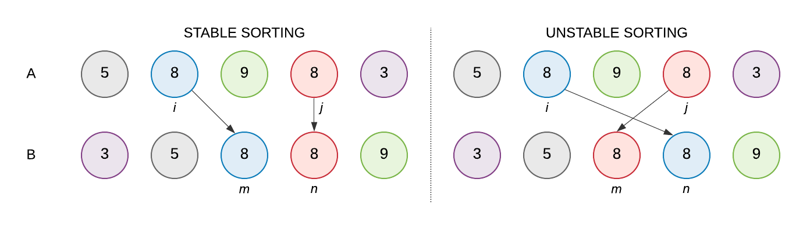

# CVIČENÍ 11: ŘADICÍ ALGORITMY

Algoritmizace a programování

## CÍL 1: PŘÍMÉ ŘADICÍ ALGORITMY

### 1.1 Stabilní a nestabilní algoritmy řazení

Řadicí algoritmy dělíme na **stabilní** a **nestabilní**. Toto dělení vychází z toho, jak algoritmus zachází s prvky, které mají stejný klíč řazení.

Stabilní algoritmus zachovává relativní pořadí shodných prvků tak, jak byly v původní posloupnosti. Nestabilní algoritmus tento výsledek nezaručuje.

Stabilitu nepotřebuješ vždy. Pokud řadíš jen samotná čísla bez dalšího významu, pravděpodobně ti bude jedno, v jakém pořadí za sebou dvě stejné hodnoty skončí.

Důležitá je ale ve chvíli, kdy se stejným klíčem řazení pracují různé objekty, které od sebe umíš odlišit. Typický příklad je seznam jmen nebo záznamů, kde můžeš řadit podle více různých kritérií.

> **💡 Poznámka:** Stabilní algoritmy mívají často vyšší výpočetní nebo paměťovou náročnost. Pokud stabilitu nepotřebuješ, může být výhodnější použít i nestabilní algoritmus.

### 1.2 GitHub repozitář pro dnešní cvičení

Soubory pro dnešní cvičení jsou k dispozici na GitHubu.

**Adresa repozitáře:** doplní vyučující.

**📝 ÚKOL: Git a příprava repozitáře**

1. Na vlastním GitHub účtu vytvoř kopii zdrojového repozitáře (`fork`).
2. Naklonuj si repozitář ze svého GitHub účtu do složky s dnešním cvičením.
3. V lokálním repozitáři nastav pomocí terminálu novou vzdálenou adresu (`remote`) na původní adresu repozitáře (`upstream`).
4. V lokálním repozitáři vytvoř novou větev s názvem `sorting_algorithms` a přepni se do ní.

> **💡 Tip:** Pokud si nejsi jistý postupem, vrať se ke cvičení o Gitu a GitHubu a použij stejný workflow jako minule.

---