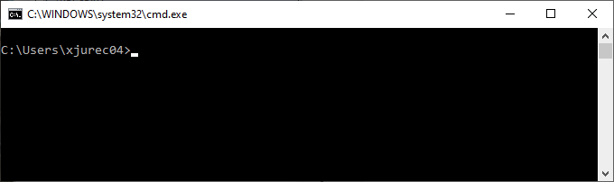
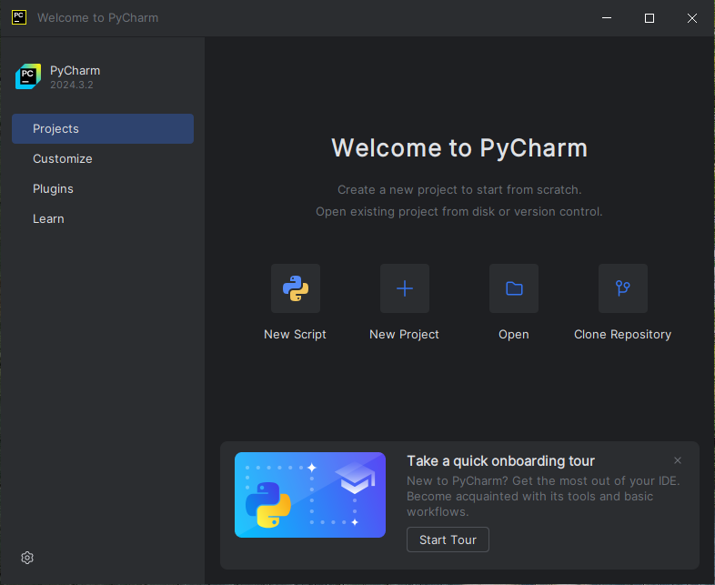
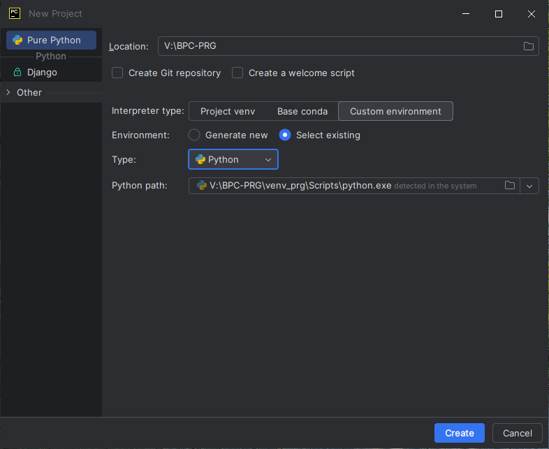
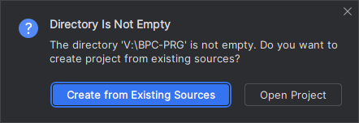
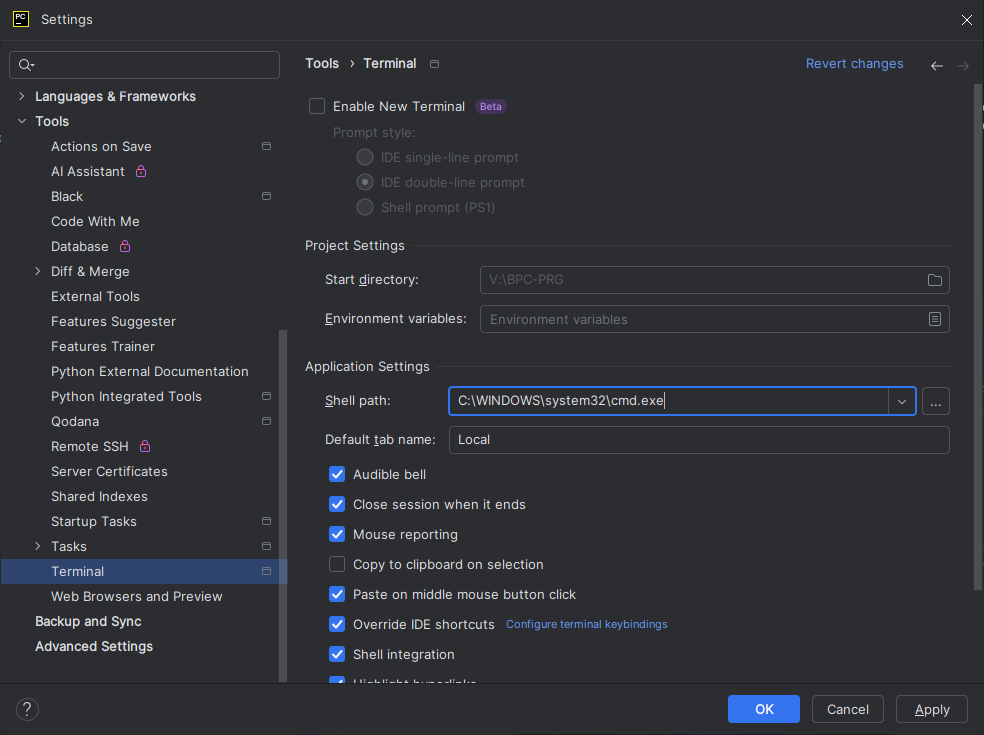
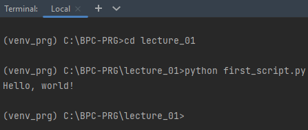
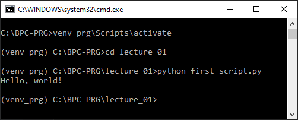
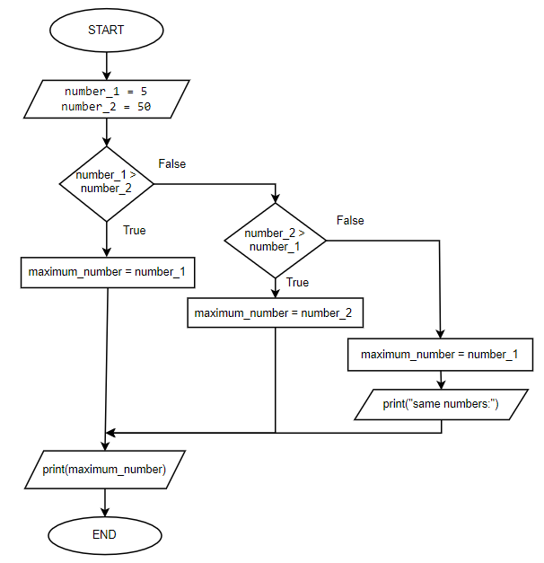
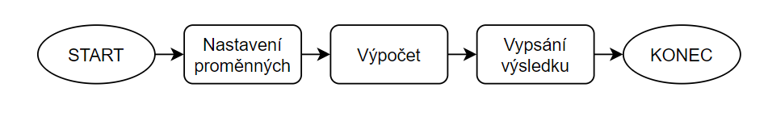

# CVIČENÍ 1: SEZNAMUJEME SE S PROGRAMOVÁNÍM

Algoritmizace a programování

## ÚVOD

**Programování** (kódování, angl. *coding*) označuje souvislý proces, který vede od zadání problému k jeho funkčnímu řešení v podobě spustitelného počítačového programu. Pod tímto souhrnným názvem si představme několik podúkolů, z nichž každý přispívá na cestě k úspěchu. Rozumíme jimi analýzu zadaného problému a jeho pochopení (*Co se po nás chce? Jak má vypadat výsledek? Co potřebuji znát, abych uměl zadání splnit? Jaký bude nejmenší krok, z něhož budu vycházet?*), výběr vhodného existujícího či sestavení nového algoritmu (*Řešil můj problém někdo přede mnou? Jaké jsou možnosti řešení a jaké jsou jejich přínosy a zápory? Který z postupů bude pro mé konkrétní zadání nejvhodnější a proč?*) a jeho implementace, optimalizace a testování ve vybraném programovacím jazyce. Rozkládání problému na dílčí části a jejich následné poskládání dohromady nazýváme také **algoritmizace** neboli vytváření **algoritmu**. Pojem algoritmus chápeme jako postup s přesně popsanými kroky, které k danému cíli vedou.

Algoritmus má jasně dané vlastnosti, které musí splňovat:

**konečnost**: Algoritmus nekončí v nekonečném cyklu.

**resultativnost**: Po konečném počtu kroků vrátí výstup (kterým můžeme chápat i chybu).

**správnost**: Výstup musí být správný.

**determinovanost**: V každém kroku je následující krok jasně daný.

**univerzálnost**: Algoritmus je obecné řešení aplikovatelné na více než jeden konkrétní případ.

**opakovatelnost**: Při stejném vstupu musí dát stejný algoritmus stejný výsledek.

Výše zmíněné pojmy nezavádíme proto, abychom se měli co učit zpaměti. Mnohem důležitější bude pochopit jejich význam a snažit se osvojit si kroky, které nám umožní správně využívat a navrhovat takové algoritmy, které budou tyto požadavky splňovat. 

Po cestě nás čeká spousta problémů, výzev, nesčetně hodin strávených nad nefungujícím kódem. Možná i pláč. Budeme dělat spoustu chyb, ale to je zcela jednoznačně ten nejlepší způsob, jak se něco nového naučit!  A na závěr úvodu jedna drobná rada:

*Pokud napoprvé neuspějete, nazvěte to “verze 1.0”. (Autor neznámý)*

## CÍL 1

### PYTHON A PYCHARM

V průběhu našeho kurzu budeme používat programovací jazyk Python (čti [ˈpaiθən], pro fajnšmekry možno též [ˈpyto:n]). Jde o programovací jazyk, který v roce 1991 vytvořil Guido van Rossum. Tento open source projekt (s legálně dostupným otevřeným zdrojovým kódem) nabízí zdarma instalaci pro většinu platforem: MS Windows, macOS, Unix a Android.

Python můžeme ovládat pomocí textového editoru a příkazové řádky (command line, command prompt, terminal,...), online editorů nebo pomocí dedikovaného prostředí (Integrated Development Environment – IDE). V našem případě budeme používat IDE .

#### 1.1	Vytvoření adresáře pro ukládání práce

Ve školním počítači najdete v Tento počítač disk s označení V: (nebo též gigadisk). Tento disk je vám k dispozici pro ukládání materiálů z jednotlivých hodin, načítá se společně s vaším účtem při přihlášení. K tomuto disku je možné se připojit i z domova. Více informací je v Intraportálu VUT v záložce VUT disk.

| Úkol |
| --- |
| Na disku V vytvoř adresář BPC-PRG (SPRG) a v něm adresář pro první cvičení lecture01. |

#### 1.2	Příkazová řádka

Ve cvičení budeme pracovat s příkazovou řádkou. Příkazovou řádku spustíme pomocí některého z následujících způsobů: 

tlačítko **Win + R**, následně zadáme příkaz **cmd** a potvrdíme,

ve **vyhledávacím poli** Windows zadáme heslo **cmd** nebo **Příkazový řádek** nebo **Command Prompt** (u anglicky lokalizovaných PC).

Následně se objeví černé okno, ve kterém uvidíme cestu k aktuálnímu adresáři, ve kterém se právě nacházíme, např. na disku C v adresáři Users v podadresáři xjurec04:

Za uvedenou cestou se pak nachází znak >, který nám indikuje možnost zadání příkazu resp. výzvy (angl. *prompt*). Tento znak se liší v závislosti na operačním systému počítače. Na školních počítačích, které běží na operačním systému Windows, uvidíme právě znak >, na Unix systémech pak znak $. Pro zpřehlednění budeme v materiálech všechny znaky před > vynechávat. Pokud tedy tento znak v materiálech uvidíme znamená to, že budeme daný příkaz zadávat do příkazové řádky.

Bohužel, toto není jediný rozdíl mezi příkazovými řádky odlišných operačních systémů. V tabulce níže si můžeme prohlédnout rozdíly mezi základními příkazy v příkazové řádce. Za zmínku pak zejména stojí rozdíl v zadávání cesty k adresáři, resp. cesty ke konkrétnímu souboru. Pro oddělení jednotlivých úrovní v adresářové struktuře se u Windows používá znak zpětného lomítka \, u Unix znak klasického lomítka /. Tento rozdíl často způsobuje problémy zejména při práci se soubory. Námi vytvořené programy by měly být univerzální tzn. měly by tedy být schopné pracovat se soubory bez ohledu na operační systém. Pro správnou práci cestami k souborům v Pythonu existují specializované knihovny, se kterými se seznámíme později.

| Vyzkoušej a analyzuj výstup | Vyzkoušej a analyzuj výstup | Vyzkoušej a analyzuj výstup |
| --- | --- | --- |
|  | MS Windows | Unix OS (Linux, macOS) |
| aktuální adresář | > cd | $ pwd |
| změna adresáře | > cd \path\to\your\folder | $ cd /path/to/your/folder |
| skok v adresáři o úroveň výše | > cd .. | $ cd .. |
| změna disku | > V: | $ cd /v |
| výpis obsahu adresáře | > dir | $ ls |
| vymazání příkazové řádky | > cls | $ clear |

Nakonec si nastavte cestu k adresáři na vámi vybrané úložiště pro soubory z BPC-PRG (SPRG).

#### 1.3	Virtuální prostředí

V adresáři pro náš předmět nyní vytvoříme virtuální prostředí. Do příkazové řádky zadáme následující příkaz:

| > python -m venv venv_prg |
| --- |

V aktuálním adresáři si nyní můžeme všimnout nového adresáře **venv_prg**, ve které jsou soubory virtuálního prostředí. Tento adresář nebudeme nikdy nikam nepřesouvat, nic v něm nebudeme měnit, ani vkládat. V opačném případě přestane virtuální prostředí fungovat.

Ověříme, že virtuální prostředí funguje, a to jeho aktivováním. Za předpokladu, že jsme stále ve adresáři, kde jsme vytvořili virtuální prostředí, zadáme do příkazové řádky následující:

| > venv_prg\Scripts\activate |
| --- |

Po spuštění tohoto příkazu by mělo dojít ke změně v příkazové řádce a na začátku by se mělo objevit **(venv_prg)**. To znamená, že virtuální prostředí je aktivní. My se od teď naučíme kontrolovat, že virtuální prostředí je aktivní, předtím, než spustíme jakýkoliv skript v Pythonu. Virtuální prostředí je také možné deaktivovat, a to zadáním příkazu:

| > deactivate |
| --- |

|  | Proč používáme virtuální prostředí? Virtuální prostředí umožňuje běh programů na úrovni uživatele, tj. ne na úrovni jádra OS (operačního systému) a ovladačů. Ve zkratce to znamená, že programováním nemůžeme provést změny takové, aby ovlivnily běh našeho stroje. Tento postup doporučujeme jako prevenci potíží i pro vaše domácí počítače! |
| --- | --- |

#### 1.4	Interaktivní Python konzole

Pokud máme aktivované virtuální prostředí, můžeme v příkazové řádce spustit Python pomocí příkazu python:

| > python Python 3.11.1 (...) Type "help", "copyright", "credits" or "license" for more information. >>> |
| --- |

Tento příkaz vypíše různé informace, pro nás je nejdůležitější zejména aktuálně používaná verze Pythonu, která by měla být 3.10 a vyšší. Pokud tomu tak není, ozvěte se cvičícímu.

Po výpisu informací pak následuje trojice znaků >>>. Podle těchto znaků poznáme, že momentálně je možné zadávat příkazy jazyka Python. My zatím tedy žádné neznáme, ale Pythonu funguje i jako kalkulačka. Dejme tedy Pythonu za úkol spočítat součet čísel 7 a 6.

| >>> 7 + 6 13 |
| --- |

Python konzole je ideální pro demonstraci jednoduchých příkazů, protože ihned vidíme výsledek. Interaktivní konzoli budeme v rámci materiálů často využívat a pokud tedy uvidíme na začátku ukázky kódu >>>, jedná se o příkaz, který má být zadán do Python konzole.

#### 1.5	První kroky s PyCharm

Po spuštění PyCharmu zvolíme v úvodní okně možnost vytvoření nového projektu **New** **project**.

V následujícím okně upravíme a zkontrolujeme několik důležitých údajů:

**Location **projektu nastavíme na adresář pro předmět BPC-PRG (SPRG), který jsme již vytvořili (např. V:\BPC-PRG).

Z nabízených možností v části **Interpreter type** zvolíme **Custom environment**.

Dále nastavíme položku **Environment** na možnost **Select existing**. 

**Type** ponecháme na výchozí hodnotě **Python**.

Do **Python path** přidáme cestu k  vytvořenému prostředí. Klikneme na ikonu adresáře, kde v nově otevřeném okně vybereme soubor **python.exe**, který se nachází uvnitř virtuálního prostředí. V horní části okna by pak měla být napsána například tato cesta: V:\BPC-PRG\venv_prg\Scripts\python.exe. Správnost potvrďte tlačítkem OK.

Zkontrolujeme, že je vše správně nastaveno a projekt vytvoříme tlačítkem **Create**.

Povolíme vytvoření projektu v našem adresáři BPC-PRG výběrem možnosti **Create from Existing Sources**.

Na závěr nastavíme v PyCharmu příkazovou řádku. Vlevo nahoře klikneme na ikonu čtyř vodorovných čar a pod nabídkou **File** vybereme **Settings…** V okně nastavení vybereme v nabídce nalevo položku **Tools** → **Terminal**. V tomto nastavení pak změníme **Shell path** z rozbalovací nabídky na **C:\WINDOWS\system32\cmd.exe**. Změnu uložíme pomocí tlačítka **Apply**, případně okno zavřeme pomocí tlačítka **OK**.

|  | Pokud se něco nepovedlo, nebojte se říci cvičícímu! |
| --- | --- |

Gratulujeme! Pokud vše proběhlo v pořádku, měli byste před sebou nyní vidět zbrusu novou obrazovku, která se od teď stane vaším věrným společníkem.

Pokud si prohlédneme výchozí obrazovku projektu, najdeme vlevo dole dvě důležitá okna – **Terminal** a **Python Console. **Oba tyto prvky už známe.

**Terminal** slouží k simulaci systémové příkazové řádky. Simulaci proto, že se pohybujeme ve virtuálním prostředí. Proto také při rozkliknutí vidíme na horním okraji okna nápis **Local** a na začátku řádku v kulatých závorkách název našeho virtuálního prostředí **(venv_prg)** dále aktuální cestu a znak **>**. Terminálů můžeme mít spuštěných více naráz, provedeme tlačítkem **+**. Do terminálu můžeme zadávat stejné příkazy jako jsme si ukazovali u příkazové řádky. 

**Python Console** slouží pro přímé spouštění příkazů v jazyce Python. To, že se pohybujeme v “pythonním” prostředí poznáme tak, že na začátku řádku vidíme tyto tři znaky **>>>**. 

Nahoře vidíme sadu jednoduchých tlačítek, ze kterých nás bude aktuálně zajímat **Run**, **Debug** a **Stop**. Run spouští napsaný program, Stop jej ukončuje. Debug je odvozenina od anglického slovíčka “bug”, tedy brouk. Slouží nám při hledání chyb v programu, tedy debuggingu (“debugování”).

|  | Žádný učený z nebe nespadl a při programování to platí dvojnásob! Proto se nebudeme již od počátku bát používat unikátních možností komunity kolem jazyku Python. U 99,5 % problémů, se kterými se setkáváme, nejsme první, kdo je řeší. Proto se naučíme naplno využívat vyhledávání pomoci buď u vyučujících, na Google, v oficiální dokumentaci k Pythonu nebo například na platformě StackOverflow. |
| --- | --- |

V průběhu kurzu se budeme postupně setkávat a seznamovat s dalšími prvky prostředí.

## CÍL 2

### PRÁCE S PROMĚNNÝMI V KONZOLI

Při programování bude jedním z našich nejvíce používaných slov: **proměnná **(angl. *variable)*. Proměnné slouží k ukládání informací, na které se můžeme odkazovat a pracovat s nimi při programování. Zároveň je používáme pro popis dat pomocí předdefinovaných názvů pro intuitivnější porozumění kódu. Proměnné si můžeme představit jako krabice, do nichž ukládáme jednotlivé informace a které jsou uloženy v paměti počítače. Do proměnných můžeme uložit různé typy informací: číslo (1, 2, 3), desetinné číslo (1.5, 23.7), text ("Těšíme se na Python!") nebo např. logickou informaci (True, False).

#### 2.1	Pojmenování proměnných

Pojmenovat správně proměnnou je považováno za jeden z nejdůležitějších úkolů při programování. Myslete na to, že název proměnné musí být dostatečně popisný a přesný pro pozdější porozumění kódu ať už vámi nebo vašimi spolužáky a kolegy. Představte si, o kolik jednodušší bude porozumět a vzpomenout si na účel kódu, když nebude proměnná pojmenována např. mt, ale maximum_temperature! Pro pojmenovávání proměnných budeme používat tzv. Style Guide for Python Code, neboli PEP 8 (k důkladnému prostudování na tomto ). 

Proměnné pojmenováváme lowercase_separated_with_underscore (tzn. všechna písmena jsou malá, v případě dlouhého názvu oddělujeme podtržítkem). Namísto desetinné čárky píšeme desetinnou tečku. Přiřazení hodnoty do proměnné provádíme pomocí operátoru **=** (rovná se). Podle PEP 8 je také zvykem kolem každého operátoru psát jednu mezeru z každé strany.

| >>> first_variable = 0.5 |
| --- |

Konstanty, tedy proměnné používané v celém programu s jednou stálou hodnotou, pojmenováváme UPPERCASE_SEPARATED_BY_UNDERSCORE. Definujeme je vždy na začátku skriptu (i zpětně).

| >>> FIRST_CONSTANT = 10 |
| --- |

Názvy proměnných nebudou nikdy začínat číslem ( např. 2_slovo).

|  | V Pythonu se budeme vyhýbat pojmenovávání proměnných nebo funkcí pomocí vyňatých slov (ang. reserved words) např.: and, as, assert, break, class, continue, def, del, elif, else, except, False, finally, for, from, atd. Není nutné se je učit nazpaměť! Se všemi se postupně seznámíme. Zavedeme si tedy pravidlo kontroly, zda se námi zamýšlený název proměnné v tomto seznamu nenachází. |
| --- | --- |

#### 2.2	Matematické operace

Jak jsme si již řekli, proměnná slouží pro ukládání informací. Pro práci a operace s proměnnými potom slouží funkce (angl. *function*). Funkci uvažujeme jako organizovanou sekci kódu, která pro nás provádí specifický úkol. Při programování budeme nejdříve používat funkce vestavěné (angl. *build-in*); tedy takové, které Python obsahuje automaticky) a posléze se je naučíme i sami programovat.

Jednou z nejpoužívanější vestavěných funkcí je print(), která umí vypsat námi vybranou informaci. Touto informací může být i proměnná.

| >>> print(first_variable) 0.5 |
| --- |

| Úkol |
| --- |
| Pomocí funkce print() vypiš všechny proměnné, které jsme si doposud zadefinovali.  Jak by bylo možné vypsat několik proměnných najednou pomocí použití pouze jediného příkazu print()? |

Proměnné si mezi sebou mohou informace předávat. Tedy, mohu vytvořit proměnnou vycházející svým obsahem z již vytvořené proměnné.

| >>> new_variable = first_variable >>> print(new_variable) 0.5 |
| --- |

Mezi čísly, resp. proměnnými můžeme provádět také základní matematické operace: 

| Operace | Operátor | Výraz |
| --- | --- | --- |
| Sčítání | + | 7 + 3 |
| Odčítání | - | 7 - 3 |
| Násobení | * | 7 * 3 |
| Dělení | / | 7 / 3 |
| Umocnění | ** | 7 ** 3 |
| Modulo | % | 7 % 3 |

Operace umocnění a modulo si vyzkoušíme s použitím proměnných. Číslo 7 uložíme do proměnné a, číslo 3 uložíme do proměnné b. Výsledek umocnění uložíme do proměnné c, výsledek operace modulo uložíme do proměnné d.

| >>> a = 7 >>> b = 3 >>> c = a ** b >>> d = a % b |
| --- |

Pro kontrolu si ověříme, že proměnná c obsahuje číslo 343 a proměnná d číslo 1.

#### 2.3	Logické a porovnávací operace

Při programování budeme velmi často využívat logických operátorů. Jednak pro logické operace a také pro porovnávání proměnných. Používané operátory vychází z Booleovy logiky.

| Operace | Operátor | Výraz | Výstup |
| --- | --- | --- | --- |
| Rovná se | == | 7 == 3 | 0 (False) |
| Nerovná se | != | 7 != 3 | 1 (True) |
| Větší, menší než | >,< | 7 > 3 | 1 (True) |
| Větší rovno, menší rovno | >=,<= | 7 <= 3 | 0 (False) |
| Sjednocení | or |  |  |
| Průnik | and |  |  |
| Negace | not |  |  |

Na výstupu těchto operací dostáváme tzv.** logické proměnné** neboli **True** / **False****. **True slouží k označení výroku za pravdivý (v matematickém zápisu hodnota 1) a výraz False potom označuje výrok za nepravdivý (v matematickém zápisu hodnota 0).

| Úkol |
| --- |
| Do konzole zadej příklady z tabulky a výstup zkontroluj podle posledního sloupce tabulky. |

Tyto operace lze pomocí logických operátorů skládat do složitějších logických výroků. U níže uvedených výroků nejdřív ručně určete hodnotu, kterou na výstupu očekáváte. Následně výrazy zadejte do konzole a zkontrolujte správnost vašeho řešení.

| Vyzkoušej a analyzuj výstup |
| --- |
| >>> 5 == 5 and 5 == 5 >>> 5 == 5 or 5 == 2 >>> not(5 != 2) >>> 5 <= 10 or 10 >= 4 >>> 5 <= 10 and 10 <= 4 |

Pokud jste postupovali správně, poměr výsledných výroků True : False by měl být 3 : 2.

## CÍL 3

### SEKVENČNÍ SPOUŠTĚNÍ PROGRAMU

#### 3.1	První skript

Programy, které vytvoříme, ukládáme ve formě skriptů. Skript je sled příkazů jdoucích po sobě, pomocí něhož program interpretuje požadavky. Náš první si vytvoříme následovně:

**Ikona čtyř vodorovných čar **→** File** → **New** → **Python File** → (zde si svůj první skript pojmenujeme) **first_script**

|  | Soubor se nám automaticky pojmenoval s příponou .py. Touto příponou označujeme všechny spustitelné soubory v jazyce Python. Všimněme si, že se nový soubor automaticky objevil v levém sloupci s adresářem. |
| --- | --- |

Naším cílem bude nyní přimět počítač, aby nám vypsal do příkazové řádky známou programátorskou hlášku: *Hello, world!*

Protože počítač udělá jen a pouze to, co mu nařídíme, musíme náš požadavek specifikovat jednotlivými příkazy. K této úloze nám poslouží příkaz (ang. *command*) vycházející z podstaty úkolu. Chceme něco vypsat, neboli vytisknout. Proto použijeme příkaz print()*. *Do kulatých závorek za názvem příkazu uvádíme **vstup**. To, co dostaneme po provedení příkazu, nazýváme **výstup**. Dále dáváme počítači vědět, že bude na výstup vypisovat textový řetězec, který zabalíme na vstupu do apostrofů '', nebo uvozovek "". 

|  | Použití jednoduchých či dvojitých uvozovek je v jazyce Python zaměnitelné. Vždy se ale na začátku skriptu rozhodněte, jakou notaci budete užívat, a držte se jí. Pomůže to pro pozdější porozumění a sjednocení programátorské praxe. |
| --- | --- |

Na první řádek vytvořeného skriptu tedy napíšeme:

| print("Hello, world!") |
| --- |

Kontrola: Pro ověření, že je příkaz uveden správně, napíšeme jej také do Python Console. 

| >>> print("Hello, world!") Hello, world! |
| --- |

Vyzkoušíme také vypsat do konzole ten samý příkaz, ale bez uvozovek.

| >>> print(Hello, world!) Traceback (most recent call last): …   File "<input>", line 1 	print(Hello, world!)                          ^ SyntaxError: invalid syntax |
| --- |

V tomto případě místo požadovaného textu vidíme chybovou hlášku, která nás upozorňuje na chybu v zápisu (syntaxi) příkazu tedy na chybějící uvozovky. Chybových hlášek uvidíme ještě spoustu a je potřeba je naučit se v nich číst. Python se nám bude vždycky snažit napovědět, kde chyba pravděpodobně vznikla.

Ověřili jsme si správnost a funkčnost zapsaného příkazu, nyní můžeme skript spustit. V okně Terminal se ujistíme, že jsme ve správném adresáři. Protože budeme spouštět skript v jazyce Python, použijeme tento název jako klíčové slovo. Náš příkaz bude tedy vypadat takto:

| > python first_script.py |
| --- |

Výstup z terminálu by měl být podobný níže uvedenému:

Stejný příkaz lze také použít v samostatné příkazové řádce. Nejprve zkontrolujte, že v příkazové řádce je stále puštěné virtuální prostředí a že se nacházíte ve správném adresáři, pak vyzkoušejte příkaz i tam.

#### 3.2	Debugování (odstraňování chyb)

**Debugování** (počeštělý výraz z angličtiny *debug, *“*odbroukovávání*”) je proces, v průběhu kterého se postupným spouštěním našeho kódu sekvenčně, tedy řádek po řádku, snažíme lokalizovat chybu. Ukážeme si, jak spouštět vytvořený skript v debugovacím modu. Pro tento účel můžeme využít více možností: 1) vpravo nahoře použijeme tlačítko “zeleného brouka”, 2) stiskem pravého tlačítka ve skriptu a volbou Debug, 3)  v záložce Run vybereme volbu Debug. Místo, na kterém chceme náš program zastavit, si označíme červenou tečkou vedle čísla řádku (angl. *breakpoint*). Po spuštění debugovacího módu se program v tomto místě zastaví. Další řádky kódu lze pak spustit pomocí *krokování *(šipky vlevo dole) a navíc je možné si prohlédnout obsah proměnných vpravo dole v okně **Variables**.

| Úkol |
| --- |
| Uprav skript lecture_01.py následujícím způsobem: vypisovanou hlášku ulož do proměnné message, proměnou message pomocí funkce print() vypiš (skript bude tedy obsahovat 2 řádky kódu).  Umísti breakpoint (červenou tečku) na řádek 1 a to kliknutím vpravo vedle čísla řádku.  Spusť Debug, vyzkoušej krokování a prohlédni si proměnné. |

## CÍL 4

### NASTAVENÍ GIT, GITHUB A PRVNÍ COMMIT

Verzovací systém Git budeme používat pro odevzdání domácích úkolů a zadávání programovacích testů, a proto zde projdeme nezbytné základy pro práci s tímto nástrojem.

#### 4.1	Nastavení Gitu

Před zahájením práce v Git je vhodné nastavit jméno a e-mailovou adresu. Při spolupráci více lidí na projektu je pak možné dohledat, kdo kterou změnu udělal.

Do příkazové řádky vložte následující příkazy a změňte v nich jméno (bez diakritiky) a email.

| > git config --global user.name "Zuzana Nova" > git config --global user.email z.nova@vut.cz |
| --- |

Dále můžeme nastavit barevné výpisy. To nám umožní lepší orientaci v provedených změnách.

| > git config --global color.ui true |
| --- |

Ačkoliv spouštění předchozích příkazů nevypisuje žádné hlášky o provedených změnách, aktuální nastavení Gitu lze zkontrolovat pomocí následujícího příkazu.

| > git config --global --list |
| --- |

#### 4.2	Nastavení GitHub, GitHub classroom

Pro odevzdávání úkolů budeme využívat platformu GitHub, kde jste si již vytvořili účet. Na GitHubu byla vytvořena třída (classroom), kam musíte provést zápis a propojit tak třídu s vaším GitHub účtem, až poté lze plnit domácí úkoly. Proces zápisu do třídy a základní práci s Gitem si projdeme nyní společně.

V prohlížeči otevřeme GitHub () a přihlásíme se. Dále je potřeba otevřít odkaz na první úlohu, který umožní zápis do třídy. Odkaz je dostupný v e-learningu.

Po otevření odkazu bude GitHub Classroom vyžadovat autorizaci přístupu ke GitHub účtu, kterou potvrdíme. Následně se otevře seznam všech virtuálních studentů ve třídě. Ze seznamu vyberte svůj identifikátor (příjmení a jméno) a propojte ho se svým účtem. Poté se otevře stránka, kde budeme vyzváni k přijetí prvního úkolu (assignment). Po přijetí úkolu GitHub vytvoří repozitář (adresář), kam budeme domácí úkoly odevzdávat. V repozitáři bude zadání úkolu (soubor README.md) a předchystaný soubor, do kterého doplníme řešení úkolu.

Tento repozitář je momentálně pouze na stránkách GitHubu, ale pro úpravu souborů je nutné ho naklonovat do svého počítače. Na stránce repozitáře klikneme na zelené tlačítko “Code”, následně se objeví odkaz na repozitář, který využijeme při klonování (viz screenshot níže). Odkaz si zkopírujeme do schránky.

Nejprve v příkazové řádce přejděme pomocí příkazu cd do hlavního adresáře projektu (např. C:\BPC-PRG, případně C:\BPC-PRG\lecture_01), kam nyní naklonujeme repozitář. Klonování repozitáře spustíme pomocí příkazu git clone a za něj doplníme odkaz na repozitář, který máme uložený ve schránce.

| > git clone https://github.com/slytherins-hub/your_repository.git |
| --- |

Nyní máme soubory pro domácí úkol k dispozici v počítači a můžeme v nich provádět úpravy. **V** **tomto případě provádíme úpravy pouze v souboru **assignment_1_1.py** a jen nahradíme znaky **…** podle zadání.**

#### 4.3	První commit

Po dokončení úprav je nutné řešení odeslat zpátky na GitHub k ohodnocení. Vytvoříme tedy první revizi souboru a to v příkazové řádce pomocí příkazů git add a git commit.

Nejprve do revize přidáme upravený soubor.

| > git add assignment_1_1.py |
| --- |

Následně vytvoříme první revizi a přidáme zprávu (obvykle jedna věta, max. 80 znaků) popisující provedené změny.

| > git commit -m "message" |
| --- |

Vytvořenou revizi odešleme do repozitáře pomocí příkazu git push.

| > git push origin main |
| --- |

Úspěšné nahrání změn můžeme ověřit obnovením stránky s repozitářem na GitHubu, kde je možné provedené změny prohlížet a případně komentovat.

.

## PRAKTICKÉ PŘÍKLADY

#### Vývojové diagramy

Vývojové diagramy slouží ke grafickému znázornění jednotlivých kroků algoritmu nebo jakéhokoli obecného procesu. Využíváme je před samotným programováním pro ujasnění, jak budeme postupovat k vytyčenému cíli. Vývojový algoritmus je stěžejním nástrojem při tvorbě architektury programu.

Teď si představíme několik základních prvků: elipsa s popisem START/KONEC (označuje začátek a konec procesu), šipka (propojuje jednotlivé prvky a určuje směr zpracování příkazů), obdélník s popisem (definuje dílčí krok zpracování).

#### Příklad 1

Vaším úkolem je pomocí vhodných operací vypočítat částku, kterou zaplatíte za rok při odvodu daní. Měsíční příjem činí 25 000,- a daňová srážka činí 15 %.

Postup:

**Nakreslete vývojový diagram**

Vývojovým diagramem popíšeme jednotlivé kroky vedoucí k řešení problému.

**Nejdříve nastavujeme hodnotu konstantám, poté vytváříme zbylé proměnné.**

Vytvořte proměnné, které budou obsahovat informace o vašem měsíčním příjmu, počtu měsíců v roce a daňové srážce. Připravíme (deklarujeme) si i proměnnou pro výsledek.

| NB_MONTHS = 12 monthly_income = 25000 tax_pct = 15 tax_payment = 0 |
| --- |

**Pomocí vhodných operací vypočítejte částku zaplacenou na daních za rok.**

Nejdříve si upravíme hodnotu proměnné tax_pct na desetinné číslo.

| tax_rate = tax_pct / 100 |
| --- |

	Poté provedeme samotný výpočet.

| tax_payment = (monthly_income * NB_MONTHS) * tax_rate |
| --- |

**Výslednou částku vypište do Terminalu.**

| print(tax_payment) |
| --- |

#### Příklad 2

Pomocí operací, které jsme se doposud naučili, urči, zda je číslo dělitelné libovolným zadaným číslem.

Postup:

Nakresli si vývojový diagram.

Vytvoř proměnné, které budou obsahovat dělence (angl. *dividend*) a dělitele (angl. *divisor*).

Urči dělitelnost těchto čísel. Výsledek operace ulož do vhodně pojmenované proměnné.

Výslednou proměnnou vypiš do terminálu.

