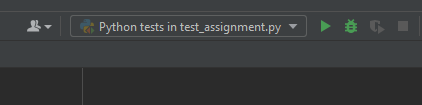
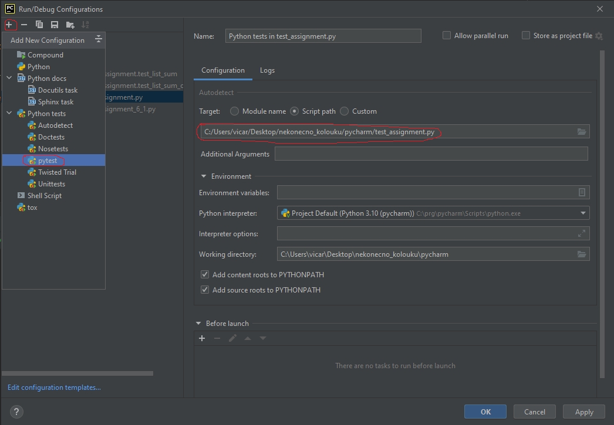

# CVIČENÍ 6: FUNKCE A MODULY

Algoritmizace a programování

## CÍL 1

### ZÁKLADY PRÁCE S FUNKCEMI

V tomto cvičení se naučíme vytvářet vlastní funkce a moduly. Funkci si můžeme představit jako ohraničený blok kódu se specifickým úkolem (např. výpočet obsahu kruhu). Pomocí funkcí můžeme program strukturovat do menších částí, které mohou pracovat částečně nebo zcela nezávisle. Díky tomu je náš kód přehlednější a snáze lze nalézt zdroj případných chyb. Funkce nám však také umožňují uplatnit tzv. princip znovupoužitelnosti. To znamená, že přístup k funkci může mít teoreticky libovolná část programu a využívat ji dle aktuální potřeby (stejně jako my jsme dosud dle potřeby využívali interní funkce Pythonu).

	Funkce v Pythonu může podobně jako funkce v matematice přijímat vstupní proměnné (které v programování nazýváme argumenty) a vracet proměnné výstupní. To, jaké vstupní a výstupní parametry funkce používá definujeme při vytváření funkce pomocí vstupně-výstupního rozhraní. Toto rozhraní pak mohou využít jiní uživatelé nebo části programu pro komunikací s naší funkcí. Funkce by měla řešit obecný úkol (např. výpočet kruhu pro libovolný poloměr, nikoliv pro omezenou množinu hodnot).

Každá funkce pracuje s vlastním jmenným prostorem (namespace). Jmenný prostor zaručuje, aby všechny názvy proměnných v programu byly unikátní a nedocházelo tak ke konfliktům. K proměnné, kterou definujeme uvnitř funkce, tedy nemá běžně přístup žádná další část programu (s jiným jmenným prostorem) i přesto, že jsme v ní použili stejný název.

#### 1.1	Definice funkce

V tomto úkolu si vytvoříme první vlastní funkci, jejímž úkolem bude určit absolutní hodnotu libovolného reálného čísla. Než se do toho pustíme, vytvoříme si nový soubor s názvem first_function.py, do kterého budeme funkci implementovat.

Funkci definujeme pomocí jednořádkové hlavičky a odsazeného těla funkce, podobně jako u cyklu for a while:

| def absolute_value(number):     """     """     if number >= 0:         return number     else:         return -number |
| --- |

Jak to funguje? Každá funkce, kterou vytvoříme, musí v hlavičce obsahovat vyhrazený příkaz def následovaný názvem funkce a kulatými závorkami s dvojtečkou na konci. Název funkce by měl vystihovat její účel a v Pythonu jej zapisujeme podobně jako proměnné (tedy malé znaky oddělené podtržítkem). Do kulatých závorek píšeme seznam parametrů, které funkce přijímá (pozor, kulaté závorky musíme uvést i v případě, že funkce žádný parametr nepřijímá).

	Poté následuje odsazené tělo funkce, tedy příkazy, které funkce provádí. Na samý začátek těla obvykle připisujeme dokumentační řetězec (*docstring*), který má za úkol popsat podrobněji účel funkce.

	Příkaz return použijeme ve chvíli, kdy chceme, aby funkce vrátila nějakou hodnotu. Proměnné uvnitř funkce totiž zpravidla nejsou jiným částem programu přístupné. O tom si povíme o chvíli později. Spuštění příkazu return kromě vrácení hodnoty běh funkce ukončí. Pokud příkaz return nepoužijeme, funkce automaticky vrátí hodnotu None.

| Úkol |
| --- |
| Zkus spustit skript s naší funkcí. Co se stalo? |

Pokud jste postupovali správně, nestalo se nic. Abychom mohli spustit kód v těle funkce, je nejdříve potřeba funkci **zavolat**. Volání naší funkce je stejné jako u funkcí, které již známe. Stačí uvést její název a do kulatých závorek připsat vstupní **argumenty**.

| Vyzkoušej a analyzuj výstup |
| --- |
| def absolute_value(number):     """     """     if number >= 0:         return number     else:         return -number  print(absolute_value(-35.8)) print(absolute_value(90)) print(absolute_value(90, 24)) |

#### 1.2	Vstupní parametry a argumenty funkce

V textu výše jsme uvedli dva na první pohled podobné pojmy – **argument** a **parametr**. Tyto pojmy se občas zaměňují, ale jejich význam je odlišný. **Parametry** funkce uvádíme při definování funkce – do kulatých závorek za její název. Parametry funkce jsou seznamem proměnných, se kterými umí funkce pracovat, ale zatím (až na výjimku, kterou si uvedeme později) neobsahují žádné konkrétní hodnoty. Naproti tomu **argument funkce** zadáváme do kulatých závorek při jejím **volání**. Jde tedy o konkrétní hodnotu, která se posléze uloží do některého z **parametrů**.

Do jednoho skriptu můžeme umístit více funkcí. Funkce budeme od sebe i od ostatního kódu pro přehlednost odsazovat dvěma prázdnými řádky (viz PEP 8):

| Úkol |
| --- |
| Ve skriptu first_function.py vytvořte novou funkci list_exponentiation(), jejímž úkolem bude umocnit seznam čísel na libovolnou kladnou mocninu. Kolik a jaké vstupní parametry bude funkce obsahovat? Kolik výstupních argumentů bude funkce vracet? |

Pokuste se nyní funkci zavolat bez **vstupního argumentu**:

| Vyzkoušej a analyzuj výstup |
| --- |
| list_exponentiation() |

Po spuštění jsme s největší pravděpodobností získali tento výsledek (zkontrolujte v terminálu): 

| File "first_function.py", line 11, in <module>     list_exponentiation() TypeError: list_exponentiation() missing 2 required positional arguments: <arg> and <arg> |
| --- |

V hlavičce funkce jsme totiž definovali 2 vstupní parametry, bez kterých funkce po svém zavolání nemůže pracovat, proto jejich vyplnění **vyžaduje**. Zkusme to ještě jednou:

| Vyzkoušej a analyzuj výstup |
| --- |
| exp_list1 = list_exponentiation([1, 2.5, 3, -2], 3) print(exp_list1)  exp_list2 = list_exponentiation(3, [1, 2.5, 3, -2]) print(exp_list2) |

Jedna z testovaných variant opět skončí chybou. Věděli byste proč? Spusťte program v debugovacím režimu a sledujte, do kterých parametrů se vstupní argumenty u obou variant přiřadí.

#### 1.3	Nepovinné vstupní parametry

V některých případech mohou být vstupní parametry funkce nepovinné. Takové parametry není nutné při volání zadávat, jelikož jim autor funkce přidělil výchozí hodnotu, se kterou bude program pracovat (v případě interní funkce zjistíš povinné a nepovinné parametry a jejich výchozí argumenty v dokumentaci dané funkce). Upravte hlavičku funkce tak, aby vstupní parametr exponent byl volitelný s výchozí hodnotou 2:

| def list_exponentiation(values_list, exponent=2): |
| --- |

|  | Aby program pracoval správně, je nutné v hlavičce funkce umístit všechny volitelné parametry až za parametry povinné. |
| --- | --- |

| Vyzkoušej a analyzuj výstup |
| --- |
| exp_list = list_exponentiation([2, -3, 1]) exp_list = list_exponentiation([2, -3, 1], 3)  print(exp_list) |

#### 1.4	Volání funkce s definovanými názvy parametrů

Už jsme si řekli, že při volání funkce je nutné dodržet pořadí vstupních argumentů tak, jak byly definovány v hlavičce funkce. Toto pravidlo můžeme obejít, pokud názvy parametrů uvedeme také při volání funkce. V takovém případě má program jednoznačnou informaci o přiřazení argumentů do vstupních parametrů a není proto nutné dodržovat jejich přesné pořadí. Tento způsob volání se hodí hlavně u funkcí, které mají velký počet vstupních parametrů – **umožňuje nám totiž vytvořit více přehledný a zdokumentovaný kód**. Změňte ve vašem skriptu syntaxi volání funkce dle následujícího příkladu a ověřte výsledek v terminálu:

| Vyzkoušej a analyzuj výstup |
| --- |
| exp_list = list_exponentiation(exponent=3, values_list=[2, -3, 1])  print(exp_list) |

|  | U výše uvedené syntaxe uděláme drobnou výjimku a operátor = budeme v těchto případech psát vždy bez mezer (viz PEP8). Protože se bude většinou jednat o jednořádkovou syntaxi, zkrátíme tak délku zápisu a usnadníme čitelnost kódu. |
| --- | --- |

#### 1.5	Výstupní argumenty funkce

Pokud potřebujeme předat dalším částem programu ke zpracování jeden nebo více výsledků naší funkce, využíváme k tomu argumenty výstupní. Výstupní argumenty uvádíme za příkaz return. Příkaz současně ukončí běh funkce. Měli bychom tedy dobře zvážit, na které místo v kódu jej umístit, aby náš program fungoval správně.

Za příkaz return lze umístit více argumentů současně. V takovém případě je oddělujeme čárkou. V Pythonu může funkce přijmout i vrátit **jakýkoliv objekt**. Výstupním argumentem tedy může být proměnná, konkrétní hodnota, matematický výraz nebo třeba jiná funkce! Syntaxe pro vrácení dvou argumentů může vypadat např. takto:

| return [3, 5, 8], cislo ** 2 |
| --- |

Nyní se vrátíme k funkci pro umocnění čísel v seznamu. Funkci si rozšíříme o jednoduchou kontrolu datového typu položek seznamu pro případ, že by nám někdo v seznamu poslal něco jiného než číslo. K tomu si přidáme definici výstupních argumentů pro různé scénáře.

| Úkol |
| --- |
| Doplňte funkci list_exponentiation() o podmínku, jejímž úkolem bude zkontrolovat pro každou iteraci proměnné value, jestli obsahuje umocnitelné číslo (float nebo int). Pro kontrolu použijte funkci isinstance().  Pokud bude podmínka splněna (položka je číslo), provede funkce její umocnění a vloží jej do seznamu exp_values.  V případě, že podmínka nebude splněna (seznam obsahuje alespoň jednu položku, která není číslem), funkce ukončí svůj běh a vrátí tři výstupní argumenty:     1) Seznam původních hodnot     2) Hodnotu True     3) Zprávu "Invalid data type for exponentiation. Aborted"  Pokud bylo možné umocnit všechny položky, funkce vrátí tři výstupní argumenty:     1) Seznam umocněných hodnot     2) Hodnotu False     3) Zprávu "Exponentiation completed" |

Samotné použití příkazu return nestačí k tomu, abychom s výstupy mohli pracovat mimo funkci. Výstupní hodnoty musíme přiřadit do nových proměnných při volání funkce. Doplňte do skriptu volání funkce a spusťte skript společně s výpisem obsahu výstupních argumentů pro následující možnosti (jaké jsou rozdíly ve výstupech a proč?):

| Vyzkoušej a analyzuj výstup |
| --- |
| output = list_exponentiation([2, -3, 1], 3) output = list_exponentiation([2,"25", 1], 3) output = list_exponentiation([2,"25", 1], 3)[0] output, is_error, message = list_exponentiation([2,"25", 1], 3)  print(output) |

Možná jste si všimli, že v prvních dvou případech uloží Python výstupní argumenty do sekvence v kulatých závorkách. Jedná se o datovou strukturu, která se v Pythonu nazývá ***n*****-tice **(**tuple**). S n-ticemi jsme se již trochu seznámili ve 4. lekci. Víme tedy, že k jednotlivým položkám můžeme přistupovat pomocí indexace (viz třetí řádek kódu). Na rozdíl od seznamu položky *n*-tice **nemůžeme měnit**, přidávat ani odebírat (immutable), s čímž musíme při manipulaci počítat. S n-ticemi jsme dosud nevědomky pracovali také při volání a definici funkcí – ano, jsou **tytéž kulaté závorky**, do kterých uvádíme vstupní parametry a argumenty.

#### 1.6	Dokumentační řetězec (docstring)

Dokumentační řetězec je víceřádkový řetězec, který stručně popisuje účel funkce a jednotlivých parametrů. Vytváříme jej hned pod hlavičkou funkce pomocí trojice uvozovek """. Dokumentační řetězec **budeme psát vždy**. V rámci zadání jej budeme kvůli přehlednosti vynechávat, vy si jej však ke každé funkci doplňte:

| def list_exponentiation(values_list, exponent=2):     """     Raises list of numbers to the power of custom exponent      :param values_list: (list) list of numbers     :param exponent: (int) quantity to which base number is raised     :return: list of raised numbers, is_error indicator, message     """ |
| --- |

| Samostatný úkol |
| --- |
| Jedním z mechanismů pro kontrolu českého rodného čísla je jeho bezezbytková dělitelnost číslem 11 (proto se na konec r. č. přidávají tzv. kontrolní číslice) a celkový počet číslic 9 nebo 10. Kontrolu r. č. můžeme vyžadovat třeba u pacientských databází podobně, jako se např. validují formuláře při zakládání uživatelského účtu na webových stránkách.  Vytvořte nový skript id_validator.py.  Ve skriptu definujte novou funkci id_is_valid(). Funkce bude mít dva vstupní parametry: personal_id typu str a control_number typu int. Druhý vstupní parametr bude volitelný s výchozí hodnotou 11.  Uvažujte jednotný formát r. č. ve tvaru "YYMMDDXXXX" nebo "YYMMDDXXX".  Funkce vždy vrátí dva výstupní argumenty. Hodnotu True, jestliže je zadané id validní (je beze zbytku dělitelné 11 a má požadovaný počet číslic), nebo hodnotu False v opačném případě. Druhým argumentem bude zpráva o úspěšném ověření nebo typu chyby (nesprávná délka řetězce, chyba dělitelnosti). Proveďte implementaci funkce. Pozor na vhodné převody mezi datovými typy, které také budete muset ošetřit.  Ověřte funkci voláním pro různé typy rodných čísel.  Funkci doplňte o vhodný dokumentační řetězec dle vzoru výše. |

#### 1.7	Lokální proměnné

Proměnné a data, která vzniknou uvnitř funkce, nejsou přístupné vnějším procesům (např. dalším funkcím). Říkáme jim proto **lokální proměnné**. Soubor všech názvů lokálních proměnných (nebo obecně objektů, nemusí jít jen o názvy proměnných) jedné funkce se nazývá **jmenný prostor** (namespace).

Pokračuj v práci na skriptu id_validator.py. Zde zkusíme, jestli máme přístup k proměnné personal_id mimo tělo funkce id_is_valid().

| Úkol |
| --- |
| Vytvoř novou funkci local_id(). Funkce nebude mít žádný vstupní parametr. V těle funkce definuj proměnnou s názvem personal_id a přiřaď ji řetězec "local_id".  Doplň funkci o vytisknutí obsahu proměnné personal_id. |

| Vyzkoušej a analyzuj výstup |
| --- |
| is_valid, message = id_is_valid("9555122038") local_id() |

V příkladu výše jsme zavolali dvě různé funkce, které obsahují objekt (proměnnou) se stejným názvem. Na výsledku vidíme, že se obsah proměnných vzájemně nijak neovlivnil. Je to proto, že každá funkce má **svůj vlastní lokální a nezávislý jmenný prostor**. Příjemným důsledkem je, že můžeme opakovaně používat stejné názvy objektů v různých funkcích. Kromě toho, že se vyhneme názvoslovné pandemii (např. id_11, id_12, id_13, id_32, apod.) nám tento princip umožňuje předejít konfliktům v případech, kdy by si funkce mohly vzájemně přepisovat obsah proměnných.

### **1.8	Globální proměnné**

Mezi globální proměnné řadíme všechny proměnné, které jsme definovali **mimo jakoukoliv funkci nebo jiný objekt**. Globální proměnné jsou součástí **globálního jmenného prostoru** a patří k nim také názvy funkcí a dalších objektů, které jsme vytvořili v našem skriptu (kterému se také říká **modul**, k tomu se dostaneme za chvíli) a nejsou vnořeny do žádného jiné objektu. 

**Globální proměnné** jsou přístupné všem funkcím a dalším objektům v modulu. Proměnné definujeme mimo tělo funkce v horní části skriptu. My si zvykneme na to, že jako globální proměnné budeme **téměř výhradně definovat konstanty**. Tedy taková data, která se v běhu programu nemění. 

| Úkol |
| --- |
| Z hlavičky funkce id_is_valid() odstraňte vstupní parametr control_number.   Na první řádek skriptu mimo jakoukoliv funkci definuj proměnnou control_number a přiřaď do ní hodnotu 11.  Uvnitř funkce id_is_valid() vytiskni obsah proměnné control_number. |

| Vyzkoušej v debuggeru a analyzuj výstup |
| --- |
| is_valid, message = id_is_valid("9555122038") |

Obsah globální proměnné je standardně k dispozici všem funkcím ve skriptu. Co se stane, když se pokusíme upravit obsah globální proměnné (respektive zvolíme stejný název pro globální a lokální proměnnou) uvnitř funkce id_is_valid()? Vyzkoušejte následující kód:

| Uprav funkci a analyzuj výstup |
| --- |
| control_number = 10  def id_is_valid(personal_id):     control_number = 11     print("Ve funkci je: ", control_number)  is_valid, message = id_is_valid("9555122038") print("Mimo funkci je: ", control_number) |

Pokud využijeme uvnitř funkce název globální proměnné, Python automaticky alokuje nové místo v paměti a bude s proměnnou pracovat jako s lokální. **Obsah globální proměnné lze ovlivnit i uvnitř funkce.** **Tento postup však může vyvolat špatně odstranitelné kolizní situace při běhu programu a proto jej nebudeme používat**.

Globální jmenný prostor funguje podobně jako lokální – všechny názvy objektů uvnitř modulu (s výjimkou lokálních objektů) musí být unikátní. V jednom modulu tedy nemůžeme vytvořit dvě globální funkce nebo globální proměnné se stejným názvem. Stejné názvy však můžeme použít v jiném modulu, který využívá svůj vlastní jmenný prostor.

#### 1.9	Zabudovaný jmenný prostor (Built-in namespace)

Obsahuje základní názvy proměnných, modulů a funkcí, které používá Python pro svůj běh. Z logiky věci vyplývá, že bychom tyto názvy **neměli používat** pro vlastní proměnné či funkce, pokud nechceme, aby náš program skončil v kolizní situaci.

## CÍL 2

### IMPORTOVÁNÍ FUNKCÍ

**2.1	Vytvoření**** ****vlastního souboru s funkcemi (modulu)**

V této části si ukážeme, jak vytvořit program, kde budou funkce deklarovány v jiném souboru a ty pak bude využívat hlavní skript, který bude spouštět. Soubor se může jmenovat libovolně a může obsahovat více funkcí. Soubor s funkcemi budeme nazývat **modul**. Soubor který bude přímo provádět nějaké úkony mimo definice funkcí budeme nazývat **skript**. 

Nejprve si vytvoříme modul s vhodnými funkcemi pro testování:

| Úkol |
| --- |
| Vytvořte soubor (modul) list_operators.py.   Do tohoto modulu vytvořte dvě funkce - list_sum() a list_max(), které mají jako vstupní parametr seznam čísel a výstupem funkcí je součet/maximum tohoto seznamu.  Funkčnost obou funkcí v tomto souboru otestujte, avšak otestování pak vymažte a ponechejte pouze deklarace těchto funkcí. |

Následně si funkce zkusíme použít v rámci nového souboru (skriptu) use_list_operators.py.

**Modul** s funkcemi je možné **importovat **pomocí klíčového slova **import**. Ke konkrétní funkci z modulu se v tomto případě přistupuje pomocí tečkové notace, kde první část tvoří název importovaného modulu a za tečkou následuje název funkce.

| Vyzkoušej |
| --- |
| import list_operators  numbers = [4, 8, 3]  sum_of_nums = list_operators.list_sum(numbers) print(sum_of_nums)  max_of_nums = list_operators.list_max(numbers) print(max_of_nums) |

V některých případech se pro udržení přehlednosti kódu hodí název modulu trochu zkrátit. To můžeme udělat následujícím způsobem:

| Vyzkoušej |
| --- |
| import list_operators as ops  numbers = [4, 8, 3]  sum_of_nums = ops.list_sum(numbers) print(sum_of_nums)  max_of_nums = ops.list_max(numbers) print(max_of_nums) |

Ne vždy je však potřeba importovat celý modul. Pokud potřebujeme pro náš program jen pár vybraných funkcí, můžeme z balíčku importovat jen ty potřebné a ty pak lze volat přímo bez názvu modulu s tečkou:

| Vyzkoušej |
| --- |
| from list_operators import list_sum  numbers = [4, 8, 3]  sum_of_nums = list_sum(numbers) print(sum_of_nums) |

Popřípadě lze naimportovat více funkcí z modulu najednou a to zápisem více funkcí na jeden řádek a oddělením jejich názvů pomocí čárek:

| Vyzkoušej |
| --- |
| from list_operators import list_sum, list_max |

### INSTALACE BALÍČKŮ

V Pythonu pojmem **modul** označujeme jeden soubor *.py se specifickým účelem. Modul zpravidla obsahuje více funkcí či jiných objektů, které můžeme připojit k našemu programu. Pojmem **balíček** (*package*) označujeme laicky řečeno kontejner s několika moduly. 

Moduly a balíčky slouží jednak k lepší organizaci, ale především zajišťují znovupoužitelnost vytvořeného kódu. Současně umožňuje předejít kolizím při pojmenování proměnných, každý modul a balíček totiž používá svůj vlastní **jmenný prostor**. Moduly a balíčky pro náš program můžeme získat několika způsoby – importem zabudovaných Pythonních balíčků, instalací a importem balíčků třetích stran či vytvořením vlastního balíčku (zde si vyzkoušíme pouze vytvoření vlastního modulu).

Příkladem zabudovaného balíčku může být například balíček random, který jsme již využívali v předchozích cvičeních  (import random).

Ukážeme si, jak instalovat balíčky třetích stran. Ve cvičení budeme balíčky instalovat do virtuálního prostředí (tento postup doporučujeme provést vždy). Instalaci lze sice provést pomocí interního manažeru balíčků v IDE  PyCharm, my si ale ukážeme instalaci pomocí terminálu, která funguje obecně bez závislosti na vývojovém prostředí. Pokud vás zajímá instalace a vytváření balíčků do hloubky, neváhejte prostudovat .

#### 2.2	Instalace balíčku matplotlib

Matplotlib je knihovna s balíčky pro vykreslování grafů a obrázků a bude se nám hodit v navazujícím příkladu. Balíčky a knihovny třetích stran budeme instalovat pomocí instalátoru pip. Veškeré příkazy budeme zadávat do **terminálu** (nikoliv Pythonní konzole). Nainstalujeme balíček pro vizualizaci dat . Balíček nemá dle dokumentace žádné specifické požadavky. Můžeme se tedy pustit rovnou do jeho instalace:

| python -m pip install matplotlib |
| --- |

V terminálu byste měli vidět průběh instalace. Společně s balíčkem matplotlib se nainstalovaly také další balíčky, které tato knihovna vyžaduje pro svou činnost (tzv. *dependencies*). Instalace by měla proběhnout bez chyby. Pokud se v terminálu objevila chybová zpráva, nebojte se ozvat cvičícímu. Výsledek instalace můžete také zkontrolovat přes manažer balíčků v PyCharmu (File –> Settings –> Project: *project_name* –> Project Interpreter nebo na spodní liště záložka Python Packages).

**2.3	Import balíčku ****matplotlib.pyplot**

Vytvořte si skript import_test.py, do kterého si zkusíme importovat balíček s funkcemi pro vykreslení kružnice. Balíčky vkládáme do našeho programu pomocí příkazu import, za kterým následuje název balíčku. Import všech balíčků provádíme vždy na začátku skriptu. Z balíčku budeme využívat pouze jeho modul pyplot.

| Vyzkoušej |
| --- |
| import matplotlib.pyplot   figure, axes = matplotlib.pyplot.subplots()  first_circle = matplotlib.pyplot.Circle((0.6, 0.6), 0.2)  axes.add_artist(first_circle) axes.set_aspect(1)  matplotlib.pyplot.show() |

Opět je možné využít zkratku pro daný balíček:

| Vyzkoušej |
| --- |
| import matplotlib.pyplot as plt |

| Úkol |
| --- |
| Upravte kód pro vykreslení kružnice tak, aby akceptoval importovaný balíček pod novým názvem plt. |

Případně si můžeme importovat jen některé funkce z balíčku:

| Vyzkoušej |
| --- |
| from matplotlib.pyplot import subplots, Circle, show |

| Úkol |
| --- |
| Jak bude nyní vypadat volání jednotlivých funkcí? Upravte opět kód pro vykreslení kružnice tak, aby akceptoval současnou formu importu. |

### VYTVÁŘENÍ VLASTNÍCH MODULŮ

#### 2.4	Zadání

Naším úkolem je vytvořit program, který určí, zda-li se dvojice kružnic protínají či nikoliv. U obou kružnic známe souřadnice středu a jejich poloměr. Při řešení problému mohou nastat 3 situace, které v našem programu musíme vyhodnotit:

Součet poloměrů kružnic **je větší než** vzdálenost středů → existují **2 průsečíky.**

Součet poloměrů kružnic **je stejný** jako vzdálenost středů → existuje **1 průsečík.**

Součet poloměrů kružnic **je menší než** vzdálenost středů → neexistuje průsečík**.**

| Samostatný úkol |
| --- |
| Vytvořte soubor circle_stats.py. V soboru circle_stats.py vytvořte funkci radius_sum(). Funkce bude mít dva vstupní parametry r1 a r2, které reprezentují poloměry dvou různých kružnic (float). Funkce vrátí součet obou poloměrů (float).  V soboru circle_stats.py vytvořte funkci euclid_distance(). Funkce bude mít čtyři vstupní parametry, které reprezentují souřadnice středů x1, y1, x2 a y2 (float) dvou různých kružnic. Funkce vrátí Euklidovskou vzdálenost mezi oběma středy (float). Pro výpočet odmocniny použijte funkci sqrt() z balíčku math (zajistěte import).  V soboru circle_stats.py vytvořte funkci has_intersection(). Funkce bude mít dva vstupní parametry, které reprezentují parametry kružnic (list: [x1, y1, r1] a [x2, y2, r2]) .  Funkce zjistí, jestli kružnice mají 0, 1 nebo 2 průniky. Pomocné výpočty budou realizovány voláním funkce radius_sum() a euclid_distance() s příslušnými vstupními argumenty.  Funkce vrátí dva výstupní parametry – hodnotu True (bool) a počet průniků, pokud funkce průnik nalezne. Hodnotu False a informaci o nulovém počtu průniků, pokud kružnice průnik nemají. |

Vytvořený modul můžeme spouštět stejně jako jakýkoliv jiný skript. Abychom ověřili správnost naší implementace zkusíme si jednotlivé funkce otestovat. Na konec souboru zkopíruj uvedený kód a spusť modul z terminálu. Pokud jsou funkce implementovány správně proběhne program bez chyby (AssertionError) a vypíše "successful run".

| Vyzkoušej a analyzuj výstup |
| --- |
| assert radius_sum(2, 3) == 5 assert euclid_distance(x1=-2, y1=2, x2=2, y2=2) == 4 assert has_intersection(circle_1=[0, 0, 2], circle_2=[0, 3, 1]) == (True, 1) assert has_intersection(circle_1=[0, 0, 2], circle_2=[0, 3, 2]) == (True, 2) assert has_intersection(circle_1=[2, -1, 1], circle_2=[1.2, 5, 3]) == (False, 0) print("successful run") |

#### 2.5  Spuštění kódu pokud je soubor volán jako skript

Při importu je celý soubor spuštěn, čímž se nám do jmenného prostoru uloží obsažené funkce a můžeme je začít používat. Pokud ale v našem souboru máme řádky mimo funkce (příkazy assert a print z předchozího příkladu), jsou tyto řádky spuštěny také. To je často nežádoucí. 

Tomu lze zabránít využitím podmínky if __name__ == "__main__": která je splněna pouze pokud je přímo spuštěn tento soubor, nikoliv pak při importu.

V rámci nového souboru import_circle_stats.py vyzkoušej, že importování provede i spuštění výpisu "successful run":

| Vyzkoušej |
| --- |
| import circle_stats |

Tomu však lze zabránit využitím podmínky if __name__ == "__main__":

| Úkol |
| --- |
| V rámci souboru circle_stats.py vložte kód pro testováni funkce do podmínky    if __name__ == "__main__":. Vyzkoušejte spuštění souborů circle_stats.py a import_circle_stats.py. Podmínka by měla zabránit spuštění řádků pro testování funkce při importu. |

Uvnitř této podmínky tedy můžeme mít kód pro testování vytvořených funkcí, který se nám však při importování těchto funkcí spouštět nebude.

#### 2.6	Hlavní skript programu

Nyní si vytvoříme skript s hlavním programem, který obstará načtení a zobrazení dat a volání všech funkcí potřebných pro stanovení existence průsečíku kružnic.  Tento skript pojmenujeme circle_intersection.py a využijeme v něm vytvořené funkce.

| Samostatný úkol |
| --- |
| Ve skriptu circle_intersection.py proveďte import funkce has_intersection() z import_circle_stats.py.  Vytvořte vhodné kruhy pro otestování.  Pomocí funkce has_intersection() zjisti zda se kruhy protínají a výsledek vhodně vypiš do terminálu. |

#### 2.7	Modul pro zobrazení dat

Program si nyní rozšíříme ještě o jeden soubor s funkcemi (modul), jehož účelem bude zobrazení analyzovaných kružnic pro vizuální kontrolu výsledku.

| Samostatný úkol |
| --- |
| Vytvořte nový soubor circles_intersection_draw.py.  V něm vytvořte funkci draw_data(). Specifikujte rozhraní funkce tak, aby mohla současně vykreslit 2 kružnice.  Implementujte kód pro vykreslení kružnic. Využijte ukázkové kódy v příkladu 2.2 a vhodných funkcí z knihovny matplotlib.  Proveďte import funkce do hlavního skriptu. Upravte skript  tak, aby pomocí nové funkce vykreslil zadané kružnice. |

Pokud se vám obrázek s kružnicemi zobrazuje pouze v omezeném intervalu (většinou od 0 do 1), můžete rozsah os změnit pomocí následujících metod (pro rozsah od -10 do 10):

| Vyzkoušej |
| --- |
| axes.set_xlim([-10, 10]) axes.set_ylim([-10, 10]) |

| Úkol |
| --- |
| Spusťte celý program v debugovacím režimu. Jakým způsobem lze vstoupit do jednotlivých zabudovaných funkcí?  Doplňte všechny funkce o dokumentační řetězce. |

### TESTOVÁNÍ POMOCÍ PYTEST (SAMOSTUDIUM)

Jak jste si již jistě všimli, domácí úkoly (obdobně jako následující půlsemestrální test) jsou kontrolovány pomocí automatických testů za pomoci balíčku pytest. V praxi se obdobné automatické testy vytváří pro veškeré vytvořené funkce a programy, abychom ověřili jejich správnost. Zároveň, když v programu provedeme nějakou úpravu, která však v programu něco znefunkční, tak nás na to automatický test upozorní.

Pochopení automatického testování nám může pomoci při hledání chyby v domácích úkolech nebo půlsemestrálním testu a výrazně nám tak pomoct pro jejich úspěšné vyhotovení.

Podívejme se na následující ukázku:

| Vyzkoušej |
| --- |
| Vytvořte si soubor assignment.py s následující funkcí, kterou budeme testovat. Funkce by měla sečíst všechny čísla z listu která jsou >0. Zatím je však funkce špatně a sčítá všechna čísla: |
| def list_sum_of_positives(numbers):     sum_of_nums = 0     for number in numbers:         sum_of_nums = sum_of_nums + number      return sum_of_nums |
| Vytvořte si soubor test_assignment.py, který bude provádět automatický test: |
| import pytest from assignment import list_sum_of_positives   @pytest.mark.parametrize(     ('numbers', 'sum_of_nums_expected'),     [         ([1, -2, 3], 4),         ([1, 1], 2),     ] ) def test_list_sum_of_positives(numbers, sum_of_nums_expected):      sum_of_nums_result = list_sum_of_positives(numbers)      assert sum_of_nums_result == sum_of_nums_expected |

Pro úspěšné spuštění testu potřebujeme balíček pytest, který si musíme nainstalovat:

| python -m pip install pytest |
| --- |

Následně lze testu spustí pomocí zadání následujícího do terminálu:

| python -m pytest test_assigment.py |
| --- |

Nebo lépe lze soubor pro testování spustit stejně jako jakýkoliv jiný soubor v PyCharm. Je však nutné si ověřit že máte spuštění správně nakonfigurováno:

Případně je možné konfiguraci upravit kliknutím na toto tlačítko a *Edit configurations *a vytvoření nové konfigurace přes *symbol +/Python tests/pytest *kde musíme zadat cestu k souboru pro testování:

Obdobně testy spouští i GitHub (v případě domácích úkolů a půlsemestrálního testu) po pushnutí vašeho řešení - úkol tak automaticky vyhodnotí. Výsledek testu pomocí GitHubu se vám zobrazí po kliknutí na červený křížek / zelenou fajfku. 

**Jak test funguje?**

Testu zadáme různé vstupy pro testovanou funkci a k nim zadáme i očekávané výstupy, které by funkce měla vrátit:

| @pytest.mark.parametrize(     ('numbers', 'sum_of_nums'),     [         ([1, -2, 3], 4),         ([1, 1], 2),     ] ) |
| --- |

Pytest provede spuštění následující funkce právě s těmito definovanými vstupy (pro [1, -2, 3] má být výstup 4, pro  [1, 1] má být výstup 2).

Tyto hodnoty postupně posílá do testovací funkce:

| def test_list_sum_of_positives(numbers, sum_of_nums_expected):      sum_of_nums_result = list_sum_of_positives(numbers)      assert sum_of_nums_result == sum_of_nums_expected |
| --- |

Následně se vypočítá výsledek testované funkce a pak se kontroluje zda je shodný s výsledkem který je očekáván.  Provede se tedy otestování pro všechny možnosti zadefinováné v @pytest.mark.parametrize, a vypíše se v kterých případech byl výsledek dle testu správně a kdy špatně.

**Interpretace výsledku testu**

Spuštění tohoto testu vypsalo následující:

| ============================= test session starts ============================= collecting ... collected 2 items  test_assignment.py::test_list_sum_of_positives[numbers0-4] FAILED        [ 50%] test_assignment.py:3 (test_list_sum_of_positives[numbers0-4]) 2 != 4  Expected :4 Actual   :2 <Click to see difference>  numbers = [1, -2, 3], sum_of_nums_expected = 4      @pytest.mark.parametrize(         ('numbers', 'sum_of_nums_expected'),         [             ([1, -2, 3], 4),             ([1, 1], 2),         ]     )     def test_list_sum_of_positives(numbers, sum_of_nums_expected):              sum_of_nums_result = list_sum_of_positives(numbers)      >       assert sum_of_nums_expected == sum_of_nums_result E       assert 4 == 2  test_assignment.py:15: AssertionError PASSED        [100%]   test_assignment.py::test_list_sum_of_positives[numbers1-2]   ========================= 1 failed, 1 passed in 0.12s =========================  Process finished with exit code 1 |
| --- |

Z testu vidíme že selhal testovací funkce selhala v případě:

numbers = [1, -2, 3], sum_of_nums_expected = 4

kde místo hodnoty  4  dostáváme z naší funkce hodnotu 2:

2 != 4

Expected :4

Actual   :2

**Řešení problému**

I do testu je možné vložit breakpoint a spustit ho v debugovacím módu.

Alternativně můžete zkopírovat vstupy do funkce při kterých program selhal a funkci si zkusit s těmito vstupními argumenty zavolat/debugovat.

| Úkol |
| --- |
| Opravte testovanou funkci, ať správně sčítá pouze kladná čísla (záporná ať nepoužívá).  Znovu spusťte test a zkontrolujte že úspěšně proběhl v obou případech.  Proč pro jeden z testovaných vstupu test proběhl správně i v případě že funkce byla špatně? |

