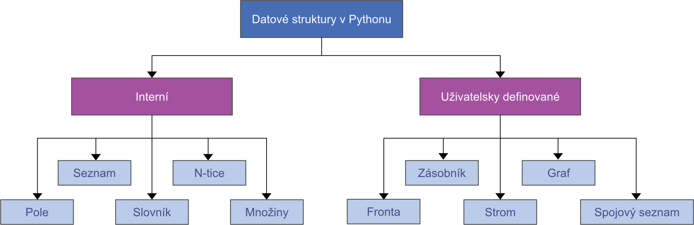
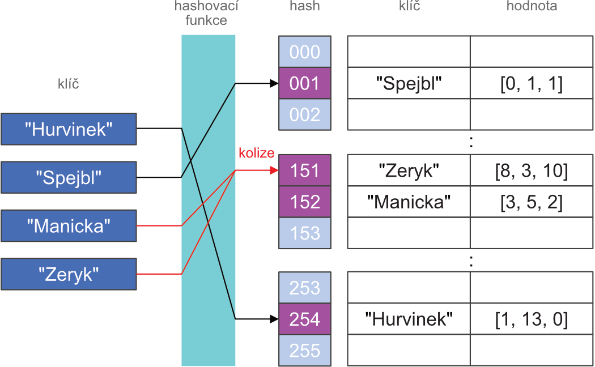

# CVIČENÍ 7: DATOVÉ STRUKTURY

Algoritmizace a programování

## CÍL 1

### DATOVÉ STRUKTURY

Při implementaci algoritmu je snaha zefektivnit výpočetní nároky programu. Taková optimalizace se netýká jen vhodného sestavení posloupnosti kroků, ale také způsobu, jakým náš program pracuje s daty. Datové typy a datové struktury nám umožňuje organizovat data tak, aby přístup a práce s nimi byly co nejvíce efektivní. Vhodná organizace dat nám také často umožňuje psát jednodušší a přehledné programy (a naopak). 

Cílem této lekce je získat přehled o výhodách a nevýhodách základních datových typů a struktur. U řady případů zjistíte, že na volbě datové struktury příliš nezáleží. V některých případech je naopak vhodná volba naprosto zásadní pro nalezení řešení problému v rozumném časovém horizontu. 

Datová struktura je zjednodušeně řečeno abstraktní obal, který nám umožňuje hromadit a organizovat data tak, aby přístup a práce s nimi byly co nejvíce efektivní. Datová struktura definuje vztah mezi daty a operace, které s nimi můžeme provádět. **Neexistuje** univerzální datová struktura, tzv. *one for all*. Proto je třeba zvolit vždy takovou datovou strukturu, která nám umožní řešit problém s maximální možnou efektivitou. V této kapitole si představíme základní neprimitivní datové struktury (primitivní datové struktury jsme si nazvali jako datové typy a probrali jsme je na začátku semestru), se kterými můžeme v Pythonu pracovat.

	Datové struktury lze obecně rozdělit na **lineární** a **nelineární**. V lineární datové struktuře (např. seznam) jsou data uspořádána ve formě sekvence a můžeme ji projít prvek po prvku v rámci jednoho cyklu. V nelineární datové struktuře (např. strom nebo graf) může existovat vazba mezi obecně mnoha prvky najednou a k prvkům nelze přistupovat sekvenčně. Taková struktura může reprezentovat např. mapu s městy a cestami mezi nimi. Základní přehled datových struktur uvádíme na obrázku.

Kromě datových struktur se budeme dnes i okrajově zabývat asymptotickou složitostí. Touto problematikou se budeme podrobně zabývat v další lekci. Momentálně nám stačí vědět, že asymptotická složitost je odhad růstu počtu operací v závislosti na množství zpracovávaných dat (*n*). Tento odhad budeme značit jako O(*f*(n)) a platí, že O(1) < O(log(n)) < O(n) < O(n^2) atd.

#### 1.1	Pole a seznamy (*arrays and lists*)

Se seznamem a jeho metodami jsme se již seznámili v předchozích lekcích a nebudeme se jím proto do hloubky zabývat. Se seznamem také úzce souvisí datová struktura s názvem *pole*. Pole uchovává data na podobném principu jako seznam. Může však obsahovat pouze položky stejného datového typu (například jen celá čísla). Na rozdíl od seznamu tak není třeba ukládat dodatečné informace o datovém typu pro každou položku, čímž dochází k úspoře paměti.

#### Kdy použít seznam

Potřebujeme jednoduchou iterovatelnou strukturu, ve které často dochází ke změně obsahu a/nebo datového typu položek.

Potřebujeme zachovat informaci o pořadí položek.

Nebudeme často provádět kontrolu přítomnosti prvků – asymptotická složitost je **O(n)**.

Nevyžadujeme náhodný přístup k položkám pomocí metod insert(), remove() a pop() – asymptotická složitost v těchto případech je **O(n)**.

#### Kdy použít pole

Potřebujeme iterovatelnou strukturu pro velké množství dat stejného datového typu.

Potřebujeme zachovat informaci o pořadí položek.

#### 1.2	NumPy Array

Za zmínku pak stojí zejména pole z externí knihovny NumPy (NumPy Array), které se velmi často používá v oblasti data science. Tento typ pole je optimalizován pro matematické operace nad vícerozměrnými maticemi a tenzory a pro tyto operace je podstatně výkonnější než interní datové struktury Pythonu.

	NumPy  (Numerical Python) je open source balíček jazyka Python, který se používá téměř ve všech oblastech vědy a techniky. V Pythonu nám nahrazuje velkou část základních funkcionalit jazyka Matlab, který je velmi oblíbený pro zpracování dat (s velmi podobnou syntaxí). V průběhu studia se setkáte s jejím opakovaným využitím například pro zpracování signálů či zpracování obrazů. Velmi vhodné je využití knihovny NumPy v případě, kdy chcete danou operaci provést pro všechny hodnoty v poli hodnot. Kromě samotného pole obsahuje tato knihovna celou řadu metod a funkcí, které umožňují snadné a efektivní operace s celým polem. Implementace pomocí NumPy bývá z pravidla výrazně efektivnější než iterování přes například celý seznam.

	Jelikož je NumPy externí knihovnou, je nutné ji nejprve nainstalovat a před použitím naimportovat. Ověřte, že máte knihovnu nainstalovanou: v PyCharmu -> File -> Settings… -> Project: *název_projektu* -> Python Interpreter. Pokud Vám v seznamu nainstalovaných balíčků chybí NumPy, proveďte instalaci pomocí tlačítka **+**. Knihovna Numpy se obvykle importuje pod zkratkou np.

| import numpy as np |
| --- |

Vytvoření pole lze provést například ze seznamu, nebo můžeme využít například funkce pro tvorbu pole nul, jedniček, náhodných hodnot, či hodnot v rozsahu (range):

| Vyzkoušej a analyzuj výstup |
| --- |
| my_array = np.array([0, 1, 2, 3]) my_array = np.zeros(4) my_array = np.ones(4) my_array = np.random.rand(4) my_array = np.arange(1, 6, 2) |

V poli lze indexovat a jde přes něj iterovat podobně jako u seznamu:

| Vyzkoušej a analyzuj výstup |
| --- |
| my_array = np.array([0, 1, 2, 3]) print(my_array[2])  for number in my_array:     print(number) |

Pole přitom mohou být vícerozměrná, kde se v nich pak indexuje následovně:

| Vyzkoušej a analyzuj výstup |
| --- |
| my_array = np.array([[0, 1, 2, 3], [4, 5, 6, 7]]) print(my_array) print(my_array[0, 1:3])  my_array = np.random.rand(2, 3, 2) print(my_array) print(my_array[0, 1, 0]) |

Velmi důležitá je pak možnost celé pole upravovat nějakou hodnotou (přičítat/odečítat, násobit/dělit, porovnávat):

| Vyzkoušej a analyzuj výstup |
| --- |
| my_array = np.array([0, 1, 2, 3])  my_multiplied_array = my_array * 5 print(my_multiplied_array)  my_binary_array = my_array > 1 print(my_binary_array) |

A obdobně jde tyto operace provádět prvek po prvku mezi dvěma poli:

| Vyzkoušej a analyzuj výstup |
| --- |
| my_array1 = np.array([0, 1, 2, 3]) my_array2 = np.array([1, 1, 2, 2]) print(my_array1 + my_array2) |

Další důležitou vlastností je možnost indexovat v jednom poli pomocí pole jiného a to buďto podle pozice:

| Vyzkoušej a analyzuj výstup |
| --- |
| my_array = np.array([2, 3, 4, 5, 6, 7]) my_array_index = np.array([0, 2, 4]) print(my_array[my_array_index]) |

Nebo pomocí stejně velkého binárního pole:

| Vyzkoušej a analyzuj výstup |
| --- |
| my_array = np.array([2, 3, 4, 5, 6, 7]) my_array_index = np.array([True, False, True, False, True, False]) print(my_array[my_array_index]) |

Což se může hodit například pokud budeme chtít vybrat jen prvky větší než určitá hodnota:

| Vyzkoušej a analyzuj výstup |
| --- |
| my_array = np.array([0, 1, 2, 3]) values = my_array[my_array > 1] print(values) |

Každé pole má datový typ, který je možné měnit:

| Vyzkoušej a analyzuj výstup |
| --- |
| my_array_float = np.ones(4, dtype=float) print(my_array_float.dtype)  my_array_int = my_array.astype(int) print(my_array_int.dtype) |

Velmi důležité je pak umět zjistit velikost pole nebo velikost měnit:

| Vyzkoušej a analyzuj výstup |
| --- |
| my_array = np.array([[0, 1, 2, 3], [4, 5, 6, 7]]) array_shape = my_array.shape print(array_shape)  my_array = my_array.reshape([4, 2]) print(my_array) array_shape = my_array.shape print(array_shape) |

Kromě toho numpy obsahuje velkou spoustu funkcí, kde lze zmínit pár nejdůležitějších:

| np.sum() np.mean() np.sqrt() np.round() np.max() np.argmax() np.sort() np.unique() |
| --- |

| Samostatný úkol |
| --- |
| Vytvoř pole s hodnotami 0, 1, 2, … 20. Umocni hodnoty pole na třetí. Všechny hodnoty pole větší než 10 nahraď nulou. Spočítej a vypiš součet všech hodnot ve výsledném poli a maximální hodnotu tohoto pole. |

**1.3	*****N*****-tice (*****tuples*****)**

S *n*-ticí jsme se již setkali. *N*-tice je podobně jako seznam uspořádaná sekvence *n* prvků. Můžeme tedy procházet v cyklu jednotlivé prvky, **nemůžeme** však **měnit** jejich obsah. U *n*-tice tedy nejsou k dispozici metody jako append(), remove() a pop(). Pokud funkce vrací více než jeden argument, bude výstup uložen právě ve formě *n*-tice.

### **Kdy použít *****n*****-tici**

Potřebujete použít konstantní sadu hodnot různých typů.

Potřebujete mít jistotu, že data ve struktuře nebudou přepsána (bezpečnost).

Potřebuje uložit sadu neměnných hodnot, kdy každá pozice ve struktuře bude mít svůj specifický význam – např. osové souřadnice či parametry rovnice.

#### 1.4	Množiny (*sets*)

Množiny obsahují na rozdíl od seznamů a *n*-tic **neuspořádané** prvky (prvky nemají svůj index). Množiny obsahují pouze unikátní prvky a obsah jednotlivých prvků je **nezměnitelný**. Pokud se pokusíme přidat prvek, který již v množině existuje, množina bude stále obsahovat prvek pouze jednou. Přestože nelze indexovat jednotlivé prvky, můžeme projít celou množinu a pro každý prvek provést nějakou operaci. Množiny jsou v Pythonu implementovány jako hashovací tabulka (viz dále) se všemi s tím souvisejícími výhodami a nevýhodami.

**Kdy použít množinu**

Potřebujete použít sadu unikátních hodnot.

Potřebujete efektivně vyhodnotit příslušnost k množině unikátních hodnot (např. znaky v abecedě).

Potřebujete efektivně provádět operace nad množinami pomocí metod intersection() (průnik), union() (sjednocení) či difference() (rozdíl). Asymptotická složitost operací je **O(n+m)**, kde *n* a *m* jsou velikosti množin.

Potřebujete efektivně odstranit duplicitní hodnoty ze seznamu či *n*-tice.

Množinu můžeme vytvořit podobným způsobem jako seznam nebo *n*-tici. K definici množiny ovšem využijeme složené závorky. O množině víme, že nemůže obsahovat duplicitní hodnoty. Pojďme si to rovnou ověřit. Ve skriptu definujte následující množinu a poté vytiskněte její obsah:

| Vyzkoušej a analyzuj výstup |
| --- |
| duck_family = {"Huey", "Dewey", "Louie", "Louie"} |

Také víme, že množina je neuspořádaná datová struktura. Zkuste přistoupit k některému z prvků pomocí indexu a ověřte výsledek:

| Vyzkoušej a analyzuj výstup |
| --- |
| duck_family[2] |

Pokud jste postupovali správně, měla by být výsledkem chybová zpráva. Indexaci sice použít nemůžeme, zato však můžeme zjistit, zda-li se prvek v množině vyskytuje:

| Vyzkoušej a analyzuj výstup |
| --- |
| "Dewey" in duck_family |

Také můžeme prvky s pomocí dostupných metod přidat, vyjmout nebo odstranit. Vyzkoušejte postupně následující příkazy a výsledek vytiskněte do terminálu:

| Vyzkoušej a analyzuj výstup |
| --- |
| duck_family.add("Daisy") duck_family.remove("Huey") member = duck_family.pop() |

Než přejdeme k praktické aplikaci, zamyslete se a zkuste vyřešit následující úkoly:

Někdy se může stát, že z množiny potřebujeme odstranit prvek, o kterém s jistotou nevíme, že se v ní vyskytuje. Pokuste se z množiny odstranit neexistující prvek. Pokud bude výsledkem chybová zpráva, zjistěte z dokumentace jak danou operaci provést bez chybového přerušení běhu programu.

Všechny výše uvedené metody mají v průměrném případě asymptotickou složitost **O(1)**. Zjistěte, jakou asymptotickou náročnost mají obdobné operace u seznamu a porovnejte obě datové struktury z pohledu jejich uplatnění.

Pokud nám nezáleží na pořadí položek v seznamu, lze množinu efektivně využít k získání unikátních záznamů. Stačí pomocí příkazu set() převést původní seznam na množinu a program automaticky odstraní všechny přítomné duplicity. Děje se tak s průměrnou asymptotickou složitostí **O(n)**:

| unique_items = set(list_of_items) |
| --- |

Uvažujme seznam IP adres návštěvníků našeho internetového obchodu. IP adresa se do databáze zapíše pokaždé, když návštěvník zobrazí stránky obchodu. Ze seznamu chceme získat statistiku o počet unikátních návštěvníků stránek za den:

| visitor_ip = ["198.125.1.000", "198.253.100.100", "120.5.5.5", "53.130.0.0", "120.5.5.5"] |
| --- |

Proveďte následující úkoly:

| Samostatný úkol |
| --- |
| Vytvořte funkci number_of_unique_items() a v ní implementujte naivní algoritmus, který v seznamu najde a spočítá všechny unikátní hodnoty. Využijte procházení pomocí cyklu for bez změny typu datové struktury. Implementujte algoritmus pro nalezení počtu unikátních hodnot s využitím množin. |

Vyhledejte v dokumentaci a seznamte se s použitím metod pro operace nad množinami union(), intersection() a difference(). Ve skriptu definujte dvě množiny hudebních skladeb – jedna reprezentuje soubor rockových balad a druhá soubor našich oblíbených písní. Všimněte si také, že jednotlivé položky jsou ve formě *n*-tic. V takovém případě je požadavek na unikátnost kladen na celou *n*-tici a nikoliv na jednotlivé prvky *n*-tice (viz vícenásobný výskyt skladeb od Nirvany). 

| balads = {("Led Zeppelin", "Stairway to Heaven"),           ("Metallica", "Fade to Black"),           ("Nirvana", "The Man Who Sold the World"),           ("Guns N Roses", "Patience"),           ("Nirvana", "Heart Shaped Box")}  favourite = {("Nirvana", "The Man Who Sold the World"),              ("Metallica", "Fade to Black"),              ("Kiss", "Detroit Rock City")} |
| --- |

| Samostatný úkol |
| --- |
| Vytvořte funkci operations_on_sets() a pomocí vhodné metody uložte do nové množiny monday_playlist všechny balady, které jsou v oblíbených nahrávkách. Pomocí vhodné metody uložte do nové množiny tuesday_playlist všechny oblíbené nahrávky, které nejsou balady. Zamyslete se, jak by vypadal naivní algoritmus s využitím for cyklu pro výše uvedené operace. |

#### 1.5	Hashování a hashovací tabulky

**Hashování** je technika, která pomocí hashovací funkce přiřazuje objektu unikátní identifikátor. Jako příklad si můžeme uvést identifikátory knih v knihovnách, které nám umožňují snadno získat informace o umístění knihy nebo výpůjčkách.

	**Hashovací tabulka** je datová struktura, která slouží pro ukládání párových objektů *klíč*–*hodnota* (*key*–*value*). Na rozdíl od seznamů nejsou prvky uspořádány do jedné sekvence a jednotlivé prvky nejsou indexovány pomocí posloupnosti celých čísel, ale pomocí klíčů ve formě čísla, řetězce nebo jiného **nezměnitelného** objektu. Klíč libovolné délky je pomocí hashovací funkce převeden na tzv. hash – hodnotu o konstantní a zpravidla menší délce než byl původní klíč. Díky tomu můžeme přistupovat k uloženým hodnotám podobně jako u seznamů s průměrnou složitostí **O(1)**. Současně však dochází k úspoře paměti, protože není nutné na rozdíl od pole či seznamu ukládat dlouhé celočíselné indexy (zejména v případě velkého počtu hodnot).

	V Pythonu najdeme hashovací tabulku pod názvem **slovník** (*d**ictionary*). Základní princip přístupu pomocí klíčů je uveden na následujícím obrázku.

|  | Pomocí hashovací funkce můžeme získat pouze konečné množství hashů (adres). V tabulce však můžeme mít teoreticky libovolné množství objektů. Hashovací funkce tedy nezaručuje, že pro dva různé objekty vrátí různou adresu. Taková situace se nazývá kolize. Hashovací tabulka zpravidla obsahuje mechanismus, jak se s takovou situací vypořádat. Při velkém nárůstu počtu kolizí (související s množstvím uložených dat) však může zásadně klesnout rychlost vyhledávání v tabulce. Asymptotická složitost pro nejhorší případ je O(n). |
| --- | --- |

#### Kdy použít slovník (hashovací tabulku)

Potřebujete implementovat rychlé vyhledávání položek (databáze)

Potřebujete využít logickou vazbu mezi názvem klíče a uloženou hodnotou

Potřebujete opakovaně vkládat a odstraňovat položky s konstantním časem

Potřebujete vytvořit komplexní vazby mezi položkami (hodnotou může být klíč nebo seznam klíčů pro jiný slovník)

#### 1.6	Základní práce se slovníkem

Slovník definujeme podobně jako množinu pomocí složených závorek (v obou případech jde vlastně o hashovací tabulku). Slovník však obsahuje vždy párové prvky *klíč*–*hodnota*, které jsou odděleny dvojtečkou. Slovník s dvěma klíči tak může vypadat např. takto:

| Vyzkoušej a analyzuj výstup |
| --- |
| most_wanted = {"Pablo Escobar": 150, "Joaqim Guzmán": 125} |

Jako hodnoty jsme si zvolili průměrnou roční produkci syntetických drog obou bývalých hlav kartelů. K hodnotám slovníku nyní místo indexu přistupujeme pomocí našeho klíče:

| Vyzkoušej a analyzuj výstup |
| --- |
| pablos_amount = most_wanted["Pablo Escobar"] |

Hodnoty můžeme pomocí klíče jednoduše změnit. Jako u jiných datových struktur v Pythonu není nutné dodržet stejný datový typ hodnoty u všech záznamů. Průměrnou roční produkci si tak můžeme nahradit *n*-ticí s produkcí za poslední 3 roky:

| Vyzkoušej a analyzuj výstup |
| --- |
| most_wanted["Pablo Escobar"] = (138, 164, 151) |

Záznamy můžeme samozřejmě přidávat a odebírat podobně jako u seznamů. Přístup k položkám má však na rozdíl od seznamu konstantní průměrnou asymptotickou složitost **O(1)**:

| Vyzkoušej a analyzuj výstup |
| --- |
| most_wanted["Ismael Garcia"] = (52, 50, 63)  del most_wanted["Joaqim Guzmán"] |

Slovník není nutné vytvářet pouze postupným zadáváním objektů. Prázdný slovník můžeme naplnit pomocí cyklu for. Pro konstrukci slovníku lze také využít příkaz dict() a *n*-tice. A pokud je náhodou nemáme, poslouží nám již známá funkce zip():

| Vyzkoušej a analyzuj výstup |
| --- |
| names = ["Pablo Escobar", "Joaqim Guzmán", "Ismael Garcia"] production = [(138, 164, 151), (125, 113, 113), (52, 50, 63)] most_wanted = dict(zip(names, production)) |

Ze slovníku je možné dle potřeby extrahovat všechny existující klíče (*keys*) i hodnoty (*va**lues*). Také můžeme obě položky procházet pomocí cyklu:

| Vyzkoušej a analyzuj výstup |
| --- |
| dict_keys = most_wanted.keys() dict_values = most_wanted.values() |

Slovník můžeme procházet v cyklu a získat tak klíče slovníku. Případně můžeme klíče procházet také pomocí metody keys() a hodnoty pomocí metody values(). Pokud budeme potřebovat procházet v cyklu klíče a zároveň i jejich hodnoty, použijeme metodu items(), která bude v cyklu vracet dvojice.

| Vyzkoušej a analyzuj výstup |
| --- |
| for key in most_wanted:     print(key)  for key in most_wanted.keys():     print(key)  for value in most_wanted.values():     print(value)  for key, value in most_wanted.items():     print(f"{key}: {value}") |

#### 1.7	Další datové struktury

Pro přehled uvádíme seznam dalších důležitých datových struktur, které se vám mohou v budoucnu hodit.

| Struktura | Popis |
| --- | --- |
| Strom (Tree) | Stromy jsou specifickým typem grafu. Jedná se o hierarchickou strukturu, která nemůže obsahovat smyčky. |
| Trie | Trie (či Prefix Tree) technicky patří mezi stromy. Umožňuje efektivní operace nad řetězci, zejména vyhledání (retrievel) slov. |
| Halda (Heap) | Halda taktéž patří mezi stromy. Základní vlastností haldy je hierarchnické uspořádání prvků dle velikosti (potomek je menší než rodič). Taková halda se pak nazývá jako Max Heap. |

## CÍL 2

### PRÁCE SE SOUBORY

Data uložená pouze v paměti se s vypnutím naší aplikace ztratí. V mnoha případech je naopak naší potřebou data uchovávat. Pokud chceme zajistit, aby data byla trvalá (perzistentní), musíme při ukončení programu zajistit jejich uložení a při načtení programu data zase načíst. K ukládání dat aplikace existuje mnoho způsobů, kde každý má své výhody a nevýhody. Obecně můžeme ukládat data z naší aplikace následujícím způsobem:

Textové soubory s plochou strukturou (např. .txt a .csv)

Textové soubory s vnitřní hierarchií (např. .xml nebo .json)

Soubory binárního typu

Databáze 

V této části lekce se seznámíme s několika základními typy souborů a se základními funkcemi a metodami pro práci s nimi. Do detailu se podíváme na práci s textovými soubory. Práce se soubory se vám může velice hodit nejen v budoucích projektech a studentských pracích. V mnoha případech narazíte na nutnost načítání měřených dat z textových nebo CSV souborů a nebo budete sami potřebovat data po jejich zpracování uložit. 

#### 2.1	Práce s textovými soubory

Nejsnazší cestou, jak uložit data naší aplikace na pevný disk, je využít textové soubory. V textových  souborech s příponou *.txt je text uložen v jednoduché formě na jednotlivých řádcích. K oddělení řádků se pak využívá speciálních znaků. Pokud chceme ze souboru číst nebo do něj zapisovat, musíme jej nejprve otevřít. Až budeme s úpravami souboru hotovi, je nutné soubor bezprostředně uzavřít, aby se uvolnily paměťové prostředky svázané se souborem. Proto v Pythonu probíhá operace se soubory v následujícím pořadí: **otevření** souboru, **provedení operace** (čtení nebo zápis) a **zavření** souboru.

Python disponuje funkcí open() pro snadné otevření souborů. Funkce vrací objekt souboru, se kterým můžeme dále pracovat. Při otevírání textových souborů je možné specifikovat mód (režim), ve kterém je soubor otevřen. Mimo výběr módu, co budeme se souborem chtít dělat, můžeme také zvolit, zda bude soubor otevřen v textovém nebo binárním módu (režim t a b).

| Režim | Operace |
| --- | --- |
| r | otevře soubor pouze pro čtení (výchozí nastavení) |
| w | otevře soubor pro zápis a současně vytvoří nový soubor (pokud neexistuje) |
| x | otevře soubor pro zápis v exkluzivním režimu, pokud již existuje, operace selže |
| a | otevře soubor s přístupem na jeho konec a umožní přidávat data na této pozici |
| t | otevře soubor v textovém režimu |
| b | otevře soubor v binárním režimu |
| + | otevře soubor pro jeho aktualizaci (čtení nebo zápis) |

**Soubory pro následující úkoly jsou k dispozici na e-learningu.**

Pro otevření souboru je nutné zadat jako vstupní argument funkce open() název souboru resp. relativní cestu k souboru nebo absolutní cestu, pokud se soubor nenachází ve stejném pracovním adresáři jako skript:

| Vyzkoušej a analyzuj výstup |
| --- |
| file = open("lipsum.txt") file = open("V:/BPC-PRG/lecture_08/lipsum.txt") print(file) |

V naší ukázce se soubor otevře v režimu čtení a v textovém režimu ( = defaultní nastavení). Režim práce se souborem zadáváme jako druhý argument do funkce open() a můžeme je i kombinovat:

| file = open("lipsum.txt")                     # ekvivalent k 'r' nebo 'rt' file = open("lipsum.txt", mode="w")           # zápis do souborou v textovém režimu file = open("img.bmp", mode="r+b")            # čtení a zápis v binárním režimu |
| --- |

Při práci s textovými soubory si musíme dát pozor na správnou práci se znaky, a to správně zvolenou znakovou sadou. Pro práci s běžnými znaky je nejdříve nutné uvažovat ASCII sadu. Navíc je dekódování závislé na platformě, na které Python běží (cp1252 ve Windows, utf-8 obvykle u Linux). Typ kódování uzpůsobíme opět dalším argumentem ve funkci open().

| file = open("lipsum.txt", mode="r", encoding="utf-8") print(file) |
| --- |

Až skončíme s prováděním operací se souborem, musíme soubor správně zavřít. Uzavřením souboru dojde k uvolnění paměťových prostředků svázaných se souborem. To zajistíme pomocí metody close() dostupné v Pythonu k tomuto účelu.

| file = open("lipsum.txt", mode="r", encoding="utf-8") # vykonání operací se souborem v této části print(file) file.close() |
| --- |

V praxi budeme využívat další možnost jak bezpečně načíst, zpracovat a uzavřít soubor a to pomocí příkazu with. Blok příkazů pro zpracování souboru pak musí být odsazený o čtyři mezery stejně jako u cyklů atd. Po ukončení odsazení dojde k bezpečnému uzavření souboru.

| Vyzkoušej a analyzuj výstup |
| --- |
| with open("lipsum.txt", mode="r", encoding="utf-8") as file:     # vykonání operací se souborem v této části     print(file) |

#### 2.2	Čtení ze souboru

Chceme-li ze souboru číst, musíme jej otevřít v režimu čtení (r). K tomuto účelu jsou k dispozici různé metody. Nejdříve je to metoda read(size) ke čtení v rozsahu (size) o zadaného počtu znaků. Pokud není zadán parametr size, Provede se přečtení celého souboru.

Část souboru lipsum.txt, který máte k dispozici, si můžeme přečíst následujícím způsobem:

| Vyzkoušej a analyzuj výstup |
| --- |
| with open("lipsum.txt", mode="r") as file:     content = file.read()     print(content) |

Nyní zkuste zadat hodnotu rozsahu (size) např. 13 a porovnejte výstupy.

Mnohdy se nám hodí přečíst jednotlivé řádky textového souboru. Jeden řádek můžeme přečíst pomocí metody readline().

| Vyzkoušej a analyzuj výstup |
| --- |
| with open("lipsum.txt", mode="r") as file:     first_line = file.readline()     second_line = file.readline()     print(first_line)     print(second_line) |

Voláním metody readline() dvakrát po sobě provedeme přečtení prvních dvou řádků, takže byste na výstupu měli získat první dva řádky souboru lipsum.txt. 

V tomto případě se pak přímo nabízí využít metodu readlines() pro přečtení celého souboru a uložení jednotlivých řádků do seznamu. 

| Vyzkoušej a analyzuj výstup |
| --- |
| with open("lipsum.txt", mode="r") as file:     content = file.readlines()     print(content)     for line in content:         print(line.strip()) |

Na rozdíl od metody readline() přečte metoda readlines() celý soubor a jednotlivé řádky uloží do seznamu. Jednotlivé řádky souboru jsou pak vytištěny pomocí cyklu. Jak jste si všimli, tak konce řádků (\n) se ukládají jako prázdné řádky. K jejich odstranění proto využíváme metodu strip(). 

#### 2.3	Zápis do souboru

Abychom mohli v Pythonu zapisovat do souboru, musíme jej otevřít v režimu zápisu (w), připojení (a), nebo v exkluzivním režimu (x).

|  | V režimu w dojde před zápisem ke smazání všech dosavadních dat v souboru, pokud již existuje! |
| --- | --- |

Zápis řetězce nebo sekvence bajtů (pro binární soubory) provádíme pomocí metody write(). Dle následujícího příkladu vytvořte svůj první txt soubor v jazyce Python a zapište do něj tři řádky. Následně ověřte, že nově vzniklý textový soubor existuje a využijte (jakýkoliv) textový editor pro prozkoumání jeho obsahu:

| Vyzkoušej a analyzuj výstup |
| --- |
| with open("my_first_file.txt", mode="w", encoding="utf-8") as file:     file.write("Muj prvni soubor!\n")     file.write("\n")     file.write("Na Python jsem si uz zvykl\n") |

Při změně argumentů funkce write() v našem skriptu dojde k přepsání textu a uložení souboru.  Nyní si sami zkuste skript upravit (jeho doplněním) tak, aby do již existujícího souboru vepsal další řádek:

| Úkol |
| --- |
| Otevřete soubor my_first_file.txt.  S využitím obměny argumentu "w" na "a" (append) zajistěte přidání čtvrtého řádku: "a zacinam jej mit rad :)" Obsah souboru si prohlédněte v libovolném textovém editoru. |

Metod pro práci s textovými soubory je celá řada a rozšiřující znalosti již můžete získat dalším samostudiem z vhodných výukových a demonstračních materiálů. Jen pro příklad, další metody umožňují zjistit, zda je do souboru možné zapisovat, nebo z něj číst, umožňují zápis celých řádků textu, najít konkrétní pozici v textu, od které začneme číst.

#### 2.4	Práce s CSV soubory

Pro práci s CSV soubory je v Pythonu k dispozici modul csv, který nutné naimportovat. Pro načtení dat využijeme funkci csv.reader(), která vrací objekt s daty. Sady hodnot dle následujícího příkladu přečteme řádek po řádku a zobrazíme přehledně ve sloupcích. 

Jako zdroj využijeme zdrojová data biostats.csv z databáze :

| Vyzkoušej a analyzuj výstup |
| --- |
| import csv  with open("biostats.csv", mode="r") as stats_file:     reader = csv.reader(stats_file)     for row in reader:         print(row) |

V našem příkladu jsme počítali s tím, že jednotlivé hodnoty v souboru budou odděleny čárkou. Pokud se však oddělovač liší, je nutné jej specifikovat:

| reader = csv.reader(file, delimiter="\t") |
| --- |

K vytvoření CSV souboru a zápisu hodnot využíváme způsobem funkci csv.writer() a metodu writerow() pro zápis jednotlivých řádků (s hodnotami různého typu oddělenými čárkou) do souboru.

| Vyzkoušej a analyzuj výstup |
| --- |
| with open("persons.csv", mode="w", newline="") as file:     writer = csv.writer(file)     writer.writerow(["Cislo", "Jmeno", "Vek", "Vyska", "Vaha"])     writer.writerow([1, "Michal D.", "48", "178", "93"])     writer.writerow([2, "Jan S.", "42", "191", "101"])     writer.writerow([3, "Ondrej H.", "21", "170", "67"]) |

Hromadný zápis dat do CSV souboru je umožněn metodou writerows(), za podmínky, že jsou data k dispozici ve formě vnořeného seznamu: 

| Vyzkoušej a analyzuj výstup |
| --- |
| csv_data = [     ["Cislo", "Jmeno", "Vek", "Vyska", "Vaha"],     [1, "Michal D.", "48", "178", "93"],     [2, "Jan S.", "42", "191", "101"],     [3, "Ondrej H.", "21", "170", "67"], ] with open("persons.csv", mode="w", newline="") as data_file:     writer = csv.writer(data_file)     writer.writerows(csv_data) |

#### 2.5	Datový formát  JSON

Se slovníky pak úzce souvisí i datový formát JSON (*JavaScript Object Notation*), který je velice rozšířený formát pro uchování a přenos dat. Jedná se o strukturovaný, textový a na jazyce nezávislý formát. I když může JSON na první pohled vypadat hodně podobně jako  zápis v Pythonu, nejedná se o to samé a JSON má vlastní pravidla pro zápis dat. 

Pro práci s JSON (řetězci nebo soubory obsahujícími JSON objekty) budeme v Pythonu využívat modul json, který je nutné nejdříve importovat. Data z JSON řetězce lze načíst pomocí metody json.loads(). Tato funkce převede textový řetězec na odpovídající pythonní objekty. Ale pozor ne všechny pythonní objekty mají svůj ekvivalent v JSON formátu, proto je vhodné načtená data v Pythonu vždy zkontrolovat. Jaký objekt (datovou strukturu) získáme po načtení dat v následujícím příkladu?

| Vyzkoušej a analyzuj výstup |
| --- |
| import json  json_string = """     {"name": ["Jiri", "Michal"], "age": [30, 25], "city": ["Praha", "Brno"]} """ persons = json.loads(json_string) print(persons) |

Strukturovaná data mohou být také uložena v souboru, pak postupujeme obdobně jako při práci s textovými soubory. Pro načtení JSON řetězce ze souboru a převedení na pythonní objekty pak využijeme metodu json.load():

| with open("personal_data.json") as data_file:     data = json.load(data_file) |
| --- |

V případě zápisu dat z Pythonu do JSON souboru umístěném na disku využijeme metody json.dump(). Pro zakódování dat do JSON řetězce pak použijeme json.dumps().

| Vyzkoušej a analyzuj výstup |
| --- |
| with open("personal_data.json", mode="w") as json_file:     json.dump(persons, json_file, indent=4, sort_keys=True) |

V libovolném textovém editoru si zobrazte nově vytvořený soubor personal_data.json. Uvidíme, že data jsou strukturovaná a jejich formátování jsme ovlivnili pomocí parametru sort_keys, který v případě hodnoty True zajistí třídění dat, a parametru indent, který zajistil odsazení. 

Také lze postupovat opačně, data načteme z JSON souboru a zobrazíme je uspořádaně a přehledně s pomocí stejných parametrů.

| Vyzkoušej a analyzuj výstup |
| --- |
| with open("personal_data.json") as json_file:     my_dict = json.load(json_file) print(json.dumps(my_dict, indent=4, sort_keys=True)) |

#### 2.6	Praktický příklad

Vraťme se teď k našim narkobaronům. Tajná služba chce na seznam hledaných osob přidat další kriminální živly. Seznam nových živlů byl zaslán v souboru new_criminals.json. 

| Samostatný úkol |
| --- |
| Vytvoř nový skript criminals.py a v něm hlavní funkci main(), do ní zkopíruj následující řádky:  names = ["Pablo Escobar", "Joaqim Guzmán", "Ismael Garcia"] production = [(138, 164, 151), (125, 113, 113), (52, 50, 63)] most_wanted = dict(zip(names, production))  V hlavní funkci proveď načtení dat ze souboru new_criminals.json, přiřaď je do proměnné new_criminals a ověř, v jaké datové struktuře se data načetla.  Vytvoř funkci criminals(), která bude mít dva vstupní parametry: současný slovník zločinců - most_wanted a bude nový slovník zločinců - new_criminals.  Ve funkci zkontroluj, jestli se některý z nových zločinců již nachází ve slovníku most_wanted.  Pokud ano, proveď ve slovníku most_wanted aktualizaci hodnot produkce drog pro daného zločince. Pokud ne, přidej daného zločince do slovníku most_wanted včetně jeho hodnot produkce.  Volání funkce a korektnost její implementace ověřte voláním z hlavní funkce main(). |

| Samostatný úkol |
| --- |
| Hlavní funkci rozšiř o slovník origin, do kterého jsme uložili množiny všech hledaných osob dle země jejich původu (volba je zcela fiktivní):  origin = {    "Mexico": {"Manuel Noriega", "Pablo Escobar", "Joaqim Guzmán", "Ismael Garcia"},    "Columbia": {"Rick Ross", "William Jardine"}, }  Vytvoř funkci get_production(), která pro zadaný stát vrátí celkovou produkci syntetických drog za poslední tři roky.   Vstupním parametrem funkce bude kromě názvu státu také slovník origin a most_wanted. Pro řešení využijte hodnoty ve slovníku origin jako klíče pro vyhledávání ve slovníku most_wanted.   Volání funkce pak může vypadat např. takto: get_production("Columbia", origin, most_wanted) a výstup bude 70.  Volání funkce a korektnost její implementace ověřte voláním z hlavní funkce main(). |

### SAMOSTATNÝ ÚKOL

| Samostatný úkol |
| --- |
| Implementujte algoritmus pro kontrolu správně vyplněného řádku sudoku.  V modulu sudoku.py vytvoř funkci is_correct(). Funkce bude mít jeden vstupní parametr – seznam s devíti prvky (čísly).  Výstupním parametrem bude logická hodnota True, pokud je řádek sudoku správně vyplněn.  Na funkci jsou kladeny následující požadavky: Seznam projde kontrolou, pokud bude obsahovat čísla 1 až 9 a každé z nich právě jednou. Kontrola bude provedena pomocí množin a metod nad množinou.  Volání funkce a korektnost její implementace ověř voláním hlavní funkce main(). |

