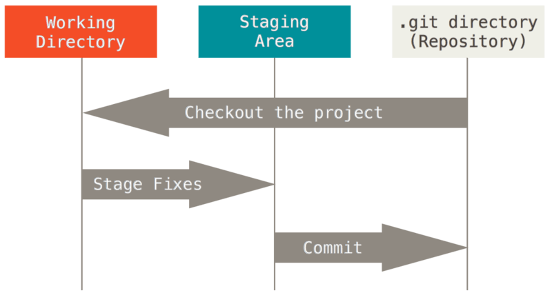
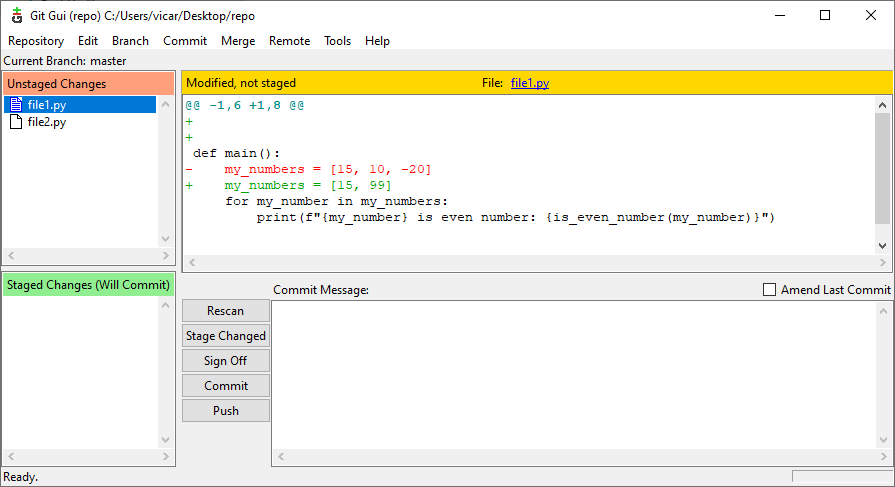
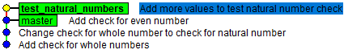
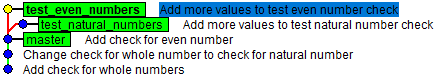
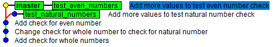
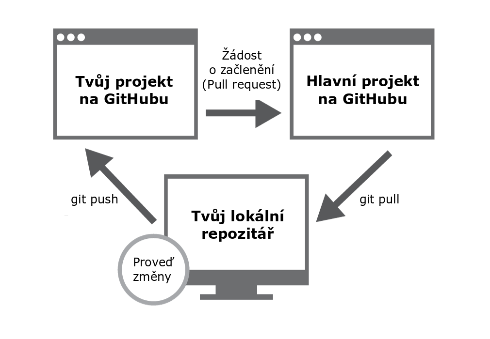

# CVIČENÍ: ZÁKLADY GIT A GITHUB

Algoritmizace a programování

## CÍL 1

### ZÁKLADY PRÁCE S GIT

V tomto cvičení se blíže seznámíme se systémem **Git**, který již znáte z domácích úkolů. Git je poměrně univerzální nástroj pro správu a synchronizaci dat v souborech. Git je verzovacím nástrojem, tzn. zaznamenává změny prováděné v souborech v průběhu času a uživatel tak může kdykoli obnovit jejich konkrétní verzi (to je tzv. verzování).

Lokální úložiště je zajištěno na vlastním počítači pomocí verzovací databáze, jak vyjadřuje obrázek uvedený níže. Lokální verzovací systém uchovává v databázi sadu verzí spravovaného souboru. 

Git používá pro spravované soubory tři základní stavy: 

změněno (modified) = v souboru byly provedeny změny, soubor ale ještě nebyl zapsán do databáze,

připraveno k zapsání (staged) = změněný soubor v jeho aktuální verzi je určen k zapsání do další verze,

zapsáno (committed) = data jsou bezpečně uložena ve vaší lokální databázi.

Z výše uvedeného vyplývá, že projekt je v systému Git rozdělen do tří částí: 

pracovní adresář (working directory),

oblast připravovaných změn (staging area),

adresář systému Git (Git directory).

Tyto stavy a jejich vzájemný vztah jsou znázorněny na následujícím obrázku.

Git se dá používat různými způsoby - k dispozici jsou základní nástroje pro použití příkazového řádku a existuje i řada grafických uživatelských rozhraní pro snadnou a názornou práci s repozitáři. Ačkoli jsou grafická prostředí multiuživatelská, přehlednější,  pracuje se s nimi pohodlněji a k tomu nabízí k řadu přídavných nástrojů, v nekomerční podobě (free verzi) nabízí jen omezené možnosti. Mezi nejznámější patří:

GitHub

GitLab

BitBucket

GitKraken

V této lekci se naučíme Git nakonfigurovat a inicializovat repozitář, zahájit sledování souborů, připravovat soubory k **zápisu (stage**), zapisovat **revize (commit)** a vytvářet **větve (branches)** repozitáře. Seznámíme se s platformou pro správu vzdálených repozitářů - **GitHub**.

**1.1	Globální nastavení**

Předtím než začneme Git používat, musíme ho správně nastavit. Nejprve je potřeba Gitu nastavit editor. Do příkazové řádky zadejte:

**Windows:**

| > git config --global core.editor notepad > git config --global format.commitMessageColumns 80 > git config --global gui.encoding utf-8 |
| --- |

**Linux/macOS**:

| $ git config --global core.editor nano |
| --- |

Na projektu většinou spolupracuje více lidí dohromady, proto každá změna musí mít svého autora, kterého lze dohledat. Pokud v Gitu nemáte nastavené jméno a email, proveďte nastavení pomocí následujících příkazů a změňte v nich jméno a email:

| > git config --global user.name "Zuzana Nova" > git config --global user.email z.nova@vut.cz |
| --- |

Nakonec nastavte barevné výpisy Gitu v příkazové řádce.

| > git config --global color.ui true |
| --- |

Po zadání příkazů git config to vypadá, že se nic nestalo. Nic nového se do příkazové řádky nevypíše, ale to je naprosto v pořádku. Aktuální nastavení lze zkontrolovat zadáním následujícího příkazu:

| > git config --global --list |
| --- |

| core.editor=notepad format.commitmessagecolumns=80 gui.encoding=utf-8 user.name=Zuzana Nova user.email=z.nova@vut.cz color.ui=true |
| --- |

V případě, že bude chtít nějaké konkrétní nastavení změnit, použijte znova příkaz nastavení s novými hodnotami. Pokud konfigurace Gitu v jakémkoliv kroku neproběhla, ihned se obraťte na cvičícího.

**1.2	Založení repozitáře**

Vytvořte si složku pro dnešní cvičení a pomocí příkazové řádky se do ní přepněte (pomocí cd). Následně založíme v této složce gitový repozitář.

| > git init Initialized empty Git repository in ./.git/ |
| --- |

Tento repozitář je zatím prázdný. Ověřte to příkazem git status.

| > git status On branch master   No commits yet   nothing to commit (create/copy files and use "git add" to track) |
| --- |

Tento výpis nám říká, že jsme na hlavní větvi master „On branch master“ (o větvích se dozvíte více později). „No commits yet“, říká, že v gitu zatím není žádná revize a hláška „nothing to commit“ říká, že ve složce není nic, co bychom do gitu mohli přidat, adresář je prázdný.

|  | Git při inicializaci vytváří skrytou složku .git a do ní si uloží nějaké informace. U ní platí stejně jako u složky s virtuálním prostředím, že do této složky nebudeme nijak zasahovat, nebudeme ji nikam přesouvat nebo mazat. |
| --- | --- |

**1.3	První revize**

| Samostatný úkol |
| --- |
| Vytvoř soubor analyse_numbers.py. Při vytváření souboru v PyCharmu se program zeptá, zda chcete přidat soubor do Gitu. Hlášku prozatím nepotvrzuj a přidání do Gitu zruš pomocí Cancel.  Vytvoř funkci is_whole_number() se vstupním parametrem number. Tato funkce ověří, jestli je hodnota v proměnné number celé číslo. Výstupním parametrem bude logická hodnota True, pokud je číslo celé, a False v případě, že celé není. Nezapomeň doplnit kód definující hlavní funkci bez vstupních parametrů. V hlavní funkci vytvoř proměnnou my_number, ke které přiřaď libovolnou číselnou hodnotu. Funkci is_whole_number() zavolej se vstupním argumentem my_number a výsledek vypište do terminálu. |

Po dokončení úkolu zadejte do příkazové řádky opět příkaz git status a všimněte si, co se změnilo.

| > git status On branch master  No commits yet   Untracked files:   (use "git add <file>..." to include in what will be committed)           analyse_numbers.py  nothing added to commit but untracked files present (use "git add" to track) |
| --- |

Git nám nyní hlásí, že registruje jeden soubor analyse_numbers.py, který ale zatím nesleduje. Stejně jako nám tento soubor svítí v příkazové řádce červeně, stejně barevně se zobrazuje i v PyCharmu.

Každý soubor, který chceme pomocí Gitu sledovat, musíme do Gitu nejprve **přidat**. PyCharm nám, to nabízel automaticky při vytváření souboru, ale je nutné to umět i bez jeho pomoci. Soubor přidáme manuálně pomocí následujícího příkazu:

| > git add analyse_numbers.py |
| --- |

Výsledek ověříme pomocí git status:

| > git status On branch master   No commits yet   Changes to be committed:   (use "git rm --cached <file>..." to unstage)       	new file:   analyse_numbers.py |
| --- |

Náš soubor nyní zezelenal a změny se z pracovního adresáře přesunuly do části **Stage**. Tady najdeme změny, které budou přidány do nové **revize** (**commit**).

Vytvoříme tedy novou revizi:

| > git commit |
| --- |

Po zadání tohoto příkazu se otevře editor Poznámkový blok (Notepad), do kterého napíšeme popisek k této revizi, abychom věděli, jaké změny jsme v dané revizi provedli. Na první řádek napište tedy např.: Add check for whole numbers. Ostatní řádky začínající # můžete ignorovat. Soubor Uložte (**nepoužívejte “Uložit jako”**) a zavřete. 

Další možností, jak zadat popis revize, jste již používali u domácích úkolů (viz níže). Jakou variantu při vytváření commitu zvolíte, záleží na vás.

| > git commit -m "Add check for whole numbers" |
| --- |

Po zavření okna editoru nebo po zadání předchozího příkazu, se v příkazové řádce se vypíše krátká informace o provedené revizi.

| [master (root-commit) a670f2d] Add check for whole numbers  1 file changed, 14 insertions(+)  create mode 100644 analyse_numbers.py |
| --- |

Zkontrolujte stav repozitáře.

| > git status On branch master nothing to commit, working tree clean |
| --- |

Tento výpis nám říká, že Git žádné změny nevidí. Ty jsou již uloženy v revizi, kterou jsme právě vytvořili. Teď si můžete povšimnout, že v PyCharmu soubor analyse_numbers.py již není barevně zvýrazněn, nejsou v něm tedy žádné změny.

Detailní informace o poslední revizi lze získat pomocí příkazu git show.

| > git show commit a670f2d2744a27e29fcb4a24bf6ed5a2835d0d12 (HEAD -> master) Author: Zuzana Nova <z.nova@vut.cz> Date:   Wed Mar 24 17:05:48 2021 +0100   	Add check for whole numbers   diff --git a/analyse_numbers.py b/analyse_numbers.py new file mode 100644 index 0000000..3ae86f1 --- /dev/null +++ b/analyse_numbers.py @@ -0,0 +1,14 @@ +def is_whole_number(number): +    if number % 1 == 0: +        return True +    else: +        return False + + +def main(): +    my_number = 15 +    print(f"{my_number} is whole number: {is_whole_number(my_number)}") + + +if __name__ == "__main__": +    main() |
| --- |

Úplně nahoře vidíme unikátní označení revize, díky kterému se můžeme v budoucnu k této revizi vrátit, pokud bude potřeba. Následuje jméno autora a e-mail, datum vytvoření revize, její popis, a nakonec shrnutí změn. Ve výpisu se lze pohybovat pomocí šipek nahoru/dolů, klávesami PgUp/PgDn a procházení ukončíte pomocí klávesy q.

**1.4	Druhá revize**

| Úkol |
| --- |
| Nyní potřebujeme změnit již hotovou funkci is_whole_number(), protože jsme zjistili, že nepotřebujeme ověřovat, zda je číslo celé, ale potřebujeme zjistit, zda se jedná o číslo přirozené. Změňte adekvátně funkci is_whole_number(): Upravte název funkce. Upravte část ověřující vlastnosti čísla. Nezapomeňte upravit volání funkce. Po úpravě funkce zkontrolujte stav repozitáře. |

| > git status On branch master Changes not staged for commit:   (use "git add <file>..." to update what will be committed)   (use "git checkout -- <file>..." to discard changes in working directory)       	modified:   analyse_numbers.py   no changes added to commit (use "git add" and/or "git commit -a") |
| --- |

Git, který sleduje náš soubor, zjistil, že se něco změnilo a ve výpisu soubor opět zčervenal. V PyCharmu se změny ve sledovaném souboru projeví zmodráním jeho názvu a vedle čísel řádků se objeví barevný sloupec. Zelená značí přidání celého nového řádku, modrá změnu na stávajícím řádku a šedá šipka značí smazané řádky. Pokud na ně v PyCharmu kliknete, uvidíte, jak kód v daném místě před Vaší úpravou vypadal. Co všechno se změnilo zjistíme také pomocí příkazu git diff. Tento příkaz se bude hodit pokaždé, když během úprav kódu přestane některá programu část fungovat. Díky němu vidíme změny, které jsme prozatím provedli, tudíž chyba musí být na některém z upravovaných (barevných) řádků.

| > git diff diff --git a/analyse_numbers.py b/analyse_numbers.py index 3ae86f1..69b9b5c 100644 --- a/analyse_numbers.py +++ b/analyse_numbers.py @@ -1,5 +1,5 @@ -def is_whole_number(number): -    if number % 1 == 0: +def is_natural_number(number): +    if number % 1 == 0 and number > 0:          return True      else:          return False @@ -7,7 +7,7 @@ def is_whole_number(number):  def main():      my_number = 15 -    print(f"{my_number} is whole number: {is_whole_number(my_number)}") +    print(f"{my_number} is natural number: {is_natural_number(my_number)}") |
| --- |

Podle výpisu můžeme vidět, co se, na kterém řádku změnilo. Červeně vyznačené řádky s - byly odebrány a řádky zelené s + na začátku naopak přibyly. Dál můžeme vidět, že i když v řádku změníme jen jediné slovo, Git ukáže řádek jako smazaný a znova přidaný. Řádky začínající s @@ říkají, kde v souboru proběhla změna.

Pokud jsou úpravy kódu hotové, řekneme gitu, aby je použil v další revizi.

| > git add analyse_numbers.py |
| --- |

Stav zkontrolujte pomocí git status.

| > git status On branch master Changes to be committed:   (use "git reset HEAD <file>..." to unstage)           modified:   analyse_numbers.py |
| --- |

Vytvořte novou revizi pomocí git commit a zkontrolujte pomocí git show, který ukáže poslední revizi.

| > git show commit d012da8f74790bf9a7774addd9744c977426f439 (HEAD -> master) Author: Zuzana Nova <z.nova@vut.cz> Date:   Wed Mar 24 19:54:46 2021 +0100   	Change check for whole number to check for natural number   diff --git a/analyse_numbers.py b/analyse_numbers.py index 3ae86f1..69b9b5c 100644 --- a/analyse_numbers.py +++ b/analyse_numbers.py @@ -1,5 +1,5 @@ -def is_whole_number(number): -    if number % 1 == 0: +def is_natural_number(number): +    if number % 1 == 0 and number > 0:          return True      else:          return False @@ -7,7 +7,7 @@ def is_whole_number(number):  def main():      my_number = 15 -    print(f"{my_number} is whole number: {is_whole_number(my_number)}") +    print(f"{my_number} is natural number: {is_natural_number(my_number)}") |
| --- |

|  | Jak psát zprávy k revizím Na prvním řádku shrňte změny ideálně v jedné větě, která nepřesáhne 50 znaků. Tato věta se obvykle píše v činném rodě, začíná velkým písmenem a neukončuje se tečkou, např.:  Fix typo in introduction to user guide  Tyto jednořádkové popisky slouží k lepší orientaci v historii revizí projektu a využívají je různé další nástroje s Gitem spojené, a proto si na nich dejte záležet. Pokud nejste schopni shrnout změny na tomto jediném řádku, pravděpodobně jsou změny příliš rozsáhlé a bylo lepší je rozdělit do několika menších revizí. To možná ze začátku nebude úplně jednoduché dodržet, ale je to jenom o cviku. Většinou není potřeba změny více popisovat, ale jestliže je podrobněji popsat potřebujete, oddělte první řádek jedním volným a změny zde popište. Vysvětlete, co a proč jste měnili, nepopisujte jak. Jednotlivé řádky by neměly přesáhnout 72 znaků, což přibližně odpovídá délce řádků začínající s #. |
| --- | --- |

Revizí bude postupně přibývat a bude se hodit je umět procházet. Existuje na to spousta způsobů. Jedním z nich je git log, který vypíše všechny revize od nejnovější až po začátek projektu. V logu se dá pohybovat stejně jako u výpisu z příkazu git diff. Více informací k logu najdete v nápovědě.

| > git log commit d012da8f74790bf9a7774addd9744c977426f439 (HEAD -> master) Author: Zuzana Nova <z.nova@vut.cz> Date:   Wed Mar 24 19:54:46 2021 +0100   	Change check for whole number to check for natural number   commit a670f2d2744a27e29fcb4a24bf6ed5a2835d0d12 Author: Zuzana Nova <z.nova@vut.cz> Date:   Wed Mar 24 17:05:48 2021 +0100   	Add check for whole numbers |
| --- |

Pro orientaci v historii se bude určitě hodit i grafické rozhraní gitk. Zadejte příkaz gitk --all a prohlédněte si svou dosavadní historii Gitu.

| > gitk --all |
| --- |

| Samostatný úkol |
| --- |
| Do souboru analyse_number.py přidejte funkci, která zjistí, zda je číslo sudé is_even_number(). Vstupním parametrem bude číslo (number). Výstupním parametrem bude logická hodnota True, pokud je číslo sudé, a False v případě, že sudé není. Volání funkce přidejte i do hlavní funkce a výstup vypište do terminálu. Vytvořte novou revizi a výsledek si zkontrolujte přes program gitk pomocí příkazu gitk --all. |

|  | Pokud program gitk necháte otevřený, nové změny se v něm projeví až po obnovení buď pomocí menu: File -> Update nebo pomocí klávesy F5. |
| --- | --- |

#### 1.5	Grafické rozhraní git gui

Git disponuje také grafickým rozhraním, které nahrazuje využití příkazů v příkazové řádce. Velmi dobře jde kombinovat využití příkazové řádky a grafického rozhraní. Grafické rozhraní můžeme otevřít pomocí příkazu git gui. Tento příkaz otevře grafické rozhraní:

Tímto grafickým rozhraním můžeme například velmi snadno provést aplikace příkazů add, commit a push: add provedeme kliknutím na ikony jednotlivých souborů, což je přesune do kolonky *Staged Changes* (alternativně lze přesunout všechny soubory pomocí tlačítka *Staged Changed*); commit provedeme vložením commit message a tlačítkem *Commit*; push lze provést tlačítkem *Push*, kde budeme dotázáni na cílovou větev a repozitář. Zároveň zde vidíme zobrazení aktuálních změn jednotlivých souborů. Změny v souborech se automaticky nezobrazí a je potřeba rozhraní aktualizovat tlačítkem *Rescan* popřípadě vypnutím a zapnutím.

Git gui je tedy alternativou příkazů v příkazové řádce a je na Vás zda se jej rozhodnete využívat - velmi vhodné je oba přístupy kombinovat. 

## CÍL 2

### VĚTVENÍ V GITU

Během práce na programu budete občas současně pracovat na několika dílčích částech a přijde čas, kdy budete chtít tyto změny sloučit dohromady. Stejně tak se může stát, že během řešení Vaší části zjistíte, že potřebujete opravit chybu v hlavním programu a pak se vrátit ke své původní práci. Proto se naučíme v Gitu používat **větve** (**branches**). Z jedné větve je možné se pak přepnout do jiné, provést změny, vrátit se zpět do původní větve a pokračovat dál v práci.

**2.1	Vytvoření nových větví**

V našem repozitáři už jednu větev využíváme. Výpis větví v repozitáři získáme pomocí příkazu git branch.

| > git branch * master |
| --- |

Zatím tedy v repozitáři máme jen jednu větev master - **hlavní větev**.

Vytvořte si novou větev pomocí příkazu git branch a k němu doplňte název nové větve. V našemu souboru budeme chtít přidat větev pro testování funkce is_natural_number().

| > git branch test_natural_number > git branch * master   test_natural_numbers |
| --- |

Tento příkaz vytvořil novou větev, ale hvězdička a zeleně svítící text nám říká, že jsme pořád na větvi master. Do nové větve se přepneme dalším příkazem:

| > git checkout test_natural_numbers > git branch   master * test_natural_numbers |
| --- |

| Úkol |
| --- |
| Otestujte funkčnost funkce is_natural_number(). Změňte proměnnou my_number na proměnnou my_numbers, která bude obsahovat seznam několika čísel. V cyklu procházejte jednotlivé prvky seznamu a vypisujte si výsledky pro funkci is_natural_number(). Pokud jsou výstupní hodnoty správné, z aktuálního stavu souboru vytvořte novou revizi. Stav zkontrolujte pomocí gitk --all |

Aktuální větev je zvýrazněná tučně a starší větev master je stále na původní revizi.

Vraťme se teď na hlavní větev master a vytvořme na ní novou větev test_even_numbers.

| > git checkout master > git branch test_even_numbers > git checkout test_even_numbers  > git branch   master * test_even_numbers   test_natural_numbers |
| --- |

| Úkol |
| --- |
| Do souboru doplňte totéž jako při testování přirozených čísel a v seznamu čísel my_numbers zvolte jiné hodnoty. Vytvořte novou revizi a zkontroluj pomocí gitk --all. |

Takto se lze přepínat mezi různými větvemi, jen je dobré vždy před přepnutím na jinou větev vytvořit novou revizi a pomocí git status ověřit, že je vše uložené, než se přepnete jinam.

Obdobně probíhá i práce v týmu, kdy společný základ reprezentuje hlavní větev master a každý pracuje na své větvi, dokud není práce na větvi hotová.

**2.2	Sloučení větví**

Pokud máme některou větev hotovou, budeme potřebovat změny z této větve začlenit i do větve master a větve tak sloučit.

V repozitáři se přepneme zpět na větev master a sloučení provedeme pomocí příkazu git merge a za něj přidáme název větve, kterou chceme sloučit..

| > git merge test_even_numbers Updating b78c08d..84c17f8 Fast-forward  analyse_numbers.py | 5 +++--  1 file changed, 3 insertions(+), 2 deletions(-) |
| --- |

Větve byly sloučeny. „Fast forward“ znamená, že se pouze přidaly nové změny do větve master a nic se neslučovalo. Výsledek zkontrolujte pomocí gitk --all. Vidíme, že větev master se posunula dál na poslední revizi z této větve.

Nyní sloučíme i druhou větev test_natural_numbers.

| > git merge test_natural_numbers Auto-merging analyse_numbers.py CONFLICT (content): Merge conflict in analyse_numbers.py Automatic merge failed; fix conflicts and then commit the result. |
| --- |

Git v tomto případě nedokáže větve sloučit, protože v obou větvích došlo ke změnám na stejných řádcích a Git neví, kterou verzi vybrat. A proto finální rozhodnutí nechává na uživateli a na problematické místo upozorní. Objeví se hláška merge conflict a v příslušném souboru se objeví značky označující úsek, kde je problém a obsah z obou revizí. 

| def main(): <<<<<<< HEAD     my_numbers = [15, 10, -20]     for my_number in my_numbers:         print(f"{my_number} is even number: {is_even_number(my_number)}") =======     my_numbers = [15, -1, 2.5]     for my_number in my_numbers:         print(f"{my_number} is natural number: {is_natural_number(my_number)}") >>>>>>> test_natural_number |
| --- |

Soubor upravíme podle svých představ, smažeme ty části kódu, které si nepřejeme začlenit, případně upravíme kód tak, aby fungoval, a smažeme značky, které do souboru přidal Git (<<<, ===, >>>). 

| def main():     my_numbers = [15, 10, -20, 2.5]     for my_number in my_numbers:         print(f"{my_number} is even number: {is_even_number(my_number)}")         print(f"{my_number} is natural number: {is_natural_number(my_number)}") |
| --- |

Pomocí git add, git commit vytvoříme revizi s řešením konfliktu. Bez ohledu na to, zda slučování proběhlo bez konfliktu nebo ne, můžeme ke každé **slučovací revizi** (**merge commit**) přidat popisek. Výsledek ověřte pomocí gitk --all.

Po sloučení změn již staré větve nepotřebujeme, protože veškeré změny jsou již v hlavní větvi master. Vymažeme je tedy.

| > git branch -d test_natural_numbers Deleted branch test_natural_number (was a8321a3).  > git branch -d test_even_numbers Deleted branch test_even_number (was 84c17f8). |
| --- |

CÍL 3

SPOLUPRÁCE

Při práci na společném projektu je klíčové, aby každý člen týmu měl přístup k práci těch ostatních. Vyzkoušíme si tedy, jak přistupovat ke vzdálenému repozitáři, jak z něj získat aktuální stav projektu i jak do projektu přispět vlastními změnami.

**3.1	GitHub**

Jednou ze služeb poskytující možnost nahrání gitového repozitáře a sdílení s ostatními je GitHub, který využíváme i my. Při práci na domácích úkolech pracujete se vzdáleným repozitářem, který vlastníte vy. Teď si vyzkoušíme práci s repozitářem, který založil někdo jiný. 

V příkazové řádce se přepněte mimo složku, kde jsme doteď pracovali a zadejte příkaz git clone a k němu přidejte odkaz na repozitář:

| git clone https://github.com/slytherins-hub/KJ_prezencka |
| --- |

Díky tomuto příkazu se vytvoří nová složka a v něm bude obsah repozitáře někoho jiného. Na obsah tohoto repozitáře se můžete podívat i v prohlížeči po zadání odkazu z předcházejícího příkazu. 

Nyní si vyzkoušíme, jak se můžete zapojit do projektu. 

| Úkol |
| --- |
| Přepněte se do naklonované složky a zkontrolujte historii repozitáře (např. pomocí gitk nebo git log). V pracovním adresáři vytvořte prázdný textový soubor a uložte ho pod svým jménem  (jmeno_prijmeni.txt). Nepoužívejte diakritiku. Vytvořte novou revizi. git add jmeno_prijmeni.txt git commit |

Teď zbývá změny začlenit do původního repozitáře. To ale nebude úplně jednoduché, původní majitel repozitáře si určitě nepřeje, aby mu kdokoliv mohl zasahovat do jeho práce. Proto je potřeba své změny nejdříve nahrát do vlastního repozitáře a pak dát majiteli vědět, že pro něj máte změny, které by se mu mohly hodit a pošlete **žádost o začlenění** (**pull request**). Pak už je na majiteli, zda změny začlení nebo ne.

Momentálně máme složku ve svém pracovním adresáři a víme, kde na GitHubu je původní repozitář. Ještě ale nemáme vytvořený svůj vzdálený repozitář, kam bychom mohli poslat změny a následně požádali o začlenění.

Otevřete si v prohlížeči GitHub a přihlaste se. Pak otevřete odkaz, který jsme zadávali v příkazu git clone. Vpravo nahoře najdete tlačítko **Fork** a klikněte na něj. Teď se vám vytvořila vlastní kopie repozitáře. Adresa by měla být 

A jak teď tedy nahrát změny na GitHub? Nejdříve se podíváme na adresy, které si GitHub sám pamatuje.

| > git remote -v origin  https://github.com/jmeno/prezencka (fetch) origin  https://github.com/jmeno/prezencka (push) |
| --- |

Pod zkratkou origin vidíme adresu původního vzdáleného repozitáře. Nyní si vytvoříme zkratku k našemu vzdálenému repozitáři, abychom nemuseli pokaždé zadávat celou adresu a místo ní používali jen zkratku.

| > git remote add vase_jmeno https://github.com/vasejmeno/prezencka  > git remote -v origin  https://github.com/jmeno/prezencka (fetch) origin  https://github.com/jmeno/prezencka (push) vase_jmeno  https://github.com/vase_jmeno/prezencka (fetch) vase_jmeno  https://github.com/vase_jmeno/prezencka (push) |
| --- |

Teď můžeme poslat změny na náš vzdálený repozitář.

| > git push vase_jmeno main |
| --- |

V prohlížeči zkontrolujte, že nahrání změn na vzdálený repozitář proběhlo.

Teď chceme dát vědět původnímu majiteli, že pro něj máte změny k začlenění, chceme vytvořit pull request. Na stránce Vašeho vzdáleného repozitáře se nahoře objeví možnost **C****ontribute** a po rozkliknutí **Open pull request**. Otevřte tedy nový pull request, zkontrolujte popisek změny a pull request potvrďte.

Před začleněním změn obvykle probíhá kontrola kódu (**Code review**), a pokud má autor projektu nějaké připomínky k vašim změnám, může si v pull requestu vyžádat další změny a opravy a nebo změny rovnou schválí. Další revize je možné do pull requestu odeslat opakováním známých příkazů:

| > git add jmeno_prijmeni.txt > git commit > git push vase_jmeno main |
| --- |

V případě, že jsou změny v pořádku a autor by je chtěl ve svém projektu mít, provede jejich začlení do své verze (**Merge pull request**). Abychom vždy pracovali na nejnovější verzi, je nyní potřeba aktualizovat i naši lokální kopii. Změny k sobě do počítače stáhnete pomocí následujícího příkladu.

| > git pull origin main |
| --- |

Pomocí git status ověříme stav repozitáře a pomocí gitk --all nebo git log můžeme zkontrolovat, jak se projekt posunul.

| Úkol |
| --- |
| V souboru, který jste přidali do repozitáře prezencka, doplňte, jakou máte dnes náladu. V repozitáři prezencka vytvořte novou větev. git branch nazev_vetve Přepněte se do nově vytvořené větve. git checkout nazev_vetve V souboru se svým jménem proveďte potřebné změny. Vytvořte novou revizi. Pošlete změny do svého vzdáleného repozitáře. git push vase_jmeno nazev_vetve Vytvořte pull request. Po začlenění Vašich změn: Přepněte se zpět na hlavní větev. Stáhněte aktuální verzi repozitáře. Smažte větev, na které jsou změny, které byly začleněny. git branch -d nazev_vetve |

