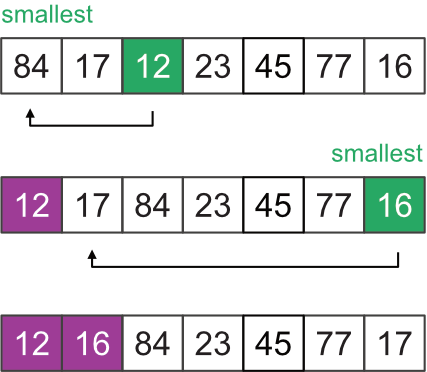
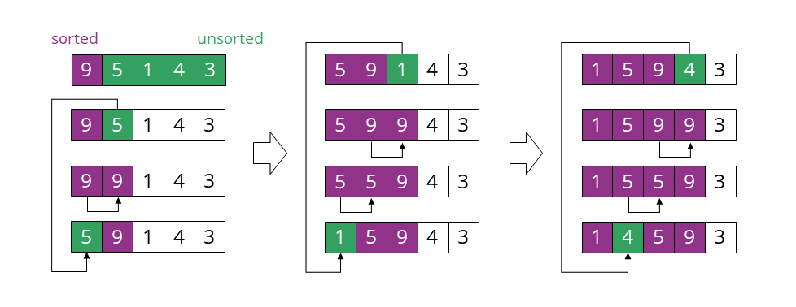

# CVIČENÍ 11: ŘADÍCÍ ALGORITMY

Algoritmizace a programování

## ÚVOD

Čas, potřebný pro zpracování dat pomocí konkrétního algoritmu, zpravidla narůstá v závislosti na množství dat, které je nutné zpracovat (vliv má samozřejmě také konkrétní počítač, spuštěné procesy a další parametry). Aby bylo možné určit alespoň přibližný odhad výpočetního času, využívá se odhadu růstu funkce, která popisuje složitost v závislosti na velikosti vstupních dat. Odhad složitosti algoritmu lze provést jak pro výpočetní čas, tak pro paměťové nebo jiné prostředky.

V předešlém cvičení jste se již s touto problematikou seznámili a obdobně ji budete uplatňovat i v tomto cvičení. 
	Třídicí nebo řadící algoritmy mají za úkol pomoci přerovnat čísla, seznamy, nebo obsah souborů do správného pořadí, např. od nejmenšího po největší. Se seřazenými údaji se pak mnohem lépe pracuje. Uplatní se pak třeba u vyhledávání. Nejjednodušší třídící algoritmy patří do skupiny přímých metod. Jsou krátké, jednoduché a třídí přímo v seznamu. Nepotřebujeme pomocné proměnné. Takové  algoritmy mají většinou časovou složitost typu **O(****n****2****)**. Jsou vhodné v případech, kdy tříděných dat není příliš mnoho. Mezi takové algoritmy patří zejména **řaze****ní přímým výběrem (Selection Sort)** nebo **řazen****í přímým vkládáním (Insertion Sort)**. Sofistikovanější třídící algoritmy pracují s časovou složitostí typu** O(****n*****log****(n)****)**. Jedním z nich je tzv. **třídění sléváním (Merge Sort)**, které je založené na principu spojování (slévání) již setříděných posloupností dohromady. V neposlední řadě existují třídící a řadicí metody určené pro specifická data, pro data, která mají speciální vlastnosti. Do této kategorie patří například **třídění počítáním (Count Sort)** a **přihrádkové třídění (Bucket Sort)**.

## CÍL 1

### ALGORITMY ŘAZENÍ

Řadící algoritmy dělíme na **stabilní** a **nestabilní**. Toto dělení vychází ze způsobu, jakým algoritmus nakládá se stejnými prvky (resp. s prvky se stejným klíčem, dle kterého je sekvence řazena). Stabilní algoritmus zachovává relativní pozici shodných prvků tak, jak byly umístěny v původní neseřazené posloupnosti. Nestabilní algoritmus tento výsledek naopak nezaručuje:

Stabilitu algoritmu nemusíme vyžadovat vždy. To je ostatně zřejmé z obrázku výše. Při seřazení čísel bez jakékoliv vazby na další informace nám pravděpodobně bude jedno, v jakém pořadí za sebou se číslo 8 v seřazené posloupnosti vyskytne.

Stabilita je však zásadní v případech, kdy od sebe dva prvky se shodným klíčem **dokážeme** nějakým způsobem **odlišit**. Jednoduchým příkladem může být seznam jmen, který chceme abecedně seřadit. V takovém případě bude řazení probíhat podle prvního znaku ve jméně. Jméno *Karel* a *Kamila* pak budou mít stejný klíč řazení (znak *K*), jsou však obsahově i významově odlišitelné. Představme si nyní situaci, že takový seznam chceme seřadit podle dvou klíčů – např. dle průměru známek a abecedně. Co se stane, pokud bychom na seznam seřazený dle známek aplikovali nestabilní algoritmus ve snaze provést poté abecední řazení?

|  | Stabilní algoritmy mají zpravidla vyšší výpočetní a/nebo prostorovou asymptotickou náročnost. Pokud tedy není z pohledu řešeného problému kladen požadavek na stabilitu, je výhodnější použít některý z nestabilních algoritmů. Nestabilní algoritmus lze převést na stabilní, pokud jako poslední klíč řazení přidáme index prvků v původní sekvenci. Je však nutné zvážit, zda-li tato úprava nepovede k neúměrnému navýšení celkové asymptotické složitosti algoritmu. |
| --- | --- |

#### 1.1	GitHub repozitář pro dnešní cvičení

Soubory pro dnešní cvičení jsou k dispozici na GitHubu a to na následující adrese:

**Adresa repozitáře:** 

| Úkol – Git (Podrobný postup viz cv. 9 – cíl 3) |
| --- |
| Na vlastním GitHub účtu vytvořte kopii (fork) zdrojového repozitáře.  Naklonujte si repozitář ze svého GitHub účtu do složky s dnešním cvičením.   V lokálním repozitáři nastavte pomocí terminálu novou vzdálenou adresu (remote) na původní (slytherins-hub) adresu repozitáře (trojúhelníková spolupráce):  git remote add upstream <repository_address>  V lokálním repozitáři vytvořte novou větev (branch) s názvem sorting_algorithms a do této větve se přepněte pomocí příkazu:  git checkout <branch_name> |

#### 1.2	Selection Sort

Selection Sort patří mezi jednoduché **nestabilní** řadící algoritmy. Jeho výhodou mezi algoritmy s obdobnou asymptotickou složitostí je především konstantní paměťová náročnost. Základní princip algoritmu pro seřazení čísel v seznamu vypadá následovně:

Najdi nejmenší prvek v seznamu a prohoď jeho pozici s prvním prvkem seznamu.

Najdi druhý nejmenší prvek v seznamu a prohoď jeho pozici s druhým prvkem seznamu.

Opakuj činnost, dokud nejsou seřazeny všechny prvky.

Vrať seřazenou posloupnost.

Vizuální ukázka pro první dva kroky algoritmu může vypadat např. takto:

| Úkol |
| --- |
| Do modulu sorting.py implementujte funkci read_data(), jejímž úkolem bude načíst data z CSV souboru numbers.csv.  Funkce bude mít jeden vstupní parametr - název CSV souboru.  Funkce pomocí modulu csv načte CSV soubor ve formě slovníku. Klíče tohoto slovníku budou jednotlivé názvy sloupců a hodnoty budou čísla uložená v odpovídajícím sloupci. Funkce vrátí slovník všech čísel uložených pod jednotlivými klíči (sloupci).  Volání funkce a korektnost její implementace ověřte voláním z hlavní funkce main(). Vytvořte novou revizi (commit) a změny nahrajte na svůj vzdálený repozitář (push). |

| Samostatný úkol - Selection Sort |
| --- |
| Do modulu sorting.py implementujte funkci selection_sort(), jejímž úkolem bude vzestupně seřadit všechny prvky posloupnosti dle principů Selection Sort.  Funkce bude mít jeden vstupní parametr – libovolně dlouhý seznam celých čísel. Funkce vrátí seřazený seznam prvků.   Jako vstup využijte některou z číselných řad načtených v předešlém úkolu.  Volání funkce a korektnost její implementace ověřte voláním z hlavní funkce main(). Vytvořte novou revizi (commit) a změny nahrajte na svůj vzdálený repozitář (push). |

**Nápověda**: Prohození dvou prvků seznamu lze v Pythonu realizovat pomocí velmi sympatické syntaxe, která má navíc díky kombinaci operace *set* a *get* konstantní asymptotickou složitost O(1): 

| my_list = [1, 2, 3, 4] my_list[1], my_list[3] = my_list[3], my_list[1] |
| --- |

| Samostatný úkol - Rozšíření funkce |
| --- |
| Rozšiřte rozhraní funkce selection_sort() o jeden nepovinný vstupní parametr s názvem direction.   Argument direction rozhodne o tom, zda bude posloupnost seřazena vzestupně nebo sestupně. Rozšiřte algoritmus tak, aby funkce mohla vrátit jak vzestupně, tak sestupně seřazenou posloupnost.   Vytvořte novou revizi (commit) a změny nahrajte na svůj vzdálený repozitář (push). |

#### 1.3	Analýza algoritmu Selection Sort

Proveďte analýzu implementovaného algoritmu a odhadněte jeho asymptotickou složitost pro případy uvedené v tabulce.

Zjistěte v dokumentaci, jaká je asymptotická složitost metod insert() a pop(). Jak by byla ovlivněna asymptotická složitost algoritmu pro oba scénáře pokud bychom prohození dvou prvků realizovali pomocí těchto dvou metod?

| Případ | Nejlepší scénář | Nejhorší scénář |
| --- | --- | --- |
| vzestupné seřazení posloupnosti |  |  |
| sestupné seřazení posloupnosti |  |  |

#### 1.4	Bubble Sort

Bubble Sort patří mezi nejjednodušší **stabilní** algoritmy řazení. Algoritmus pracuje na principu probublávání čísel požadovaným směrem. Základní princip algoritmu pro vzestupné seřazení čísel v seznamu vypadá následovně:

Začni na první pozici.

Porovnej dva po sobě jdoucí prvky. Pokud má první prvek větší hodnotu než prvek druhý, prohoď jejich pořadí.

Posuň se o jednu pozici.

Opakuj bod číslo 2 a 3 pro celou sekvenci. (Po prvním průchodu celou sekvencí došlo k probublání největší hodnoty na poslední pozici)

Opakuj dokud není seřazena celá sekvence.

Vizuální ukázka pro první tři iterace algoritmu může vypadat např. takto:

| Samostatný úkol - Bubble Sort |
| --- |
| Do modulu sorting.py implementujte funkci bubble_sort(), jejímž úkolem bude vzestupně seřadit všechny prvky posloupnosti dle principů Bubble Sort.  Funkce bude mít jeden vstupní parametr – libovolně dlouhý seznam celých čísel. Funkce vrátí seřazený seznam čísel.  Volání funkce a korektnost její implementace ověřte voláním z hlavní funkce main().  Vytvořte novou revizi (commit) a změny nahrajte na svůj vzdálený repozitář (push). |

**Nápověda**: Všimněte si, že algoritmus znovu nekontroluje prvky, které již seřadil. Tomu by mělo odpovídat nastavení řídících cyklů.

#### 1.5	Analýza algoritmu Bubble Sort

Proveďte analýzu implementovaného algoritmu a odhadněte jeho asymptotickou složitost pro případy uvedené v tabulce. Výsledky porovnejte s ostatními algoritmy řazení.

| Algoritmus | Nejlepší scénář | Nejhorší scénář |
| --- | --- | --- |
| Bubble Sort |  |  |

**1.6	Insertion Sort**

Insertion Sort je další ze **stabilních** řadících algoritmů a v praxi bývá efektivnější než dosud zmíněné algoritmy Selection Sort a Bubble sort. Tento algoritmus funguje podobně jako třídění karet v ruce při některé z karetních her. Princip algoritmu pro vzestupné seřazení je následující:

Začni na první pozici, tento prvek považuj za seřazený. Zbylou část sekvence považuj za neseřazenou.

Vezmi první prvek z neseřazené oblasti.

Porovnej tento prvek s jeho předchůdcem (tedy posledním prvkem v seřazené oblasti). Pokud je předchůdce větší než prvek, který chceme zařadit, posuň ho o jednu pozici doprava. (Tak vznikne místo pro nový prvek.) 

Opakuj bod tři dokud existují v seřazené oblasti čísla větší než číslo, které chceme zařadit.

Vlož prvek do seřazené oblasti.

Pokračuj dalším prvkem z neseřazené oblasti, opakuj body 3 až 6.

Vizuální ukázka pro první tři iterace algoritmu je níže:

| Samostatný úkol - Insertion Sort |
| --- |
| Do modulu sorting.py implementujte funkci insertion_sort(), jejímž úkolem bude vzestupně seřadit všechny prvky posloupnosti dle principů Insertion Sort.  Funkce bude mít jeden vstupní parametr – libovolně dlouhý seznam celých čísel. Funkce vrátí seřazený seznam čísel.  Volání funkce a korektnost její implementace ověřte voláním z hlavní funkce main().  Vytvořte novou revizi (commit) a změny nahrajte na svůj vzdálený repozitář (push). |

**1.7	Analýza algoritmu Insertion Sort**

Proveďte analýzu implementovaného algoritmu a odhadněte jeho asymptotickou složitost pro případy uvedené v tabulce. Výsledky porovnejte s ostatními algoritmy řazení.

| Algoritmus | Nejlepší scénář | Nejhorší scénář |
| --- | --- | --- |
| Insertion Sort |  |  |

#### 1.8	Řazení v Pythonu

Základním nástrojem pro řazení v Pythonu je funkce sorted() a metoda sort(). Oba nástroje využívají **stabilní** algoritmus Timsort, který  má asymptotickou složitost v průměrném i nejhorším případě O(n*log(n)) a prostorovou složitost O(n).

Metoda sort() modifikuje pořadí hodnot přímo uvnitř datové struktury. Je tedy vhodná ve chvíli, kdy není nutné zachovat původní sekvenci prvků. Jelikož se jedná o metodu nad seznamem, voláme ji pomocí následující syntaxe:

| Vyzkoušej a analyzuj výstup |
| --- |
| my_list = [3, 8, 1, 2, 32] my_list.sort() |

Funkce sorted() vytváří nový seznam seřazených prvků z původní iterovatelné datové struktury. Jelikož se jedná o funkci, je třeba definovat vstupní argument (iterovatelná proměnná) a její výstup uložit do nové proměnné:

| Vyzkoušej a analyzuj výstup |
| --- |
| my_list = [3, 8, 1, 2, 32] my_list = sorted(my_list) |

Oba nástroje umožňují zadat dva nepovinné vstupní argumenty reverse a key. Účel prvního z nich lze snadno odhadnout. Ověřte v Pythonu výsledek následující syntaxe pro seznam hodnot výše:

| Vyzkoušej a analyzuj výstup |
| --- |
| my_list = sorted(my_list, reverse=True) |

Vstupní argument key umožňuje nastavit klíč, podle kterého bude sekvence seřazena. Ukažme si jednoduchý příklad na seznamu textových řetězců. Ten bychom rádi seřadili podle počtu znaků s využitím interní funkce len(): 

| Vyzkoušej a analyzuj výstup |
| --- |
| list_of_words = ["MOO", "meeeoow", "woof", "BZZZZZZ"] list_of_words = sorted(list_of_words, key=len) |

Obdobně můžeme postupovat v případě klasického abecedního řazení, avšak bez vlivu malých a velkých znaků (využijeme metod nad řetězcem pro převod verzálek na malé znaky) :

| Vyzkoušej a analyzuj výstup |
| --- |
| list_of_words = ["MOO", "meeeoow", "woof", "BZZZZZZ"] list_of_words = sorted(list_of_words, key=str.lower) |

Jako klíč řazení key lze nastavit teoreticky libovolnou interní funkci Pythonu, pokud dokáže pracovat nad daty, která máme k dispozici. 

### **1****.****9****	Další řadící algoritmy**

Pro přehled uvádíme seznam základních algoritmů řazení s jejich asymptotickou výpočetní a prostorovou složitostí. Seznam není nutné znát zpaměti. Vzpomeňte si na něj ve chvíli, kdy řazení nad vašimi daty pomocí interních funkcí vašeho oblíbeného programovacího jazyku bude probíhat neúměrně dlouho.

| Algoritmus | Nejlepší scénář | Nejhorší scénář | Průměrný scénář | Prostorová složitost |
| --- | --- | --- | --- | --- |
| Merge Sort | O(n*log(n)) | O(n*log(n)) | O(n*log(n)) | O(n) |
| Heap Sort | O(n*log(n)) | O(n*log(n)) | O(n*log(n)) | O(1) |
| Radix Sort | O(n*k) | O(n*k) | O(n*k) | O(n+k) |
| Quick Sort | O(n*log(n)) | O(n*log(n)) | O(n2) | O(n*log(n)) |

|  | U většiny algoritmů lze celkem snadno nalézt jejich implementaci v Pythonu on-line. Kvalita různých variant se však značně liší. Nezřídka tak můžete narazit na špatně optimalizovaný program, který sice provádí řazení (nebo jinou činnost) dle obecné specifikace algoritmu, ale překračuje deklarovanou asymptotickou složitost. Takový kód obvykle postrádá dokumentaci a bez hlubšího ověření jej nedoporučujeme využívat. |
| --- | --- |

