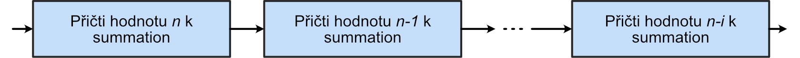
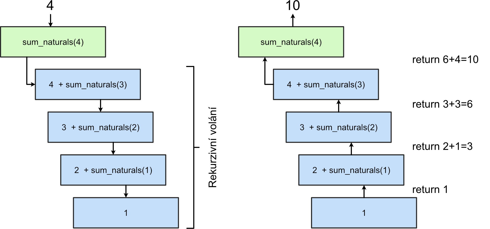
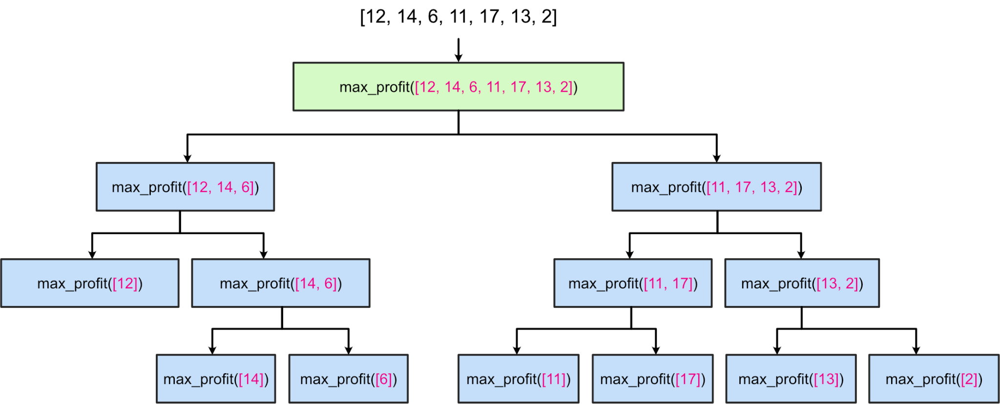
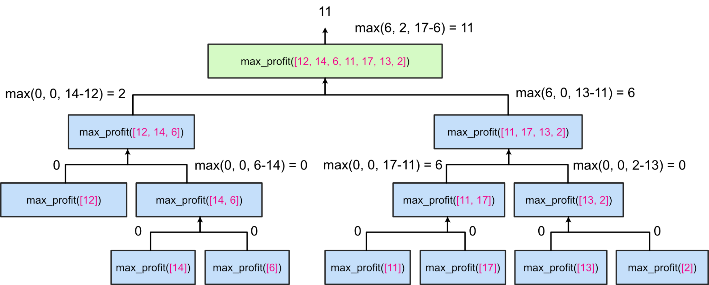
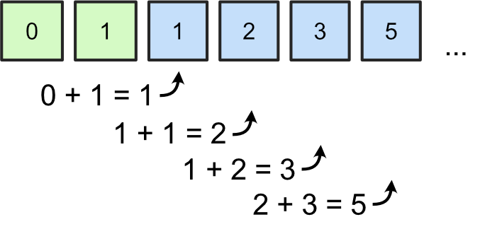
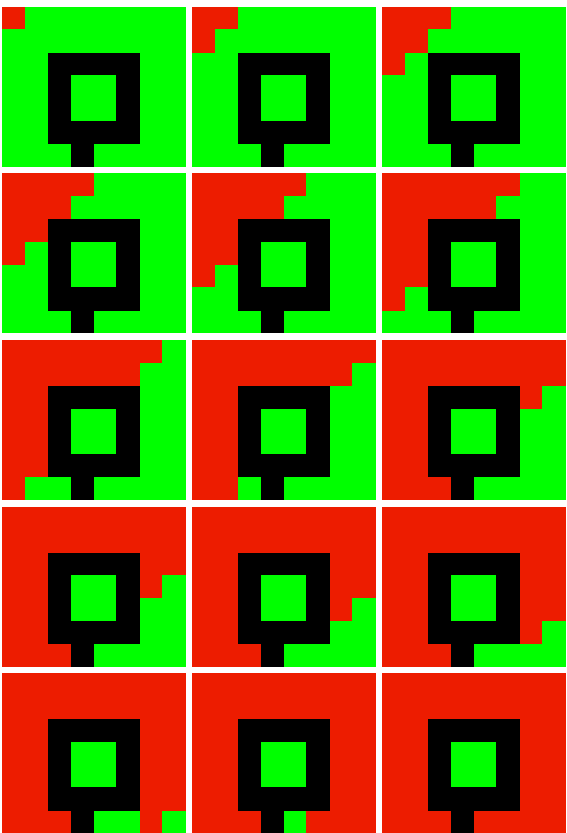

# CVIČENÍ 12: REKURZE, ROZDĚL A PANUJ

Algoritmizace a programování

## CÍL 1

## REKURZIVNÍ ALGORITMY

Rekurze je v programování způsob konstrukce kódu – zpravidla ve formě funkce nebo procedury 

– která volá **sama sebe**. Základem řešení problému je tedy podobně jako u iterace kód, jehož volání se s dílčí modifikací proměnných opakuje. Rekurzi využívají například skupiny algoritmů založené na přístupu Rozděl a panuj (Divide & Conquer) nebo na Dynamickém programování (Dynamic Programming). 

#### 1.1	Součet prvních *n* přirozených čísel

Základní princip rekurzivní funkce si můžeme demonstrovat na následujícím příkladu. Ukažme si nejdříve, jak by mohlo vypadat jednoduché iterativní řešení. To jistě napadne většinu z vás během několika vteřin:

| def sum_naturals(n):     summation = 0      while n > 0:         summation += n         n -= 1      return summation |
| --- |

Z kódu je zřejmé, že v **každém kroku cyklu průběžně** **aktualizujeme** obsah výstupní proměnné (požadovaný výsledek) na základě doposud analyzovaných přirozených čísel. Takový iterativní algoritmus bychom mohli znázornit jako sekvenci operací (pozor. jedná se jen o znázornění návaznosti iterativního procesu, nikoliv validní blokové schéma):

### **1****.2	Součet prvních *****n***** přirozených čísel – rekurzivně**

A jak by vypadala rekurzivní implementace stejného algoritmu?

| Vyzkoušej a analyzuj běh programu |
| --- |
| def sum_naturals_rec(n):     if n <= 1:         return n     else:         return n + sum_naturals_rec(n-1) |

Všimněte si pozorně, co obsahuje tělo naší rekurzivní funkce (a z čeho se skládá každý rekurzivní algoritmus):

Volání sebe sama uvnitř těla funkce (poslední řádek červeně).

Podmínku, která ukončí funkci s návratem konkrétní hodnoty bez rekurzivního volání.

Bez prvního bodu by se samozřejmě **nejednalo** o rekurzivní funkci. Druhý bod je naopak zásadní pro to, aby náš **algoritmus byl konečný**.

Rekurzivní volání totiž proběhne ještě před tím, než je funkce, která toto volání provedla, ukončena. V praxi to znamená, že každá rekurze vytvoří v paměti novou instanci volané funkce se všemi svými proměnnými (ukážeme si později v debuggovacím režimu). Bez řádné podmínky ukončení tedy může dojít k teoreticky nekonečnému “rozmnožení” naší funkce v paměti. Reálně pak k **zahlcení paměti** či **výpočetních prostředků** a pádu programu.

Rekurzivní proces si můžeme zobrazit pomocí stromu volání funkce sum_naturals_rec(). Pro součet prvních 4 přirozených čísel by strom volání vypadal takto:

V levém schématu probíhá rekurzivní volání. Všimněte si, že algoritmus celý problém nejdříve rozloží na tzv. **nejmenší podproblém**. V našem případě jsme definovali nejmenší podproblém jako obecný součet dvou čísel:

| n + sum_naturals_rec(n-1) |
| --- |

Protože musíme provést celkem 3 součty, vznikly nám rekurzí **3+1 nové instance** funkce. V poslední instanci neprovádíme součet, ale ukončujeme rekurzivní běh vrácením posledního přirozeného čísla.

V pravé části schématu vidíme, co se stane ve chvíli, kdy algoritmus narazí na podmínku ukončení. Tímto došlo k úplnému rozložení problému a rekurzivní algoritmus nyní může z dílčích řešení poskládat řešení celkové postupným součtem nalezených hodnot. 

| Úkol |
| --- |
| Upravte kód pro rekurzivní výpočet součtu n přirozených čísel tak, abychom získali algoritmus pro rekurzivní výpočet faktoriálu.  Faktoriál čísla n! je součin všech přirozených čísel, která jsou menší nebo rovna n. Např. pro n = 5:    Faktoriál můžeme zapsat několika způsoby. Pro rekurzivní implementaci výpočtu se pak hodí zejména:                         pokud n = 0     pokud n > 0 |

## CÍL 2

### ROZDĚL A PANUJ (D&C)

Princip algoritmů typu D&C lze přiblížit z podstaty původního významu. Výrok, přisuzovaný podle různých zdrojů např. Juliu Caesarovi, popisuje způsob, jakým zvládnout dav. Caesar úspěšně vypozoroval, že skupině lidí, která je navzájem v konfliktu a rozhádaná, se vládne lépe než jednotné a semknuté společnosti.

Podobným způsobem jsou konstruovány algoritmy D&C. Semknutou společností je v tomto případě komplexní výpočetní problém. Řešení takového problému však často vyžaduje také komplexní program s vysokou asymptotickou výpočetní náročností. Dle principu D&C se snažíme problém (zpravidla analyzovaná data) rozdělit do menších skupin (v naší analogii skupiny osob) a analyticky nalézt **nejmenší podproblém**, který je společný pro všechny skupiny a současně je efektivněji řešitelný než problém původní – komplexní.

Podproblém vyřešíme nezávisle pro každou skupinu a výsledné řešení poté složíme z dílčích řešení. Princip D&C by se proto také mohl nazývat: **rozděl, panuj a slož zpět dohromady**. 

#### 2.1	Optimální investiční program – maximální zisk z jednoho prodeje

Máme dáno libovolně dlouhé pole (seznam) celých čísel. Posloupnost čísel reprezentuje časový vývoj akcie firmy na burze cenných papírů (např. za každou hodinu nebo den). Za předpokladu, že v daném časovém úseku můžeme provést jen jednu nákupní a jednu prodejní transakci, jakého maximálního zisku můžeme dosáhnout? Uvažujme také, že nákup a prodej můžeme provést v ten stejný den (s nulovým ziskem a ztrátou).

| po | út | st | čt | pá | po | út |
| --- | --- | --- | --- | --- | --- | --- |

| 12 | 14 | 6 | 11 | 17 | 13 | 2 |
| --- | --- | --- | --- | --- | --- | --- |

Jakého maximálního zisku můžeme v ukázkových datech dosáhnout?

Největšího zisku můžeme dosáhnout, pokud akcie **nakoupíme ve středu** a **prodáme je v pátek**, jelikož: 17 - 6 = 11

Za zmínku stojí, že největší rozdíl je dán jako: 17 - 2 = 15. Takovou transakci však nemůžeme provést, protože nelze prodat akcie dříve, než jsme je koupili.

Ukažme si opět, jak by mohlo vypadat jednoduché naivní řešení pomocí iterativního algoritmu. V takovém případě jsme nuceni za pomoci hrubé síly (Brute Force) analyzovat všechny dostupné kombinace párů hodnot a určit jejich profit:

| def max_profit(stock_prices):     nb_vals = len(stock_prices)         max_profit = 0      for i in range(nb_vals):         for j in range(i + 1, nb_vals):             max_profit = max(max_profit, stock_prices[j] - stock_prices[i])      return max_profit |
| --- |

V poli je celkově n*(n + 1) / 2 unikátních párů hodnot. Tento algoritmus tedy bude mít asymptotickou složitost v nejhorším případě O(n^2). **Zvládneme**** to lépe**?

#### 2.2	Optimální investiční program – D&C

Pojďme se nad problémem zamyslet z pohledu metody D&C. Jaké scénáře mohou nastat, pokud rozdělíme pole přibližně na dvě poloviny? V takovém případě máme celkem tři možnosti, jak nejlépe provést nákup a prodej:

Optimální nákup i prodej se bude nacházet v **levé** půlce pole.

Optimální nákup i prodej se bude nacházet v **pravé** půlce pole.

Optimální **nákup** se bude nacházet v **levé** a **prodej v pravé** půlce pole.

Z předchozího textu už víme, že algoritmy D&C pro svůj běh využívají rekurzi. Pomocí rekurzivního volání tedy musíme** rozložit pole na nejmenší podproblém**, který bude v našem případě tvořen jednou hodnotou (nákup i prodej ve stejný den). Rozložení musí být samozřejmě **postupné**. V první rekurzi tedy rozdělíme pole na poloviny, v druhé iteraci rozdělíme každou polovinu na nové dvě poloviny, a tak dále… Výsledný algoritmus tedy může vypadat následovně:

Pokud je velikost pole menší nebo rovno 1, maximální zisk je 0 (nákup i prodej ve stejný den).

V opačném případě:

Rozděl pole na 2 poloviny.

Rekurzivně zjisti maximální zisk v levé polovině, ulož ji jako left_profit.

Rekurzivně zjisti maximální zisk v pravé polovině, ulož ji jako right_profit.

Najdi **nejmenší** hodnotu v levé půlce (levný nákup), ulož ji jako left_min.

Najdi **nejvyšší** hodnotu v pravé půlce (drahý prodej), ulož ji jako right_max.

Vrať maximum z left_profit, right_profit a (right_max - left_min).

| def max_profit(stock_prices):     nb_vals = len(stock_prices)         if nb_vals <= 1:         return 0      left_profit = max_profit(stock_prices[:nb_vals // 2])     right_profit = max_profit(stock_prices[nb_vals // 2:])      left_min = min(stock_prices[:nb_vals // 2])     right_max = max(stock_prices[nb_vals // 2:])      return max(left_profit, right_profit, right_max - left_min) |
| --- |

#### 2.3	Analýza algoritmu

Rekurzivní proces si opět můžeme zobrazit pomocí stromu volání. Z grafu vidíme, že každá instance vyvolá pro **rozdělení pole **dvě nové rekurze. Protože při každém rekurzivním volání rozdělíme pole na dvě poloviny, odpovídá maximální počet rekurzivního volání asymptotické složitosti O(log(n)). Jedno rekurzivní volání si můžeme představit jako jednu hladinu v našem stromu volání. V každé hladině je poté nutno provést právě *n* operací pro nalezení maximální hodnoty. Celková asymptotická složitost je tedy O(n*log(n))!

## CÍL 3

### PRAKTICKÉ PŘÍKLADY

### **3****.1	Než začneme…**

Opakování je matka moudrosti. Proto si zopakujeme práci s Gitem a soubory k dnešnímu cvičení si nejdříve přesuneme na individuální GitHub účet a poté naklonujeme do pracovního adresáře s dnešním cvičení.

**Adresa repozitáře**: 

| Úkol – Git (Podrobný postup viz cv. 10 – cíl 3) |
| --- |
| Na vlastním GitHub účtu vytvořte kopii (fork) zdrojového repozitáře. Otevřete v prohlížeči adresu zdrojového repozitáře. Vpravo nahoře najdete tlačítko Fork a klikněte na něj.  Naklonujte si repozitář ze svého GitHub účtu do složky s dnešním cvičením.  V lokálním repozitáři nastavte pomocí terminálu novou vzdálenou adresu (remote) na původní (slytherins-hub) adresu repozitáře (trojúhelníková spolupráce):  git remote add upstream <repository_address>  Po splnění každého úkolu vytvořte novou revizi a proveďte její upload na vzdálený repozitář. |

#### 3.2	Rekurzivní implementace Fibonacciho posloupnosti

Fibonacciho posloupností v matematice nazýváme nekonečnou posloupnost přirozených čísel. Popsal ji poprvé italský matematik Leonardo z Pisy, známý také jako Fibonacci, když studoval populace množících se králíků.

Výchozími prvky posloupnosti jsou hodnoty 0 a 1. Celá posloupnost se tvoří tak, že každé další číslo vznikne součtem dvou předcházejících. Vznikne tedy řada: 0, 1, 1, 2, 3, 5, 8, 13, 21,...

Fibonacciho posloupnost opět můžeme popsat několika způsoby. Pro následnou implementaci rekurzivního algoritmu se pak hodí zejména:

				pokud *n* = 0

				pokud *n* = 1

		jinak

| Samostatný úkol |
| --- |
| Do modulu fibo.py implementujte algoritmus rekurzivního výpočtu n-tého prvku Fibonacciho posloupnosti.  V modulu fibo.py vytvořte funkci recursive_nth_fibo(). Funkce bude mít jeden vstupní parametr – číslo udávající pořadí prvku Fibonacciho posloupnosti, který chceme spočítat.  Funkce vrátí n-tý prvek Fibonacciho posloupnosti, kde n je námi zadané číslo.  Volání funkce a korektnost její implementace ověřte voláním z hlavní funkce main().  V hlavní funkci budeme požadovaný počet prvků posloupnosti zadávat vstupem z klávesnice. Funkce vypíše seznam prvních n prvků posloupnosti.  Vytvořte novou revizi (commit) a změny nahrajte na svůj vzdálený repozitář (push). |

#### 3.3	Rekurzivní implementace binárního vyhledávání

Algoritmus binárního vyhledávání již znáte z předchozích cvičení. Jde o způsob prohledávání zadaného prostoru, seřazeného číselného seznamu, za účelem nalezení specifické hodnoty. Tento algoritmus můžeme implementovat pomocí rekurze. Připomeneme si princip algoritmu:

Zkontroluj prostřední prvek. Pokud obsahuje hledanou hodnotu, ukonči hledání a vrať pozici prostředního prvku.

Pokud je prostřední prvek menší než hledané číslo, zmenši oblast prohledávání na pravou půlku seznamu.

Pokud je prostřední prvek větší než hledané číslo, zmenši oblast prohledávání na levou polovinu seznamu.

Opakuj předchozí kroky dokud existuje oblast, která ještě nebyla prohledána. 

Rekurzivní přístup přichází na řadu v momentu krácení prohledávaného prostoru na polovinu (ať už levou, nebo pravou).

| Samostatný úkol |
| --- |
| Do modulu binary_search.py implementujte algoritmus rekurzivního výpočtu binárního vyhledávání.   V modulu binary_search.py vytvořte funkci recursive_binary_search(). Funkce bude mít čtyři vstupní argumenty: prohledávaný seznam, hledaná hodnota, index levého okraje prohledávaného prostoru, index pravého okraje prohledávaného prostoru.  Funkce vrátí index hledané hodnoty, pokud se v seznamu nachází, a hodnotu None, pokud se hodnota v seznamu nenachází.  Volání funkce a korektnost její implementace ověřte voláním z hlavní funkce main(). Jako vstup využijte hodnoty uložené v json souboru sequential.json.  Vytvořte novou revizi (commit) a změny nahrajte na svůj vzdálený repozitář (push). |

#### 3.4	Flood fill (semínkové vyplňování)

Flood fill ) je algoritmus, který určuje a mění oblast připojenou k danému uzlu ve vícerozměrném poli na základě nějakého společného atributu. Typickým využitím je nalezení spojené komponenty v obraze, což můžete znát z nejrůznějších kreslících programů jako nástroj vyplnit oblast (kyblík s barvou). 

Algoritmus začíná ze zvoleného semínka, odkud se nová barva šíří všemi směry do dalších pixelů, pokud mají pixely stejnou barvu jako má semínko:

Algoritmus je velmi vhodný pro rekurzivní implementaci - semínko může rozšířit svou barvu na okolní pixely a ty můžou rekurzivně rozšířit svou barvu na své okolí. Postup bude tedy následující:

Pro aktuální pixel zkontroluj, zda leží uvnitř v obraze (pozice se nedostala mimo velikost obrazu) a zda je zelený. Pokud ne, tak vrať nezměněný obraz.

Změň barvu aktuální pixelu na červenou.

Zavolej tuto funkci rekurzivně pro sousední pixely.

Vrať upravený obraz.

| Samostatný úkol |
| --- |
| Do modulu flood_fill.py implementujte algoritmus pro semínkové vyplňování.  V modulu flood_fill.py vytvořte funkci flood_fill().  Funkce bude mít tři vstupní argumenty.: obraz (array čísel), kde pixely popředí (kde je povoleno rozšiřování) mají hodnotu 1, pixely pozadí (zábrany) hodnotu 0 a již přebarvené pixely hodnotu 2, x souřadnice pozice aktuálního pixelu, y souřadnice pozice aktuálního pixelu.  Funkce vrátí následovně pozměněný obraz: pokud je pixel mimo rozměry obrazu vrátí vstupní obraz, pokud má pixel hodnotu 0 nebo 2 vrátí vstupní obraz, pokud má pixel hodnotu 1 změní se jeho hodnota na 2 a rekurzivně se funkce zavolá pro 4 sousední pixely a vrátí takto pozměněný obraz.  Volání funkce a korektnost její implementace ověřte voláním z hlavní funkce main(). Jako vstup využijte hodnoty některého z předpřipravených načtených obrázků a jako vstupní semínko použijte souřadnici [0,0] (levý horní roh).  Vytvořte novou revizi (commit) a změny nahrajte na svůj vzdálený repozitář (push). |

