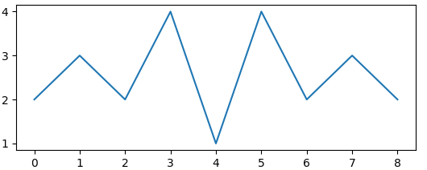

# Domácí úkol č. 8
> **Upravujte pouze soubor `assignment_8.py`**

### Numpy
`NumPy` (*Numerical Python*) je open source balíček jazyka Python, který se používá téměř ve všech oblastech vědy a techniky.
V Pythonu nám nahrazuje velkou část základních funkcionalit jazyku Matlab, který je velmi oblíbený pro zpracování 
dat (s velmi podobnou syntaxí).
V průběhu studia se setkáte s jejím opakovaným využitím, například pro zpracování signálů či zpracování obrazů. 
Velmi vhodné je využití knihovny `numpy` v případě, kdy chcete danou operaci provést pro všechny hodnoty v poli (*array*) hodnot.

### Matplotlib 
`Matplotlib` je balíček pro vykreslování v programovacím jazyce Python, která velmi dobře spolupracuje právě s knihovnou `numpy`. 
Tato knihovna nám zastává vykreslovací funkcionality jazyka Matlab (s velmi podobnou syntaxí). 
Využíváme ji opět při zobrazování zpracovávaných dat.

> Balíčky `numpy` a `matplotlib` je potřeba nainstalovat příkazem `python -m pip install numpy` a `python -m pip install matplotlib` 
> nebo v PyCharmu přes *File -> Settings -> Project -> Project -> Python interpreter -> **+** a vyhledání a nainstalování patřičné knihovny*.

## Zadání

Vaším úkolem bude jednoduché zpracování snímku očního pozadí a EKG signálu pacienta.
Bude zapotřebí načíst data obrázku i signálu, vhodně zpracovat a výsledky zobrazit. U obrázku budeme zjišťovat,
jakou část plochy obrázku zabírají cévy, jakou průměrnou intenzitu mají pixely cév, kde obrázek odlišených cév 
vhodně zobrazíme. Poměr plochy cév a průměrnou intenzitu cév vypíšeme. 
Pro EKG signál zjistíme pozice R vln a spočítáme tepovou frekvenci, kde pozici R vln vhodně zobrazíme a tepovou frekvenci vypíšeme.

> Obrázek bude reprezentován maticí - dvourozměrným numpy array. Například malinký obraz s 9 pixely (o rozměru 3x3 pixely)
> by byl uložený jako `np.array([[2, 3, 2], [4, 1, 4], [2, 3, 2]])` a vypadal takto:

> Signál bude reprezentován vektorem - jednorozměrný numpy array. Například signál s 9 vzorky by byl uložený jako
> `np.array([2, 3, 2, 4, 1, 4, 2, 3, 2])` a vypadal takto:

 

### Načtení dat
Data jsou uložená ve vstupním adresáři `input_data`, kde jsou uložená data 3 pacientů. Ke každému pacientovi se 
zde nachází obrázek `.png` a signál `.txt`.
Vytvořte funkci `read_data()` která bude mít na vstupu číslo pacienta `int` (0-2) a dva výstupy -  obrázek (2D numpy array - `ndarray`) a signál (1D numpy array - `ndarray`).
Pro načtení obrázku lze využít funkci `matplotlib.pyplot.imread` a pro načtení signálu nezapomeňte vstupní data převést z řetězce na čísla a následně na numpy array pomocí `numpy.array()`.

> Po načtení si obrázek a signál zkuste zobrazit pomocí `matplotlib.pyplot.imshow()` a `matplotlib.pyplot.plot()` (každá z nich následovaná `matplotlib.pyplot.show()`).

### Analýza obrazu
Vytvořte funkci, která provede [segmentaci](https://cs.wikipedia.org/wiki/Segmentace_obrazu) cév v obrázku na jednoduchém principu [prahování](https://cs.wikipedia.org/wiki/Prahov%C3%A1n%C3%AD) 
a vyhodnotí poměrnou plochu cév a průměrnou intenzitu pixelů cév.
Vytvořte funkci `analyze_image()`, která bude mít na vstupu obraz `ndarray` a 3 výstupy:
1. segmentační maska - binární obraz `ndarray` s datovým typem `bool` která bude mít hodnoty `True` pro pixely cév a 
   `False` pro pixely pozadí,
2. poměrná plocha cév `float` (0-100) udávající, kolik procent plochy obrázku zaujímají cévy,
3. průměrná intenzita pixelů cév `float` udávající, jaký je průměr z pixelů, kde je segmentační maska `True`.
Pro prahování využijte předdefinovanou konstantu `IMAGE_THRESHOLD`, kde hledáme pixely s hodnotou menší než práh.

> Pro numpy array můžeme provádět operace s celý polem současně například `multiplied_array = array * 5` 
> nebo indexovat pomocí jiného binárního pole `A_values_where_B_is_True = A[B]`. Dále lze využít `numpy.sum()`, `numpy.mean()` a `numpy.shape()`.

### Analýza signálu
Vytvořte funkci, která provede detekci R vln v EKG signálu, opět pomocí [prahování](https://cs.wikipedia.org/wiki/Prahov%C3%A1n%C3%AD) a spočítá tepovou frekvenci.
Vytvořte funkci `analyze_signal()`, která bude mít na vstupu signál `ndarray` a 2 výstupy:
1. signál detekcí R vln - binární signál `ndarray` s datovým typem `bool`, který bude mít hodnoty `True` pro pozice 
   odpovídající R vlnám a `False` pro pixely pozadí,
2. tepová frekvence (tepů za minutu) `float`.
Pro prahování využijte předdefinovanou konstantu `SIGNAl_THRESHOLD`, kde hledáme prvky s hodnotou menší než práh.

Signál nejprve naprahujte. Následně vzniklý binární signál procházejte ve for-cyklu, kde, pokud narazíte na hodnotu 
`True`, ponechte ji jen v případě, že následující hodnota signálu je `False`. Jinak ji naraďte hodnotou `False`. 
Poslední hodnotu nastavte vždy na `False`.
Tento proces tedy ponechá pro sérii více hodnot `True` pouze poslední z nich a takový výsledek odpovídá požadovanému výstupnímu signálu detekcí R vln. 

Tepovou frekvenci (počet tepů za sekundu) spočítejte jako `počet detekovaných r vln / doba trvání signálu`, kde doba trvání signálu je vždy 10s. Hodnotu převeďte na počet tepů za minutu.

### Zobrazení výsledku
Vytvořte funkci `main()`, která nebude mít žádný vstup ani výstup.
Funkce v cyklu projde všechny čísla pacientů, načte a zanalyzuje jejich data a výsledek pro každého pacienta vypíše a vykreslí následovně:
* vypíše číslo pacienta a jeho vypočítané hodnoty,
* vykreslí původní obraz a segmentační masku (pomocí funkce `matplotlib.pyplot.imshow()`),
* vykreslí signál a detekční signál (pomocí funkce `matplotlib.pyplot.plot()`).

> Po zavolání jednotlivých vykreslovacích funkcí nezapomeňte zavolat příkaz `matplotlib.pyplot.show()`, který provede zobrazení aktuálního vykreslení.

